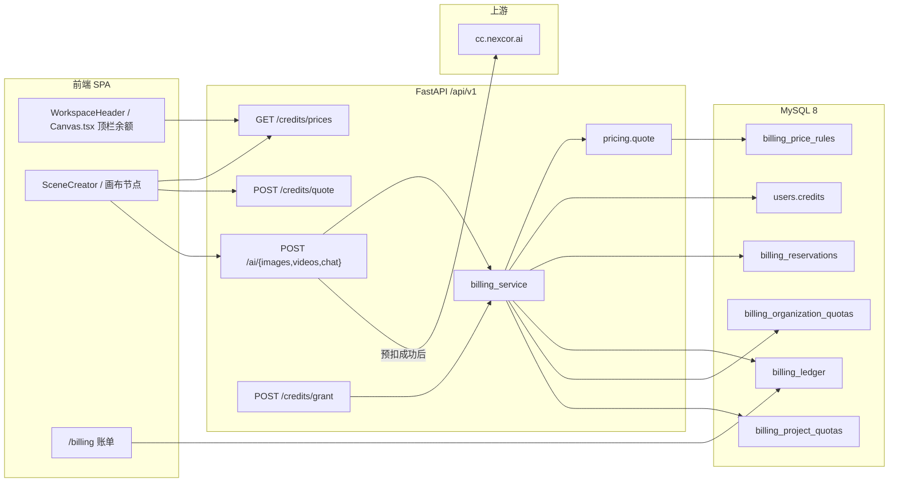
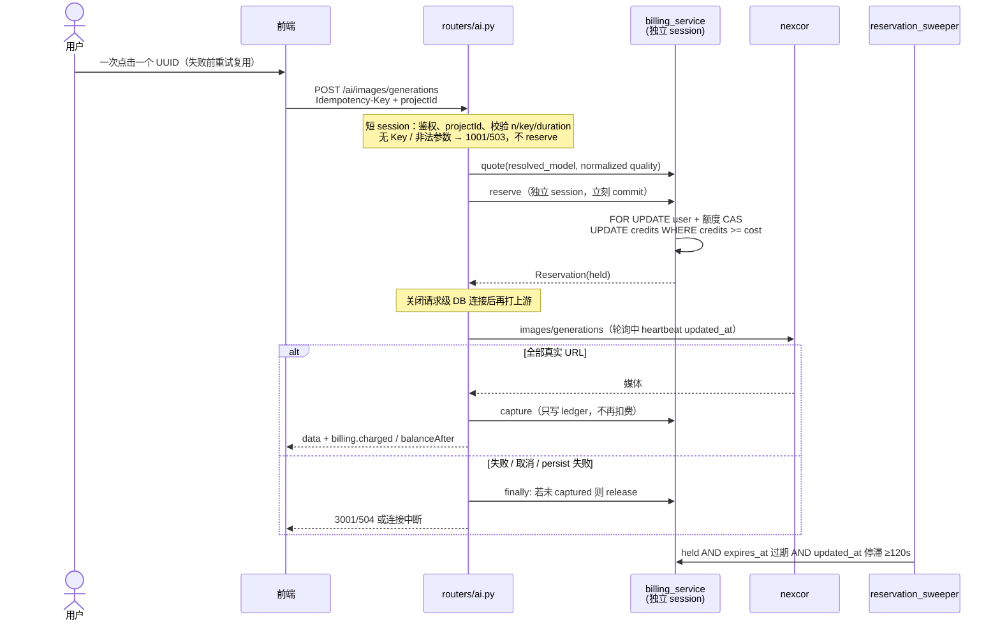
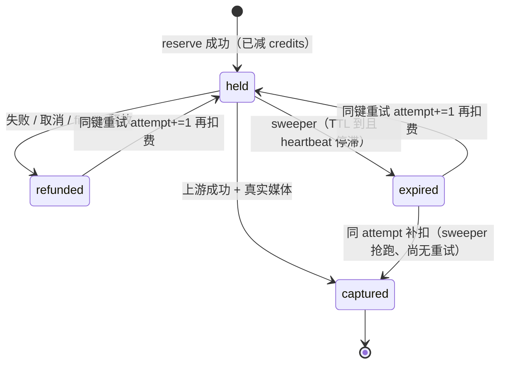
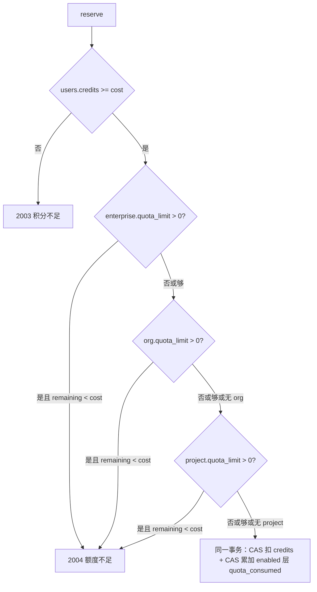
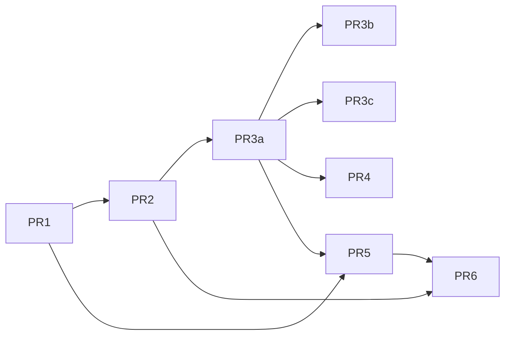

# MangaCanvas 计费 / 积分系统设计

| 字段 | 值 |
|------|----|
| 作者 | MangaCanvas engineering |
| 日期 | 2026-09-09 |
| 状态 | Approved（评审 4 轮，0 open issues） |
| 范围 | `MangaCanvas` 后端 FastAPI + 前端 HashRouter SPA；生产 ECS `47.104.138.144` + MySQL 8 |
| 非范围（v1） | Stripe / 支付宝 / 微信；新中间件（Redis、Celery、消息队列）；改 nexcor 网关 |

---

## Overview

当前生成链路已经在花 nexcor / DashScope 的钱，但产品侧计费是空转：`User.credits` 从不递减，`BillingLedger` 在调用上游**之前**写入 `entry_type="consume"` 且 **`amount=0`**，四级额度表只提供 GET/PUT、生成时从不扣减。失败、超时、占位图、模型不可用都会留下（或回滚）无意义流水，账单页与价格页是营销壳。

本设计把积分做成**真实钱包**：按「模型 + 计量单位」报价；调用 nexcor **之前**用独立短事务预扣（reserve）；**仅在拿到真实媒体/文本后**入账 consume；失败 / 超时 / 占位图 / 客户端取消 / 进程崩溃超时则释放预扣并恢复余额。账本追加写、余额与额度都用 `UPDATE ... WHERE remaining >= :cost` 防并发透支。组织 / 项目额度表已存在，v1 **有条件启用**（`quota_limit > 0` 才拦截）。**新建组织与新建项目默认 `quota_limit=0`（该层关闭）**，避免每个新项目被 10 万封顶误伤。v1 不接支付通道，充值只走超级管理员发放。

工程默认：`BILLING_ENABLED` **默认 False**，注册用户 `credits=0`、**不静默送体验包**。PR3 第一次上生产必须带着 flag 关闭；超管 `grant`（PR2）可用之后再在 env 打开扣费。新用户送分仍是产品 Open Question，不在实现里猜。

---

## Background & Motivation

### 产品与运行时

- 前端：React 18 + Vite 5 + TypeScript，`HashRouter` SPA（`src/App.tsx`）。
- 后端：FastAPI，前缀 `/api/v1`（`backend/app/main.py`），SQLAlchemy 2，JWT。
- 生产：阿里云 ECS `47.104.138.144`，MySQL 8（`mysql+pymysql`，`pymysql==1.1.1`），无 Alembic；启动时 `Base.metadata.create_all`。
- 生成网关：nexcor OpenAI 兼容 `https://cc.nexcor.ai/v1`（`OPENAI_API_KEY` / `OPENAI_BASE_URL`），密钥仅在服务端 `backend/app/config.py`。
- 模型探测：`backend/app/model_probe.py` 对 nexcor 发空请求（~2.5s），隐藏不可用模型。
- Nginx `proxy_read_timeout` 已调到 **600s**（`scripts/deploy.sh`），与视频轮询匹配。

现有生成入口（全部走服务端，浏览器不持有网关密钥）：

| 模态 | 模型 | 后端 | 前端 |
|------|------|------|------|
| 图像 | `gpt-image-2`、`wan2.7-image` / `-pro`、`qwen-image-2.0` / `-pro`；偶发 DashScope `wan2.6-*` | `POST /ai/images/generations` → `openai_image_generate` / `dashscope_async` | **主路径**：`SceneCreator`、画布 `ImageConfigNode`（`Canvas.tsx` 自有顶栏，不挂 `WorkspaceHeader`）。`ImageGenerationForm` 被角色/物品表单复用但 **submit 不调 AI**。另有未使用的 `src/api/imageGenerationApi.ts` 同样 POST 该路径 |
| 视频 | `happyhorse-1.1-t2v` / `i2v`；模板特效改写成 i2v prompt。百度网关 Seedance 2.0 / 2.5 已接入生成，**v1 报价表未覆盖**，打开 `BILLING_ENABLED` 前需补 `price_rules` | `POST /ai/videos/generations`，nexcor 轮询最多 110×5s ≈ **550s** + persist 180s；Seedance 走百度 `/api/v3/contents/generations/tasks` 同样 110×5s；DashScope 分支 `180×3s`；**nginx `proxy_read_timeout` 600s**，视频最坏路径会先被网关掐 | `VideoConfigNode`、`TemplateEffectNode`、`videoService.generate` |
| 文本润色 | `qwen-plus` | `POST /ai/chat/completions` → `dashscope_chat` | `TextNode`、`useWorkflowOrchestrator` |

组织 → 项目 → 成员层级已落地（`organizations` / `projects` / `project_members`）。计费必须能挂到 `organization_id` + `project_id`，否则团队额度无法落地。

### 现状：计费是占位符

**钱包**（`backend/app/models.py` `User.credits`，INT，默认 0）：

- Seed：`superadmin` 10000，陈晓明 4000，林夏 1200，周衡 800（`backend/app/seed.py`）。
- 注册：`credits=0`（`backend/app/routers/auth.py`）。
- 登录 / `/auth/me` 通过 `serialize.user_public` 返回 `credits`，前端写入 `session.user.credits`，但工作台 Header **不展示**。

**流水** `billing_ledger`（已有字段，不要改名）：

```248:261:MangaCanvas/backend/app/models.py
class BillingLedger(Base):
    __tablename__ = "billing_ledger"
    id: Mapped[int] = mapped_column(Integer, primary_key=True, autoincrement=True)
    organization_id: Mapped[int | None] = mapped_column(Integer, nullable=True)
    project_id: Mapped[int | None] = mapped_column(Integer, nullable=True)
    user_id: Mapped[int] = mapped_column(Integer)
    entry_type: Mapped[str] = mapped_column(String(16))
    amount: Mapped[int] = mapped_column(Integer)
    balance_after: Mapped[int | None] = mapped_column(Integer, nullable=True)
    description: Mapped[str | None] = mapped_column(String(256), nullable=True)
    reference_type: Mapped[str | None] = mapped_column(String(32), nullable=True)
    reference_id: Mapped[str | None] = mapped_column(String(64), nullable=True)
    extra_metadata: Mapped[dict | None] = mapped_column("metadata", JSON, nullable=True)
    created_at: Mapped[datetime] = mapped_column(DateTime(timezone=True), default=now)
```

`BACKEND_API_SPEC_V2.md` §19.7 约定 `entryType`：`consume | purchase | refund | allocate | adjust | earn`。v1 **不新增** `hold` 到对外 API。

**占位扣费**（问题核心）：

```30:60:MangaCanvas/backend/app/routers/ai.py
def _record_usage(db: Session, user: models.User, description: str, reference_type: str) -> None:
    db.add(
        models.BillingLedger(
            user_id=user.id,
            entry_type="consume",
            amount=0,
            balance_after=user.credits,
            description=(description or "")[:200],
            reference_type=reference_type,
        )
    )
# ...
    _record_usage(db, user, prompt, "ai_image")
```

图像 / 视频 / 聊天三条路径都在调用 nexcor **之前** `_record_usage`。`get_db()` 成功才 commit、异常 rollback：

```25:34:MangaCanvas/backend/app/db.py
def get_db():
    db = SessionLocal()
    try:
        yield db
        db.commit()
    except Exception:
        db.rollback()
        raise
    finally:
        db.close()
```

后果：

1. **从不减 `users.credits`**，余额是摆设。
2. 成功时流水 `amount=0`，`GET /credits/history` 与 `GET /ai/bills` 金额全是 0。
3. `ApiError`（模型失败、超时）会 rollback，表面上「失败不记账」，但这是请求级回滚，**不能**在同一 session 里「先预扣再在 except 里退款再 raise」——raise 会把退款一起滚掉。这是本设计必须拆独立计费 session 的直接原因。
4. 无 API Key 时图像返回本地 SVG 占位（`persist_placeholder`），聊天返回本地拼句，仍可能留下 amount=0 的 consume。
5. 流水没有 `project_id` / `organization_id`（生成 API 目前也不收这两个字段）。

**额度表已建、从未消费**：

| 表 | 模型 | 写入时机 | 生成时 |
|----|------|----------|--------|
| `billing_enterprise_quota` | `BillingEnterpriseQuota` id=1 | seed | 不碰 `quota_consumed` |
| `billing_organization_quotas` | `BillingOrganizationQuota` | 建组织（`orgs.py` **`quota_limit=0`**） | 不碰 |
| `billing_project_quotas` | `BillingProjectQuota` | 建项目（**现状** `projects.py` `quota_limit=100000`；PR4 **之前**改为 `0`，与组织一致）；seed 项目 `quota_limit=300000`、`quota_consumed=12000`（**与流水无关的假数据**） | 不碰 |
| `billing_user_project_quotas` | `BillingUserProjectQuota` | GET 时懒创建 | 不碰 |

`backend/app/routers/billing.py` 只有配额 CRUD。`GET /credits` 用内存分页（先 `all()` 再 slice），并发与正确性都不够。

**前端**：

- `src/pages/Pricing.tsx`：免费 / 专业 / 企业月费营销页，无积分、无支付。
- 无限画布 `Layout.tsx` 导航有 `{ path: '/billing', label: '账单' }`，但 `App.tsx` **没有** `/billing` 路由。该 Layout **不是**真实画布壳；真实生成发生在 `src/features/infinite-canvas/Canvas.tsx`（自有顶栏：返回、工作流、API 设置、清空），**不挂** `WorkspaceHeader` / `ProjectHeader`。
- `WorkspaceHeader` / `ProjectHeader` / `UserProfileMenu` 不显示余额。
- `SceneCreator` / `ImageConfigNode` / `VideoConfigNode` 提交前不显示估价。
- `CharacterForm` / `ObjectCreator` 用 `ImageGenerationForm` 只存 metadata，**submit 不调用** `imageService`。
- 前端无 `creditsApi`；`session.user.credits` 只在登录时写一次。
- `src/api/core/error.ts` 的 `HttpError.code` 是 axios `ERR_*`，**不是**后端 body `code`（2003/2004）。`appClient` timeout 600000，**无**自动重试拦截器。

### 痛点（量化）

- 单次视频上游成本发生在 1–10 分钟轮询窗口，产品侧 0 积分；并发两个 800 积分用户各打 10 次 1080P 视频，网关照付、钱包不变。
- Seed 全站积分约 10000+4000+1200+800 = **16000**。若图像约 8–40 / 张、视频约 60–200 / 条，这就是目前「看起来很多、实际没人花」的虚假充裕。
- 历史 `amount=0` 的 consume 会污染 `totalUsed`（当前实现按 `amount < 0` 汇总，0 还不进 used；一旦开始写负数，新旧口径必须分开）。

---

## Goals & Non-Goals

### Goals（v1）

1. **成功才收费**：真实图片 URL / 视频 URL / 非空 chat content 才 `consume`。失败、超时、模型不可用、本地 placeholder、无 Key 的本地兜底 **不扣费**（已预扣则释放）。
2. **价目表**：按 `model_id` + 单位（张、视频秒 × 分辨率、chat 次）计价；整数积分，服务端为唯一真相。
3. **先检查再打网关**：余额不足或（可选）额度用尽时返回 `2003` / `2004`，HTTP 402，**不调用** nexcor。
4. **原子预扣**：独立短事务内 `users.credits` 递减 + 写 `billing_reservations`；`UPDATE ... WHERE credits >= cost`，禁止并发打成负数。
5. **UI**：生成前显示预估积分；工作台 Header **和画布 `Canvas.tsx` 顶栏**显示可用余额；账单列表显示真实金额。
6. **超管发放积分**；组织 / 项目额度 **可选启用**（`quota_limit > 0`；`quota_percent` v1 忽略）。
7. **幂等**：同一用户同一 `Idempotency-Key`：成功重放、进行中等待、失败后同键可再试；body 变更换 1006。
8. 密钥与成本策略只在服务端；浏览器最多拿**公开价目**。
9. 在现有 ECS + MySQL 8 上分 PR 上线，不引入 Redis / Stripe / 新进程模型。

### Non-Goals（v1）

- 法币支付、发票、税务、订阅（`Pricing.tsx` 月费文案可改说明，但不接通道）。
- 把生成改成异步任务队列 / WebSocket 进度（保持现有同步 HTTP + 轮询）。
- 按真实 token 向 nexcor 对账（chat 按次；上游 usage 只进 metadata 备查）。
- 删除或重命名已有四张额度表。
- 强制启用「员工 × 项目」额度（表保留，v1 不拦截）。
- 用 `quota_percent` 从企业额度推导项目预算（v1 只认硬 `quota_limit`）。
- 清理所有历史 `amount=0` 流水（可忽略；不作为正确性前置）。
- 热更新 feature flag（pydantic Settings 读 env，改完必须 `systemctl restart`）。

---

## Key Decisions

| # | 决策 | 选择 | 理由 |
|---|------|------|------|
| D1 | 扣费时点 | **Reserve-then-capture**：调用上游前预扣，成功后写 consume；失败释放预扣 | 满足「成功才收费」且挡住并发透支。成功后再 `UPDATE WHERE credits >= cost` 仍会让第二路已经打完的 nexcor 变成坏账（见 Alternatives A） |
| D2 | 账本形态 | 预扣走新表 `billing_reservations`；`billing_ledger` **仅在 capture 时写 consume**，失败预扣**不写** consume/refund | 保持 V2 的 `entryType` 枚举；用户账单不被「预扣+退款」刷屏；`totalUsed` 只含成功消费 |
| D3 | Session | 计费用独立 `SessionLocal()` 立刻 commit。生成路由 **禁止** `Depends(current_user)` / `Depends(get_db)`。新增 **`current_user_detached()`**（私有 session + `expunge_all` + `finally` 关闭），**不得**在 handler 里对 `get_db` 的 session 调 `.close()` | FastAPI 把 `get_db` generator 绑到整个请求；handler 里 `db.close()` 会让事后 `commit()` 打在已关闭 session 上，成功 capture 后 500。全局改 `current_user` 会弄脏其它写路由 |
| D4 | 额度 | 保留四张表；v1 CAS 只拦 `quota_limit > 0`。**`quota_percent` 忽略**。PR4：**新建** `quota_limit=0`，并 **幂等 UPDATE** 已有 `quota_limit=100000 AND quota_consumed=0` 的行 → 0。seed 300000 不动。打开 `BILLING_ENFORCE_QUOTAS` 前必须跑完该 UPDATE 并核对行数 | 只改 insert 会让 ECS 上已有项目在翻开关时被 10 万顶住。企业 seed 1_000_000 仍是全局熔断 |
| D5 | 计价 | 新表 `billing_price_rules` + seed upsert + **超管 `PUT /credits/prices/{id}`**。匹配前用与 `ai.py` 相同的 normalize；**按解析后的模型收费**。`reserve` **现读 DB**，不用 60s 缓存 | 画布会传 `quality=standard`；`openai_quality("standard")="medium"`。缓存只给 GET/quote 展示 |
| D6 | Chat | **按次固定积分**，不按 token | `dashscope_chat` 未稳定返回 usage；有 `openai_api_key` 时聊天模型被写死为 `qwen-plus`，按该模型计价 |
| D7 | 占位图 / 本地兜底 | 付费路径 **删除** `_persist_or_placeholder`。persist 失败 = 生成失败。占位只认 `PLACEHOLDER_SVG` 标记 / `gen_*_placeholder` 前缀，**不认任意 `.svg`**。`n>1` 必须全部真实，否则整单失败释放。`n` 上限 4 | 任意 `.svg` 会误伤真实 SVG；部分成功却按 quoted `n` 收费会违反 Goal 1 |
| D8 | 支付 | **v1 不做 Stripe**；超管 `POST /credits/grant` | 内部工作室工具 |
| D9 | 幂等键 | 唯一仍是 `(user_id, idempotency_key)` 一行。行上 **`attempt` INT**，每次从 refunded/expired 再扣费 `attempt+=1`。`capture` / `release` / `heartbeat` CAS **`(id, attempt)`**。全路径锁顺序 **user → enterprise → org → project → reservation**。retry `UPDATE` 必须 `rowcount==1`，否则 rollback 再读 | 同键重试与 sweeper 会和首次 reserve 形成 AB-BA 死锁；无 rowcount 会扣费却不占行 |
| D10 | 生成 API | 保持现路径，扩展 `projectId` + 响应 `billing` | 以现网为准，不发明 `/ai/generate` |
| D11 | 错误码 | `2003`/`2004` HTTP 402（V2）；**1005 进行中**、**1006 键/body 不匹配**（1006 为 v1 新增，V2 未列）。`3001` 的 HTTP **以现网 `ai.py` 为准（502/504）**，不用 V2 写的 500 | 客户端要能区分 wait vs abort |
| D12 | Schema | 无 Alembic；`create_all` + `schema_migrate.py` **按方言**建索引/CHECK。MySQL 8 **没有** `CREATE INDEX IF NOT EXISTS` | 生产 `mysql+pymysql`，本地 SQLite；migrate 必须能跑两次 |
| D13 | 钱包变动点 | `users.credits` 在 `reserve`、retry/`attempt+=1`、`release`、sweeper expire、`grant`/`adjust` 改变。**held→captured 不再扣**。仅当 **同 attempt** 的 expired/refunded 补扣时 capture 才再跑 credits+额度 CAS（失败则 uncollected、回滚） | 否则成功路径双扣；补扣漏额度会让熔断变松 |
| D14 | 取消与 finally | handler 用 `captured` 标志 + `finally: if reservation and not captured: release()`。覆盖 `CancelledError`（`BaseException`）。**先校验再 reserve**（无 Key、非法 n/duration 不得预扣） | `except Exception` 漏掉 nginx abort；`capture` 后 `ok()` 抛错会误 release |
| D15 | Sweeper vs 在飞任务 | TTL 图像 ≥12 min、视频 ≥20 min。heartbeat 带 **attempt**。Sweeper 只过期停滞 held。capture 仅当 `(id, attempt)` 仍匹配：held → 只写 ledger；expired/refunded 且 attempt 未变 → 补扣 credits **和额度 CAS**；attempt 已前进 → **uncollected 返回本 worker 媒体，不改行** | 图像若只在开始 heartbeat 一次，sweeper 与客户端重试会把同一行交给两个 worker |
| D16 | 打开扣费 | `billing_enabled` 默认 False。另加 **`allow_placeholder` 默认 False**。`allow_placeholder=True` 且未开扣费时才保留今日 SVG/拼句。PR3a **不宣称与今日行为相同**（n 上限、persist 失败、无 Key 503 会先落地） | flag 关着也会改生成语义；本地 demo 需要显式开关 |
| D17 | 重放载荷 | `response_payload` **只存媒体 URL**。`capture()` 返回 `{uncollected, charged, attempt_matched}`。`_with_fresh_billing(media, user_id, capture_result)` 用 **本地 media dict**，不读 B 的行。重放 `charged=0, replayed=true`。PR5 **只写 `balanceAfter`，禁止 `balance -= charged`** | 否则 mismatch 会把 B 的扣费显示成 A 的；重放会把余额减两次 |
| D18 | 视频 duration | `quote_request` 与视频 router 只接受 `{5,10,15}`，否则 1001。**改掉** `openai_video_generate` 把非法值 clamp 成 5 秒 | 否则报价 12 秒、上游做 5 秒 |

---

## Proposed Design

### 总览



### 生成扣费时序



### 模块落点

| 新/改 | 路径 | 职责 |
|-------|------|------|
| 新 | `backend/app/pricing.py` | normalize + 回退匹配；与 `openai_quality` / `openai_video_size` / `resolve_video_model` 共用 |
| 新 | `backend/app/billing_service.py` | `quote` / `reserve` / `capture` / `release` / `grant` / heartbeat；独立 session + CAS |
| 新 | `backend/app/schema_migrate.py` | 按方言幂等建索引/CHECK；启动两次不得报错 |
| 改 | `backend/app/models.py` | `BillingPriceRule`、`BillingReservation`；ledger 不加列 |
| 改 | `backend/app/routers/ai.py` | 删除 `_record_usage` 与付费路径的 `_persist_or_placeholder`；`Depends(current_user_detached)`；finally release |
| 改 | `backend/app/deps.py` | **必须**：新增 `current_user_detached()`。禁止全局改 `current_user` |
| 改 | `backend/app/routers/credits.py` | prices / quote / grant / PUT price；history SQL 分页 |
| 改 | `backend/app/main.py` | **新增** FastAPI lifespan；sweeper 走 `asyncio.to_thread` |
| 改 | `backend/app/seed.py` / `projects.py` | seed 价目；新建项目 `quota_limit=0` |
| 改 | `backend/app/ai_media.py` | 非法 duration 1001；placeholder 可检测标记 |
| 新 | `src/api/creditsApi.ts` | 前端客户端；读 `data.balance` 不是 `credits` |
| 新 | `src/pages/Billing.tsx` | 账单页 |
| 改 | `Canvas.tsx` + workspace headers + aigc clients + `imageGenerationApi.ts` + `error.ts` | 余额、估价、幂等、后端 `code` |

### 1. 计价引擎

公开价目与内部报价同一张表。**收费对象是解析后的模型**，不是客户端原始字符串。

**先解析，再匹配**（必须与 `ai.py` / `ai_media.py` 现网改写一致）：

1. **模型**
   - 图像：`settings.dashscope_api_key` 为空且 `model.startswith("wan")` 且不是 `wan2.7*` 时，与现网一样 rewrite 为 `wan2.7-image`。
   - 视频：`resolve_video_model()`；`template` 或 i2v/kf2v/首帧 → `happyhorse-1.1-i2v`。`kf2v` 不在 `VIDEO_CATALOG`，v1 **按 i2v 计价**，不 1001。
   - 聊天：`settings.openai_api_key` 存在时 `dashscope_chat` **固定** `qwen-plus`，按 `qwen-plus` 计价，忽略 body.model。
2. **quality**（图像）：调用现有 `openai_quality()`。缺省或 `standard` → `medium`；`hd` → `high`。画布 Wan/Qwen 的 `defaultParams.quality='standard'` 必须落到 medium 后再查表。
3. **n**：整数，范围 **1–4**（含）。缺省 1。越界 1001。`unit_count = n`。
4. **duration**（视频）：必须属于 `{5, 10, 15}`，否则 **1001**。禁止再走 `openai_video_generate` 里 `else: 5` 的 clamp。`unit_count = duration`。
5. **resolution**（视频）：优先 body `resolution`；否则用 `openai_video_size(size, resolution)` 的结果，含 `1920`/`1080` → `1080P`，否则 `720P`。

**价目查找**（只看 `is_active=True`；`quality`/`resolution` 在 DB 用 `""` 哨兵）：

```
lookup(resolved_model, unit, quality, resolution)
  → lookup(resolved_model, unit, quality, "")
  → lookup(resolved_model, unit, "", "")
  → 1001 未知模型/无价目
```

`quote_request` 对规则表：GET/quote 展示允许 60s 内存缓存；**`reserve` 必须现读 DB**（PUT 价目后立即生效）。PUT 时 bump 缓存代次。

**工作示例**

| 请求 | 解析 | 命中 | credits |
|------|------|------|---------|
| `wan2.7-image` + `quality=standard` + `n=1` | model 不变，quality=`medium` | `(wan2.7-image, image, "", "")` = 12 | 12 |
| `gpt-image-2` 省略 quality | quality=`medium` | `(gpt-image-2, image, medium, "")` = 20 | 20 |
| `gpt-image-2` + `quality=standard` | quality=`medium` | 同上 | 20 |
| `gpt-image-2` + `quality=high` + `n=2` | high，n=2 | 40 × 2 | 80 |
| `wan2.6-t2i` 且无 DashScope key | rewrite `wan2.7-image` | 12 | 12 |
| 模板特效 / `*kf2v*` | `happyhorse-1.1-i2v` | 按秒×分辨率 | 5s 720P→60 |
| chat + openai key，body.model 任意 | `qwen-plus` | 2 | 2 |
| `duration=12` | — | 1001 | 不 reserve |

**v1 建议标价**（整数；上线后超管 PUT 微调）：

| model_id | unit | 限定 | credits / unit | 典型一次 |
|----------|------|------|----------------|----------|
| `gpt-image-2` | image | quality=low | 10 | 10 |
| `gpt-image-2` | image | quality=medium | 20 | 20 |
| `gpt-image-2` | image | quality=high | 40 | 40 |
| `wan2.7-image` | image | `""` | 12 | 12 |
| `wan2.7-image-pro` | image | `""` | 18 | 18 |
| `qwen-image-2.0` | image | `""` | 8 | 8 |
| `qwen-image-2.0-pro` | image | `""` | 14 | 14 |
| `wan2.6-t2i` / `wan2.6-image` | image | `""` | 8 | 8（仅 DashScope 通路仍用该 id） |
| `happyhorse-1.1-t2v` / `i2v` | video_second | 720P | 12 | 5s→60，10s→120，**15s→180** |
| `happyhorse-1.1-t2v` / `i2v` | video_second | 1080P | 20 | 5s→100，10s→200，**15s→300** |
| `qwen-plus` | chat_request | `""` | 2 | 2 |

Wan/Qwen **不要**为 `standard` 单独建行；normalize 之后走空 quality 默认行。`gpt-image-2` 必须有 low/medium/high 三行，空 quality 行不要建，避免盖掉档位。

```python
@dataclass(frozen=True)
class Quote:
    model_id: str          # resolved
    modality: str
    unit: str
    unit_count: int
    unit_price: int
    credits: int
    quality: str           # normalized or ""
    resolution: str        # normalized or ""
    rule_id: int
```

负载假设：峰值 **< 50 次生成 / 小时**，价目 < 30 行。无需 Redis。

### 2. 预扣状态机



**TTL**（覆盖上游最坏路径 + nginx 超时后 worker 仍在跑的窗口）：

| 模态 | 上游最坏 | reservation TTL |
|------|----------|-----------------|
| image | nexcor httpx 180s + persist 180s；DashScope `120×1.5s=180s` + persist → **~540s** | **12 min（720s）** |
| video | nexcor `110×5s=550s` + persist 180s ≈ 730s；DashScope `180×3s=540s` + persist。nginx **600s** 会先切断客户端 | **20 min（1200s）** |
| text | httpx 60s | 3 min |

`expires_at = now() + TTL`。heartbeat 签名为 `heartbeat(id, attempt)`：`UPDATE ... SET updated_at=now() WHERE id=:id AND attempt=:attempt AND status='held'`。视频/DashScope **每次 poll** 调一次。图像/聊天：进入上游前一次，persist 期间若超过 60s 再 bump（避免「只在开始心跳一次」被 sweeper 当成死任务）。

**全路径锁顺序（死锁禁令）**：任何同时碰钱包与 reservation 的事务必须按

**`users` → `billing_enterprise_quota` → org quota → project quota → `billing_reservations`**

取锁。禁止先锁 reservation 再锁 user（那会和首次 `reserve` 形成 AB-BA）。额度层跳过 `quota_limit<=0` 的行，但仍保持这个相对顺序。

**Sweeper**（每个 uvicorn worker 都跑，必须幂等）：

- 先 **不持锁** 查出候选 `id`：`status='held' AND expires_at < now() AND updated_at < now() - 120s`。
- **逐行**新开短事务：`FOR UPDATE` **user** →（若该层启用）额度行 → **reservation `WHERE id=:id AND attempt=:attempt AND status='held'`**，CAS `held → expired`，credits 与额度加回。`rowcount != 1`（已被 retry/capture 拿走）→ rollback 本行，继续下一 id。
- 禁止过期 `updated_at` 仍新鲜的行。已 captured 不动。

**`attempt` 与 capture**（D9 + D15，CAS 一律 `(id, attempt)`）：

Worker 在 `reserve` 返回时记下 `reservation.attempt`，后续 `capture`/`release`/`heartbeat` 都带这个整数。

| 行上状态 / attempt | 本 worker 的 capture(id, attempt=A) |
|--------------------|-------------------------------------|
| `held` 且 `attempt==A` | CAS → `captured`；只写 ledger，**不再扣费** |
| `expired`/`refunded` 且 `attempt==A`（sweeper 已把钱和额度加回，还没人重试） | **补扣**：锁顺序 user→额度→reservation。credits CAS + 额度 CAS。额度 2004 → **回滚**，`capture()` 返回 `uncollected=true, charged=0, attempt_matched=true`，**不改行**。成功 → `captured` 并写 consume，`charged=amount` |
| `held`/`captured`/`expired` 且 `attempt!=A` | **丢失 worker**：`capture()` 返回 `uncollected=true, charged=0, attempt_matched=false`。**不 UPDATE 该行、不读 B 的 payload**。handler 用 **本地 media** 组 200 |
| `captured` 且 `attempt==A` | 重放：`charged=0, replayed=true`，媒体来自 `response_payload`，`balanceAfter` 现读 |

`capture()` **返回值**（独立 session 内算完再 close）：

```python
@dataclass(frozen=True)
class CaptureResult:
    uncollected: bool
    charged: int          # 展示用本单积分；replay/uncollected 必须 0；held→captured 填 reservation.amount（不再扣钱包）
    attempt_matched: bool
    replayed: bool
```

重试（D9）从 `refunded`/`expired` 再出发，**先锁 user，后改 reservation**（禁止先 UPDATE 行再扣费）：

```python
# 同一事务
user = SELECT users WHERE id=:uid FOR UPDATE
# credits CAS + 额度 CAS（enterprise→org→project）；任一层失败 → rollback → 2003/2004
result = UPDATE billing_reservations
         SET attempt=attempt+1, status='held', expires_at=:ttl,
             updated_at=now(), response_payload=NULL, ledger_id=NULL
         WHERE user_id=:uid AND idempotency_key=:key
           AND status IN ('refunded','expired') AND request_hash=:hash
if result.rowcount != 1:
    rollback()
    row = re-read()          # 不持锁
    if row.status == 'held': fail(1005, ..., 409)
    if row.status == 'captured': return replay
    fail(1005, ..., 409)     # 竞态，让客户端按 1005 等
```

两个并发 retry：胜者 `rowcount=1` 且 credits 只减一次；败者 rollback 钱包改动后读到 `held` → 1005。MySQL 单测必须覆盖「expire 后并发 retry → 一行 held、一次扣费、另一次 1005」。`IntegrityError` 仍只用于首次 insert。

### 3. 独立计费事务（并发与 rollback）

**严禁**在 `ai.py` 的请求 session 里预扣后 `fail()`。正确做法：

```python
# backend/app/billing_service.py
from sqlalchemy import update
from .db import SessionLocal

def reserve(...) -> Reservation:
    db = SessionLocal()
    try:
        user = db.execute(
            select(models.User).where(models.User.id == user_id).with_for_update()
        ).scalar_one()
        # 幂等表见 §5；IntegrityError → 回读胜者行，禁止变 500
        result = db.execute(
            update(models.User)
            .where(models.User.id == user_id, models.User.credits >= cost)
            .values(credits=models.User.credits - cost)
        )
        if result.rowcount != 1:
            fail(2003, "积分不足", 402)
        # 额度 CAS：enterprise → org → project（仍在 user 锁之后）
        db.add(reservation)  # 最后碰 reservation 行；status=held
        db.commit()
        db.refresh(reservation)
        return reservation
    except Exception:
        db.rollback()
        raise
    finally:
        db.close()
```

**held→captured 不减余额。** 同 attempt 的 expired/refunded 补扣、以及 retry `attempt+=1`，才再减 credits（并重跑额度 CAS）。

MySQL 8 InnoDB 行锁 + `rowcount`。SQLite 本地 `FOR UPDATE` 弱，**并发钱包测试必须打 MySQL 8**（docker one-liner 即可）。`create_engine` 对非 SQLite：`pool_pre_ping=True`、`pool_size=10`、`max_overflow=20`。计费连接只持有几十毫秒。生成 handler **不得**注入 `get_db`，也 **不得**对请求级 session 调 `.close()`。

`capture` / `release` / 同 attempt 补扣：先 `FOR UPDATE` **user**，再额度，再 reservation `WHERE id=:id AND attempt=:attempt`。`heartbeat` 只碰 reservation（不改 credits），可只锁该行。attempt 不匹配则 no-op，返回 `attempt_matched=False`。

**崩溃窗口**：预扣已 commit、进程被杀 → 用户暂时少一笔，heartbeat 停止后 sweeper 归还。这比未预扣就打网关安全。TTL/sweeper 是 D1 的成本。

### 4. 接入现有生成路径

**不要全局改 `current_user`。** 它在 `deps.py` 里 `Depends(get_db)`，FastAPI 会把该 generator 活到 handler **返回之后**（视频 10 分钟）。handler 里对这个 session `.close()` 会让 `get_db` 的 post-yield `commit()` 打在已关闭 session 上：capture 已成功，HTTP 却 500。

```python
# backend/app/deps.py — 仅给 /ai/* 使用
def current_user_detached(
    authorization: str | None = Header(default=None),
) -> models.User:
    db = SessionLocal()
    try:
        # 与 current_user 相同的 JWT 解析 + joinedload(role)
        user = ...
        if not user:
            fail(1002, "未授权", 401)
        db.expunge_all()
        return user  # 分离对象：id / role_id / role 标量可用；禁止再 lazy-load
    finally:
        db.close()
```

`projectId` 用另一个私有短 session 跑 `require_project_access`，用完关闭，返回 `id` / `organization_id` 标量。生成 handler：

```python
@router.post("/images/generations")
async def images(request: Request, user=Depends(current_user_detached)):
    body = await request.json()
    # --- fail-fast，尚未 reserve ---
    n = int(body.get("n") or 1)
    if n < 1 or n > 4:
        fail(1001, "n 必须为 1–4", 400)
    if not settings.openai_api_key and not settings.dashscope_api_key:
        if settings.allow_placeholder and not settings.billing_enabled:
            return ok(placeholder_payload())  # 仅本地 demo
        fail(3001, "未配置图片模型 API Key", 503)
    project = resolve_project_detached(user, body.get("projectId"))
    q = pricing.quote_request(...)
    key = _idempotency_key(request, body)
    reservation = None
    captured = False
    try:
        if settings.billing_enabled:
            reservation = billing_service.reserve(...)
            if reservation.status == "captured" and reservation.response_payload:
                captured = True
                return ok(_with_fresh_billing(
                    reservation.response_payload, user.id,
                    CaptureResult(uncollected=False, charged=0, attempt_matched=True, replayed=True),
                ))
        urls = await generate_and_persist_all_or_fail(...)
        media = {"created": int(time.time()), "data": [{"url": u} for u in urls]}
        if reservation is not None:
            cap = billing_service.capture(
                reservation.id, reservation.attempt,
                response_payload=media,  # 不内嵌 billing；mismatch 时服务端也不写 B 的行
            )
            captured = True  # 避免 finally release 打到 B 的 attempt
            return ok(_with_fresh_billing(media, user.id, cap))
        return ok(media)
    finally:
        if reservation is not None and not captured:
            billing_service.release(reservation.id, reservation.attempt, reason="finally")
```

```python
def _with_fresh_billing(media: dict, user_id: int, cap: CaptureResult) -> dict:
    wallet = billing_service.read_wallet(user_id)  # 短 session，现读 credits
    out = dict(media)
    out["billing"] = {
        "charged": cap.charged,                 # uncollected/replay 必须是 0
        "balanceAfter": wallet.balance,         # 现读，禁止用 payload 里的旧值
        "reservationId": ...,
        "model": ...,
        "uncollected": cap.uncollected,
        "replayed": cap.replayed,
    }
    return out
```

- **uncollected**（attempt 不匹配，或同 attempt 补扣失败）：HTTP **200**，`data` 为 **本 worker 的 media**，`billing.charged=0`，`billing.uncollected=true`，`balanceAfter` 现读。不 3001。
- **replay**：HTTP 200，`charged=0`，`replayed=true`，`uncollected=false`。
- **正常 held→captured**：`charged` 可填 reservation.amount（**展示「本单消耗」**，钱已在 reserve 扣过，**不是**再扣一次）。`CaptureResult.charged` 对此路径用 amount 即可。补扣成功同样填 amount。
- `_with_fresh_billing` **禁止**在 `attempt_matched=false` 时去读当前 reservation.amount（那是 B 的钱）。

单测（PR3a）：mock 上游 `await asyncio.sleep` 期间 `engine.pool.checkedout() == 0`（SQLite 可断言无未关 Session；MySQL 看 pool）。

**严禁** handler `Depends(get_db)`，**严禁**对 `get_db` 产出的 session 调 `.close()`。

`finally` 覆盖 `ApiError`、普通 Exception、**`asyncio.CancelledError`（BaseException）**。`release` 对已 captured 为 CAS no-op，因此 **禁止**把 `return ok()` 放进会误 release 的 except 分支；必须先 `captured=True`。

**付费路径删除 `_persist_or_placeholder`。** persist `ApiError` 就是失败。占位检测只认：

- 字节等于 / 包含 `PLACEHOLDER_SVG` 中的 `generated placeholder` 标记；或
- 文件名约定 `gen_*_placeholder.svg`（`persist_placeholder` 改为该前缀）。

**不要**用「路径以 `.svg` 结尾」——`persist_remote_url` 会把真实 `image/svg+xml` 存成 `.svg`。

**`n>1`**：`n` 张必须全部 persist 成功才 capture，费用 = `n * unit_price`。任一失败 → 整单失败、release（不按成功张数部分扣费）。Character/Object 的 `ImageGenerationForm` 有 quantity 1–4，但当前 submit **不调 AI**；表单上若展示估价必须写明「保存角色/物品不扣费」。

判定「成功」：

| 路径 | 成功 | 失败（finally release） |
|------|------|-------------------------|
| 图像 | **恰好 n 个**真实 URL，无一占位 | persist 失败、空 data、无 Key（应在 reserve 前 503）、取消 |
| 视频 | `persist_remote_url` 得到真实视频 | 提交失败、轮询 failed、超时、无 URL、取消 |
| 聊天 | 上游非空 content | 4xx/5xx；无 Key **reserve 前 503**（禁止本地拼句当成功） |

`Settings.allow_placeholder: bool = False`（env `ALLOW_PLACEHOLDER`）。组合：

| billing_enabled | allow_placeholder | 行为 |
|-----------------|-------------------|------|
| False | False（生产 PR3a 默认） | **不扣费**，但生成比今日严：无 Key → 503；persist 失败 → 3001；`n`∉[1,4] → 1001。**不要写「与今天相同」** |
| False | True（本地 demo） | 跳过 reserve；保留今日 SVG / 聊天拼句 |
| True | * | 忽略 allow_placeholder；占位永不收费；无 Key 在 reserve 前 503 |

PR3a 带着 `BILLING_ENABLED=0` 上线时，生成语义已经变严，只是钱包仍不扣。

**3001 的 HTTP 状态以现网 `ai.py` 为准：失败 502、超时 504**，不改成 V2 文档里的 500。

生成请求 **新增可选字段**（不破坏现有 body）：

```json
{
  "model": "qwen-image-2.0",
  "prompt": "...",
  "n": 1,
  "projectId": 101,
  "clientRequestId": "optional-if-header-missing"
}
```

`projectId` 必须通过 `require_project_access`；`organization_id` **只信库里的 `projects.organization_id`**，不信客户端。

响应在现有 `data` 上增加：

```json
{
  "billing": {
    "charged": 0,
    "balanceAfter": 1192,
    "reservationId": 9001,
    "model": "qwen-image-2.0",
    "uncollected": false,
    "replayed": false
  }
}
```

首次成功：`charged` = 本单积分（展示用）；**前端只赋 `balanceAfter`，禁止 `-= charged`**。replay / uncollected：`charged=0`。`code != 0` 的失败不带 `billing`。

### 5. 幂等

- Header：`Idempotency-Key`（推荐 UUID）。
- Fallback：`clientRequestId`。二者最长 **64**（列 `String(64)`）；更长 1001。
- 缺省：服务端生成 `req_{uuid}`，**无跨请求保护**。本仓库 `appClient` **不会自动重试**；二次点击是新用户动作，前端必须每次 click 新 UUID。
- 存储：`idempotency_key` + `request_hash`（规范化 body 的 sha256，去掉 key 本身）。
- 并发双 insert：捕获 `IntegrityError`，**回读胜者行**再按表执行，不得 500。

| 已有行 | 相同 hash | 客户端 |
|--------|-----------|--------|
| `captured` | 重放媒体 URL + **现算 billing** | 成功，0 次上游、0 次再扣 |
| `held` | `fail(1005, "生成进行中", 409)` + `Retry-After: 5` | **同一 UUID** 等待后重试同一 POST |
| `refunded` / `expired` | **新 attempt**：`attempt+=1`、status=held，credits+额度再 CAS。不换 key | 仅运输层超时 / 无 body 的 504 走这条 |
| 任意状态、**不同 hash** | `fail(1006, "幂等键与请求体不一致", 409)` | 换新 UUID |

不另做 `GET /credits/reservations/{id}`。

**前端契约（PR5 必须按表实现，禁止把 3001 当超时重试）**

一次按钮按下 = 一个 UUID，直到表中「终端」行；用户再点 = 新 UUID。

| 响应 | 处理 |
|------|------|
| HTTP 200 + `code=0` | 成功，丢弃 UUID。Header **只赋 `billing.balanceAfter`**，禁止 `balance -= charged`（replay/uncollected 的 charged 为 0；正常 capture 的 charged 也常为 0） |
| 可解析 JSON 且 `code ∈ {2003,2004,1001,1002,1003,1006,3001}` | **终端失败**，下一 click 新 UUID。**与 HTTP 无关**：含 400/401/402/403/409/502/**503**/504。无 Key 的 `3001+503`、poll 耗尽的 `3001+504` 都在此行，禁止当超时重试 |
| JSON `code=1005` | 同 UUID，尊重 `Retry-After` 再 POST |
| 运输错误（无响应）、nginx/html 504、HTTP 504 **且 body 无 JSON `code`** | 同 UUID 自动重试 |

`appClient` 无重试拦截器；自动重试写在 `imageService` / `videoService` / hooks 内，且只覆盖上表「同 UUID」行。

### 6. 额度（可选团队控制）



规则：

- `quota_limit <= 0`：**不启用**该层（兼容 `orgs.py` 新建组织 `quota_limit=0`）。
- **v1 忽略 `quota_percent`**。Seed 项目同时有 `quota_percent=30` 和硬顶 `300000`，enforce 只认后者。PUT 仍可写 percent，生成路径不读。
- **CAS，禁止先读后加。** 额度三行相对顺序固定 **enterprise → org → project**；与 user / reservation 合在一起时必须服从 §2 的 **user → 额度 → reservation**。每层：

```sql
UPDATE billing_project_quotas
   SET quota_consumed = quota_consumed + :cost
 WHERE project_id = :id
   AND quota_limit > 0
   AND quota_consumed + :cost <= quota_limit;
-- rowcount != 1 → 2004（该层启用但不够）或该层关闭（limit<=0 时本句不匹配，视为跳过，需在 SQL 里先分支：limit<=0 则不执行）
```

  关闭层：`quota_limit <= 0` 则 **不 UPDATE**。启用层 `rowcount != 1` → 2004，并 rollback 本计费事务（用户 credits 尚未扣或与 credits 同一事务则一起回滚）。
- release / expire：

```sql
UPDATE billing_project_quotas
   SET quota_consumed = GREATEST(quota_consumed - :cost, 0)
 WHERE project_id = :id AND quota_limit > 0;
```

- **新建项目**：PR4 改 `projects.py` 插入 `quota_limit=0, quota_consumed=0`。
- **存量迁移**（PR4 必须带，幂等，可重复跑）：

```sql
-- 默认 10 万、从未真实消费的项目：关掉该层（含 PR4 之前在 ECS 上建出的行）
UPDATE billing_project_quotas
   SET quota_limit = 0
 WHERE quota_limit = 100000
   AND quota_consumed = 0;
```

  seed 雾隐少年等 `quota_limit=300000 AND quota_consumed=12000` **不匹配，保持不动**。跑完 `SELECT COUNT(*) ... WHERE quota_limit=100000` 应为 0，再允许打开 `BILLING_ENFORCE_QUOTAS`。
- `BillingUserProjectQuota`：GET/PUT 保留，v1 不读不写 consumed。
- **企业 seed `quota_limit=1_000_000` 在 flag 打开后立刻成为全站熔断**（有意保留）。项目层归零之后，真正会拦住全站的是这一行 + 用户钱包。

`PUT /billing/.../quota` 权限不变。PR4 给 org GET 补上 `require_org_member`（现状无成员校验，v1 顺手收紧，不扩大）。响应可加只读 `remaining`，不改原字段名。`quotaPercent` 继续返回，文档标明「v1 不参与拦截」。

### 7. 发放与注册

- `POST /api/v1/credits/grant`：仅 `role.code == "super_admin"`。
  - Body：`{ "userId": 3, "amount": 500, "description": "活动发放" }`
  - `amount > 0`；`entry_type="allocate"`；同步加 `users.credits`；ledger `reference_type="admin"`。
- `POST /api/v1/credits/adjust`（可与 grant 同 PR）：超管有符号调整，`entry_type="adjust"`，扣减仍受 `credits >= 0` 约束。
- 注册保持 `credits=0`（现状）。**实现不得静默写入欢迎积分。** 是否送体验包见 Open Question 1；在产品拍板前，扣费靠 `BILLING_ENABLED=0` 挡住非 seed 用户被锁死。
- **不做** `purchase`，直到有支付通道。

### 8. 前端

**余额徽章必须出现在真实消费面上：**

- `src/features/infinite-canvas/Canvas.tsx` **自有顶栏**（返回 / 工作流 / API 设置旁）——这是图像/视频/润色的主战场。
- 另外：`WorkspaceHeader`、`ProjectHeader`、`UserProfileMenu`。
- 挂载时 `GET /credits`，读 **`data.balance`**（V2 字段）。**不要**读 `FRONTEND_API_REQUIREMENTS.md` 里的 `data.credits`。生成成功后 **只把 `billing.balanceAfter` 赋给 session**，**禁止** `credits -= billing.charged`（replay / uncollected / 普通 capture 的 `charged` 语义不是「再减一次」）。仍建议再拉一次 `/credits`。`uncollected=true` 时 toast 告知运营，不改余额算法。

**估价 + 按钮态**：`GET /credits/prices` 缓存 5 min 做展示；提交前（或模型/秒数变更时）打 `POST /credits/quote`，用 `sufficient` / `quotaOk` disable 生成。PR4 之前服务端 `quotaOk` **恒 true**。

展示估价的位置：

- `SceneCreator.tsx`
- 画布 `ImageConfigNode` / `VideoConfigNode` / `TemplateEffectNode` / `TextNode`
- `useWorkflowOrchestrator.ts`（编排也会 `chatService.complete`）
- `ImageGenerationForm.tsx`：角色/物品 **保存不扣费**，文案写成「仅预览估价，保存角色/物品不会扣积分」或直接不显示扣费按钮

**幂等与项目**：`imageService` / `videoService` / `chatService` **以及** `src/api/imageGenerationApi.ts`（`src/api/index.ts` 仍导出，防止日后启用双扣）在 **一次 click** 生成 UUID，header 带上；超时/1005 复用。Body `projectId`：画布用路由 `projectId`，其它用 `getActiveProjectId()`。

**错误码**：改 `src/api/core/error.ts`，把 **后端 JSON `code`**（2003/2004/1005/1006）写进 `HttpError`（今天是 axios `ERR_*`）。生成 hooks 对 2003/2004 disable 并提示充值/额度。

**账单页**：`/billing` + `Billing.tsx`。`Layout.tsx` 的「账单」链到该路由。过滤 `amount==0` 历史脏行。

**`Pricing.tsx`**：说明积分由管理员发放；去掉支付宝/微信。

样式遵循 butler。

### 9. 启动与迁移

`main.py` 今天 **没有** lifespan，需要新增。`create_all` 之后 `schema_migrate.run(engine)`。**不要写「MySQL 8 支持 `CREATE INDEX IF NOT EXISTS`」——它不支持。**

方言分支：

| 动作 | MySQL 8 | SQLite |
|------|---------|--------|
| 新表 | `create_all` | 同左 |
| 索引 `ix_billing_ledger_user_id (user_id, id)` | 查 `information_schema.statistics`，没有再 `ALTER TABLE ... ADD INDEX`；捕获 1061 | `CREATE INDEX IF NOT EXISTS` |
| `ix_billing_reservations_expiry (status, expires_at)` | 同上 | 同上 |
| `ix_billing_reservations_user_status (user_id, status)`（frozen 汇总） | 同上 | 同上 |
| `CHECK (credits >= 0)` | 查 `table_constraints`，没有再 ADD；捕获 3822 | **跳过**，应用层保证 |
| 冒烟 | 进程启动 **两次** 不得报错 | 同左 |

Seed：`seed_price_rules()` upsert。**不改**现有用户余额。

Sweeper：lifespan 里 `asyncio.create_task` 循环 `await asyncio.sleep(30)` + **`await asyncio.to_thread(sweep_once)`**（`SessionLocal` 是同步的，禁止直接堵 event loop）。**每个 uvicorn worker 一个 sweeper**；CAS 使并发 expire 安全。现网 systemd worker 数 **仓库未记载**，不要假设单 worker。

---

## API / Interface Changes

前缀保持 `/api/v1`。信封保持 `{ code, data, message? }`。

### 保留并增强

| 方法 | 路径 | 变化 |
|------|------|------|
| GET | `/credits` | 增加 `frozenCredits`。字段名是 V2 的 **`balance`**，不是 `FRONTEND_API_REQUIREMENTS.md` 的 `credits` |
| GET | `/credits/history` | **SQL LIMIT/OFFSET**；默认不返回内部 reservation。query 仍支持 `entryType` |
| GET | `/ai/balance` | 与 `/credits.balance` 对齐；可附带 `frozenCredits` |
| GET | `/ai/bills` | `amount` 改为真实数；`order_id` 仍 `bill_{id}`；补 `balanceAfter`、`description`（兼容旧前端字段） |
| POST | `/ai/images/generations` 等 | 见上：`projectId`、幂等、`billing` |
| GET/PUT | `/billing/.../quota` | 路径不变；PUT 后生成路径开始读这些数 |

GET `/credits` 响应：

```json
{
  "code": 0,
  "data": {
    "balance": 1192,
    "frozenCredits": 8,
    "totalEarned": 1200,
    "totalUsed": 8
  }
}
```

口径：

- `balance` = `users.credits`（预扣后即可花余额）。
- `frozenCredits` = Σ `billing_reservations.amount` where `status='held'`（走 `(user_id, status)` 索引）。
- `totalUsed` = abs(Σ `entry_type='consume' AND amount < 0`) —— **产品口径「成功生成花费」**，不含 adjust。
- `totalEarned` = Σ `amount > 0`（含 earn / allocate / 正 adjust / 若未来有 purchase）。今日 `credits.py` 按正负号、**不按 type**；PR2 起 `totalUsed` 收窄到 consume，这是有意的行为变更。

**钱包可重建等式（唯一硬不变量）**：

```
users.credits == SUM(billing_ledger.amount) - SUM(held reservation.amount)
```

seed 的 `earn` 行已对齐开户余额。`adjust` 可正可负，因此 **禁止**宣称 `totalEarned - totalUsed - frozen == balance`。历史 `amount=0` consume 不影响 SUM。账单 UI 过滤 0。

### 新增

**GET `/credits/prices`**（需登录，公开价目）

```json
{
  "code": 0,
  "data": {
    "list": [
      {
        "id": 1,
        "modelId": "qwen-image-2.0",
        "modality": "image",
        "unit": "image",
        "quality": "",
        "resolution": "",
        "creditsPerUnit": 8,
        "isActive": true
      }
    ]
  }
}
```

**POST `/credits/quote`**（无副作用，供按钮态）

请求：`{ "model", "modality", "n", "quality", "size", "resolution", "duration", "projectId?" }`  
响应：`{ "credits", "unit", "unitCount", "unitPrice", "modelId", "quality", "resolution", "balance", "frozenCredits", "sufficient", "quotaOk", "message" }`。

PR1 实现时 **`quotaOk` 恒为 `true`**；PR4 才读额度。quote 走缓存价目可以；展示即可。

**PUT `/credits/prices/{id}`** 仅 `super_admin`：`{ "creditsPerUnit", "isActive?" }`。upsert 覆盖当前行（v1 无价格历史）。成功后使价目缓存失效。D5 的「改价不发版」靠这个，而不是只靠 SQL。

**POST `/credits/grant`** 超管：`{ "userId", "amount", "description" }` → `{ "userId", "amount", "balanceAfter" }`。UI（PR6）按邮箱查找走现有 `GET /users?email=`，再提交 `userId`。

**POST `/credits/adjust`** 超管：`{ "userId", "amount", "description" }`，`amount` 可负。

不新增 `/billing/hold`。失败重试走同一生成 POST + 同一幂等键。

### 错误码（沿用 V2）

| code | HTTP | 场景 |
|------|------|------|
| 2003 | 402 | 积分不足（含预扣后余额不够） |
| 2004 | 402 | 企业 / 组织 / 项目额度不足（含哪一层写在 `message` 与日志） |
| 1005 | 409 | **仅**生成进行中（`Retry-After`） |
| 1006 | 409 | 幂等键已绑定不同 body（v1 新增） |
| 1001 | 400 | 未知模型/无匹配价目、非法 duration、n∉[1,4]、key 长于 64 |
| 1003 | 403 | 非超管 grant / PUT price |
| 3001 | 502 | 上游失败（finally 已 release）。**不是 V2 的 HTTP 500** |
| 3001 | 504 | 上游超时（同上） |
| 3001 | 503 | 未配置 API Key（reserve 之前） |

---

## Data Model Changes

### 新表 `billing_price_rules`

```python
class BillingPriceRule(Base):
    __tablename__ = "billing_price_rules"
    __table_args__ = (
        UniqueConstraint("model_id", "unit", "quality", "resolution", name="uq_billing_price_rule"),
    )
    id: Mapped[int] = mapped_column(Integer, primary_key=True, autoincrement=True)
    model_id: Mapped[str] = mapped_column(String(128))
    modality: Mapped[str] = mapped_column(String(16))      # image|video|text
    unit: Mapped[str] = mapped_column(String(32))          # image|video_second|chat_request
    quality: Mapped[str] = mapped_column(String(32), default="")
    resolution: Mapped[str] = mapped_column(String(32), default="")
    credits_per_unit: Mapped[int] = mapped_column(Integer)
    is_active: Mapped[bool] = mapped_column(Boolean, default=True)
    updated_at: Mapped[datetime] = mapped_column(DateTime(timezone=True), default=now, onupdate=now)
```

`quality` / `resolution` 用空字符串而非 NULL，以便 MySQL 唯一索引（NULL 在 MySQL 中不参与唯一冲突）。

### 新表 `billing_reservations`

```python
class BillingReservation(Base):
    __tablename__ = "billing_reservations"
    __table_args__ = (
        UniqueConstraint("user_id", "idempotency_key", name="uq_billing_reservation_user_key"),
    )
    id: Mapped[int] = mapped_column(Integer, primary_key=True, autoincrement=True)
    user_id: Mapped[int] = mapped_column(Integer)
    organization_id: Mapped[int | None] = mapped_column(Integer, nullable=True)
    project_id: Mapped[int | None] = mapped_column(Integer, nullable=True)
    idempotency_key: Mapped[str] = mapped_column(String(64))
    request_hash: Mapped[str] = mapped_column(String(64))
    status: Mapped[str] = mapped_column(String(16))  # held|captured|refunded|expired
    attempt: Mapped[int] = mapped_column(Integer, default=1)
    amount: Mapped[int] = mapped_column(Integer)
    model_id: Mapped[str] = mapped_column(String(128))
    modality: Mapped[str] = mapped_column(String(16))
    quote: Mapped[dict] = mapped_column(JSON)
    reference_type: Mapped[str] = mapped_column(String(32))
    ledger_id: Mapped[int | None] = mapped_column(Integer, nullable=True)
    response_payload: Mapped[dict | None] = mapped_column(JSON, nullable=True)
    extra_metadata: Mapped[dict | None] = mapped_column("metadata", JSON, nullable=True)
    expires_at: Mapped[datetime] = mapped_column(DateTime(timezone=True))
    created_at: Mapped[datetime] = mapped_column(DateTime(timezone=True), default=now)
    updated_at: Mapped[datetime] = mapped_column(DateTime(timezone=True), default=now, onupdate=now)
    # response_payload 只存媒体 URL，禁止嵌 billing
    # 另建 ix_billing_reservations_expiry (status, expires_at)
    # 与 ix_billing_reservations_user_status (user_id, status)
```

### 不改的表

- `users`：仍用 `credits` INT。不拆 `frozen_credits` 列（frozen 由 reservation 聚合，避免双写）。
- `billing_ledger`：**不加列**。capture 时：
  - `entry_type="consume"`
  - `amount = -cost`（与 V2「扣费为负」一致）
  - `balance_after` = **capture 时刻**的 `users.credits`（预扣之后、不再扣一次）。不是「再减一次」后的值
  - `reference_type` 继续 `ai_image` / `ai_video` / `ai_chat`
  - `reference_id = str(reservation.id)`
  - `extra_metadata`：`{ model, unit, unitCount, unitPrice, quality, resolution, size, duration, n }`（均为 **resolved** 值）
  - `organization_id` / `project_id` 从 reservation 拷贝
- 四张 quota 表结构不动。

### 迁移策略

1. 部署新代码 → `create_all` 建新表 → `schema_migrate` 建索引。
2. 旧 `amount=0` consume 保留；`GET /credits` 的 `totalUsed` 用 `amount < 0`，它们不影响。账单 UI 可过滤 `amount == 0`。
3. 回滚：停用新代码后，held 行靠 TTL 或一次性 SQL 把 held 金额加回 `users.credits` 再标 `expired`。提供 `scripts/release_held_reservations.sql` 备 rollback。

### 存储估算

- 价目 < 1 KB。
- reservation：成功后可保留 30 天（含 `response_payload` URL，约 1–2 KB/行）。50 次/小时 × 24 × 30 ≈ 3.6 万行 / 月，< 100 MB。
- ledger：更小。现网 MySQL 无压力。

---

## Alternatives Considered

### A. 成功后再扣，不预扣（及「短锁只包扣费」变体）

- 优点：失败路径简单；没有 TTL/sweeper。MySQL `GET_LOCK(user_id)` 或 `UPDATE WHERE credits>=cost` 只在 persist 成功后持有几十毫秒，**并不会**把用户行锁 10 分钟（旧稿把 A 钢化成「锁整段视频」是过贬）。
- 缺点：两路并发生成都能通过「看起来余额够」的检查并各自打完 nexcor；第二路 persist 成功后 `UPDATE` 失败 → **网关钱已付、用户 2003**。这正是工作室 QPS 下 D1 仍成立的原因：我们付得起 sweeper，付不起双路白嫖视频。
- **否决**相对 D1。TTL/heartbeat/capture-after-expire（§2、D15）就是为这个选择付的复杂度税。

MySQL `GET_LOCK` 可作 reserve+quota 的附加互斥，v1 不需要：InnoDB 行锁顺序已够。

### B. 预扣即写 ledger consume，失败再写 refund

- 优点：严格追加账本，用户能看到「扣了又退」。
- 缺点：`GET /credits` 的 `totalUsed` / `totalEarned` 被失败对刷高；账单噪音大；与「成功才收费」的产品表述不一致。
- **否决**为默认；若财务以后要审计失败尝试，可从 `billing_reservations` 导出，不必污染用户账单。

### C. Redis 分布式锁 / 队列

- 优点：worker 崩溃可用 TTL 自动解锁。
- 缺点：生产只有 MySQL，引入 Redis 违反「无新基础设施」。InnoDB 行锁 + reservation TTL 已够当前 QPS。
- **否决** v1。

### D. Stripe / 微信 / 支付宝作为 v1 充值

- 优点：自助买积分。
- 缺点：主体、回调、对账、退款、发票；当前用户是组织内部账号（seed 邮箱 `@artofhacking.com`）。超管发放已能跑通闭环。
- **推迟**到 v2；`entry_type=purchase` 预留。

### E. 删除额度表，只留用户钱包

- 优点：实现最小。
- 缺点：表已被 `orgs.py` / `projects.py` / `billing.py` / seed 使用；产品已有组织项目层级。删除是破坏性迁移。
- **否决删除**；改为「limit>0 才启用」。

### F. Chat 按 token

- 优点：接近上游成本。
- 缺点：`dashscope_chat` 未把 usage 纳入稳定契约；润色量小，按次 2 分即可覆盖。
- **推迟**；metadata 可先记下上游 usage（若有）供以后校准。

---

## Security & Privacy Considerations

| 威胁 | 严重度 | 缓解 |
|------|--------|------|
| 浏览器伪造低价 / 跳过扣费 | 高 | 报价与扣费只在服务端；客户端估价仅展示 |
| 泄露 `OPENAI_API_KEY` | 高 | 保持现状：只在 `config.py` / 服务器 `.env`；`GET /credits/prices` 不含密钥与上游单价 |
| 并发双花打穿余额 | 高 | `UPDATE WHERE credits >= cost` + `FOR UPDATE`；独立 commit |
| 幂等键撞车 / 重放他人 key | 中 | 唯一约束带 `user_id`；key 不能跨用户 |
| 普通用户给自己 grant | 高 | `super_admin` 校验，与 `billing.py` PUT enterprise 一致 |
| 用别人的 `projectId` 消耗其项目额度 | 中 | `require_project_access`；额度扣的是项目 consumed，**钱仍出在操作者 `users.credits`** |
| 账单泄露他人流水 | 中 | history / bills 强制 `user_id == current_user`；超管 grant 不开放全站 ledger 列表（v1） |
| Prompt 进 description | 低 | 已有 `[:200]`；不要把完整 messages 写入 ledger |
| 整数溢出 | 低 | INT 积分；grant 校验 `1 <= amount <= 1_000_000` |

认证：credits/billing/grant 仍 `Depends(current_user)`（短请求）。**`/ai/*` 只用 `current_user_detached`。** 超管判定用 **`user.role.code == "super_admin"`**（后端码），不是前端 identity 别名 `superadmin`。不在 URL 放余额。HTTPS 现网仍是 HTTP IP 访问——**不在本 PR 范围**。

`GET /billing/organizations/{id}/quota` 现状无成员校验；PR4 加上 `require_org_member`，不要更松。

---

## Observability

无 Prometheus。先用结构化日志（stdout → `journalctl -u mangacanvas`）：

```
event=billing.reserve user_id=3 project_id=101 model=qwen-image-2.0 amount=8 reservation_id=9001 status=held idempotency_key=550e8400… request_hash=ab12… balance_after=1192
event=billing.capture reservation_id=9001 latency_ms=14200 balance_after=1192
event=billing.release reservation_id=9001 reason=upstream_error
event=billing.insufficient user_id=3 amount=200 balance=12
event=billing.quota_block user_id=3 layer=project project_id=101 remaining=3 cost=8
event=billing.capture_uncollected reservation_id=9001 amount=8
event=billing.sweeper released=3
```

建议计数（日志 grep 即可，不必上系统）：

- `billing_reserve_total` / `capture_total` / `release_total` / `expire_total`
- `billing_insufficient_total`（2003）
- `billing_quota_block_total`（2004）
- `billing_idempotent_replay_total`

告警（人工 / 脚本，v1）：

1. 连续 15 min `held` 且 `expires_at` 已过、`updated_at` 停滞仍未 expired → sweeper 挂了。
2. `release` 率 > 50% 持续 1h → 上游大面积失败。
3. enterprise `quota_consumed / quota_limit > 0.8`。
4. 任一 `billing.capture_uncollected` → 人工补 `adjust`。

`GET /credits/history` 足够运营抽查。超管 grant 必须写 ledger，禁止直接 `UPDATE users SET credits`。

---

## Rollout Plan

环境：先本地 SQLite，再 ECS MySQL。`scripts/deploy.sh` 仍是「传 `app/` + restart systemd」，**无额外组件**。

### Feature flag

`Settings`（pydantic env，**改完必须重启进程**，不是热配置）：

```python
billing_enabled: bool = False          # BILLING_ENABLED=0/1
billing_enforce_quotas: bool = False   # BILLING_ENFORCE_QUOTAS
allow_placeholder: bool = False        # ALLOW_PLACEHOLDER；仅 billing_enabled=False 时生效
```

**不提供** `billing_charge_placeholders`。

`billing_enabled=False`：跳过 reserve/capture，**不再写 amount=0**。PR3a 合入后生成比今日严（见 §4 真值表），**不要**对运营说「行为与今天完全一样」。第一次生产保持 `BILLING_ENABLED=0`；本地无 Key 才开 `ALLOW_PLACEHOLDER=1`。

### 阶段

1. **PR1–2**：价目、钱包、grant、sweeper。生成仍免费。在 **MySQL 8** 上跑并发 reserve 测试。
2. **PR3a 图像**（`BILLING_ENABLED=0` 部署 → 观察日志 → 再翻 1）。
3. **PR3b 视频**（TTL/nginx/heartbeat 的主战场）。
4. **PR3c 聊天**（无 Key 改 503）。
5. **PR4** 额度：改 insert + **存量 `100000/0` UPDATE**；`SELECT COUNT` 为 0 后再开 `BILLING_ENFORCE_QUOTAS`。企业 1M 成为剩余全局帽。
6. **PR5–6** 前端。画布顶栏余额可在 3a 后就有体感。

### 回滚

- 应用：上一 artifact，**或** `BILLING_ENABLED=0` 后 `systemctl restart mangacanvas`。
- 数据：跑 `scripts/release_held_reservations.sql`（held → 加回 credits/quota → expired）。
- 已 capture 的 consume **不自动退**。
- 多 worker = 多个 sweeper；rollback SQL 与 expire 都必须 CAS。

### 兼容

- 旧前端不传 `Idempotency-Key` / `projectId`：仍能生成，只是双击可能双扣；额度可能挂不上项目。应尽快发前端。
- `GET /ai/bills` 字段名保持 snake_case `order_id` 等，避免悄悄破坏任何已接客户端。

---

## Open Questions

1. **新用户体验积分**：注册送 50/100 `earn`，还是维持 0、只靠超管发放？**工程默认：维持 0、不静默送分；`BILLING_ENABLED` 默认 False，避免 PR3 锁死注册用户。** 产品仍需拍板是否以及何时打开欢迎包。
2. **标价是否覆盖 nexcor 真实成本**：需要一份网关账单样本才能把 8/12/20 校准到目标毛利。
3. **无 Key 本地兜底**：生产应 503，还是留 `ALLOW_PLACEHOLDER=1` 给 demo？实现默认 503。
4. **超管是否需要全站流水** `GET /credits/history?userId=`？v1 不做。
5. **员工×项目额度**是否在第一个有 3+ 人共用项目后启用？
6. **`Pricing.tsx` 三档月费**是否直接改成「积分包」说明？
7. Seed 项目 `quota_consumed=12000` 是否在演示环境一次性归零？

---

## Risks

| 风险 | 严重度 | 缓解 |
|------|--------|------|
| `get_db` rollback 吃掉退款 | **高** | D3 独立 session；单测 `fail()` 后余额恢复 |
| Worker 被杀 / nginx abort，held 残留 | **高** | finally + CancelledError；heartbeat；TTL 12/20 min；rollback SQL |
| 请求级 session 占满 pool（默认 5） | **高** | AI 路由只用 `current_user_detached`；禁止 handler close `get_db` |
| 同 key 重试抢走原 worker 的行 | **高** | `attempt` CAS；mismatch → uncollected，不改行 |
| retry/sweeper 与 reserve 死锁 | **高** | 统一锁顺序 user→额度→reservation；retry `rowcount!=1` 则 rollback 再读 |
| 并发 retry 扣两次却只占一行 | **高** | 先扣费再 UPDATE 行且检查 rowcount；败者 1005 |
| 补扣漏掉额度 CAS | **高** | 每次再扣费都走 enterprise→org→project；2004 回滚 credits |
| 视频占用 uvicorn worker 10 分钟（既有） | 中 | 非本设计引入。systemd worker 数未在仓库核实 |
| 新建组织/项目 `quota_limit=0` 被当成禁止 | **高** | `<=0` 禁用该层；新项目改为 0；单测 |
| 额度 lost-update | **高** | 分层 CAS UPDATE + 锁顺序 |
| `quality=standard` 匹配失败 1001 | **高** | §1 normalize + 回退链 + 工作示例单测 |
| 价目与 catalog 不同步 | 中 | seed upsert；加模型同 PR 加价 |
| 前端双击无 key | 中 | 每次 click 新 UUID；缺 header 则无跨重试保护 |
| 失败后同 key 被拒 | **高** | refunded/expired 视为新尝试（D9） |
| 历史 amount=0 干扰客服 | 低 | UI 过滤 0 |
| 占位图被当成成功 | **高** | 删除 `_persist_or_placeholder`；只认标记前缀 |
| 打开扣费锁死 `credits=0` 用户 | **高** | `billing_enabled` 默认 False（D16） |

---

## References

- `MangaCanvas/backend/app/models.py` — `User.credits`、`BillingLedger`、四级 quota
- `MangaCanvas/backend/app/routers/ai.py` — `_record_usage`、生成、`/ai/balance`、`/ai/bills`
- `MangaCanvas/backend/app/routers/credits.py` — 余额与流水
- `MangaCanvas/backend/app/routers/billing.py` — 额度 CRUD
- `MangaCanvas/backend/app/db.py` — 请求级 commit/rollback
- `MangaCanvas/backend/app/seed.py` / `orgs.py` / `projects.py` — 初始积分与额度
- `MangaCanvas/backend/app/model_probe.py` / `ai_media.py` — 模型目录与上游超时
- `MangaCanvas/BACKEND_API_SPEC_V2.md` §17–§21 — ledger 字段、错误码 2003/2004
- `MangaCanvas/FRONTEND_API_REQUIREMENTS.md` — 前端曾设想的 `frozenCredits`
- `MangaCanvas/src/pages/Pricing.tsx`、`src/lib/session.ts`、`src/features/infinite-canvas/components/Layout.tsx`
- `MangaCanvas/src/pages/project/SceneCreator.tsx`、`src/api/aigc/*.ts`、`src/features/infinite-canvas/Canvas.tsx`
- `MangaCanvas/src/api/imageGenerationApi.ts`、`src/api/core/error.ts`
- `MangaCanvas/src/features/infinite-canvas/config/models.ts`（`quality: 'standard'`）

---

## PR Plan

每张 PR 独立可审、可合、可回滚。合入顺序严格按依赖。

### PR1 — 价目表与报价 API

- **标题**：`billing: add price catalog and quote API`
- **影响文件**：
  - `backend/app/models.py`（`BillingPriceRule`）
  - `backend/app/pricing.py`（新；normalize + 回退链 + 与 `openai_quality` / `resolve_video_model` 共用）
  - `backend/app/schema_migrate.py`（新；**按方言**，禁止把 `CREATE INDEX IF NOT EXISTS` 当 MySQL 8）
  - `backend/app/seed.py`（`seed_price_rules`）
  - `backend/app/main.py`（调用 migrate + seed）
  - `backend/app/routers/credits.py`（`GET /prices`、`POST /quote`；`quotaOk` 恒 true）
  - `backend/requirements-dev.txt`（新：`pytest`、`pytest-asyncio`）或写入 `requirements.txt` 注释为 dev
  - `backend/tests/test_pricing.py`（含 §1 工作示例）
- **依赖**：无
- **说明**：不改变生成行为。未知模型 1001。migrate 必须能对 SQLite 与 MySQL **启动两次**。

### PR2 — 钱包预扣引擎、发放、流水分页

- **标题**：`billing: reserve/capture/release wallet with admin grant`
- **影响文件**：
  - `backend/app/models.py`（`BillingReservation`）
  - `backend/app/billing_service.py`（新；heartbeat/`capture`/`release` 带 `attempt`；IntegrityError 回读；重试与补扣都跑额度 CAS）
  - `backend/app/db.py`（MySQL `pool_pre_ping` / pool_size）
  - `backend/app/config.py`（`billing_enabled: bool = False`、`billing_enforce_quotas: bool = False`；`allow_placeholder` 可在 PR3a 再加）
  - `backend/app/routers/credits.py`（balance + frozen；history SQL 分页；`POST /grant`、`POST /adjust`；`PUT /prices/{id}`）
  - `backend/app/main.py`（lifespan + `asyncio.to_thread` sweeper）
  - `backend/app/schema_migrate.py`（索引含 `(user_id, status)`；CHECK 方言分支）
  - `scripts/release_held_reservations.sql`（新）
  - `backend/tests/test_wallet_mysql.py`（**必须在 MySQL 8**：并发 reserve；**expire 后并发 retry → 一行 held、credits 只减一次、另一请求 1005**）
- **依赖**：PR1
- **说明**：**仍不改 `ai.py`**。TTL 图像 12 min / 视频 20 min。reservation 含 `attempt`。锁顺序 user→额度→reservation；retry `rowcount!=1` 必须 rollback。

### PR3a — 图像生成接入

- **标题**：`billing: charge successful image generations`
- **影响文件**：
  - `backend/app/deps.py`（**必须**：`current_user_detached`；单测 await 期间 pool.checkedout()==0）
  - `backend/app/config.py`（`allow_placeholder`）
  - `backend/app/routers/ai.py`（仅图像：`Depends(current_user_detached)`；删除 `_record_usage`；fail-fast；finally `release(id, attempt)`；`projectId`；幂等；capture 不把 billing 写入 payload）
  - `backend/app/ai_media.py`（placeholder 前缀；付费路径不用 `_persist_or_placeholder`；n 上限 4）
- **依赖**：PR2
- **说明**：**第一次生产 `BILLING_ENABLED=0`。** 合入后无 Key 默认 503（除非 `ALLOW_PLACEHOLDER=1`）。不改视频/聊天。不宣称与今日行为相同。

### PR3b — 视频生成接入

- **标题**：`billing: charge successful video generations`
- **影响文件**：
  - `backend/app/routers/ai.py`（视频路径改 `current_user_detached` + heartbeat(id, attempt)）
  - `backend/app/ai_media.py`（非法 duration **1001**，去掉 clamp-to-5）
  - `scripts/deploy.sh` / nginx 注释：600s vs TTL 20 min；不强制改 nginx
- **依赖**：PR3a
- **说明**：覆盖 CancelledError、nginx 先 504、capture-after-expire 补扣。

### PR3c — 聊天接入

- **标题**：`billing: charge successful chat polish`
- **影响文件**：
  - `backend/app/routers/ai.py`（chat，`current_user_detached`）
  - `backend/app/ai_media.py`（无 Key：`allow_placeholder and not billing_enabled` 才拼句，否则 503）
  - `backend/app/config.py`（若 3a 未加 `allow_placeholder` 则这里补）
- **依赖**：PR3a
- **说明**：按 resolved `qwen-plus` 计价。

### PR4 — 有条件启用组织 / 项目 / 企业额度

- **标题**：`billing: enforce org/project/enterprise quotas when limit > 0`
- **影响文件**：
  - `backend/app/billing_service.py`（分层 CAS）
  - `backend/app/routers/projects.py`（新建 `quota_limit=0`）
  - `backend/app/schema_migrate.py` 或 `scripts/zero_default_project_quotas.sql`（存量 `quota_limit=100000 AND quota_consumed=0` → 0；幂等）
  - `backend/app/routers/billing.py`（`remaining`；org GET `require_org_member`）
  - `backend/app/config.py`（`billing_enforce_quotas`）
  - 单测：`limit=0` 放行；并发两条打同一 enterprise 行
- **依赖**：PR3a
- **说明**：忽略 `quota_percent`。不启用 user-project。不重置 seed 300000/12000。**打开 `BILLING_ENFORCE_QUOTAS=1` 前必须跑完 UPDATE 且 `quota_limit=100000` 计数为 0。** 此后全站硬顶是企业 1_000_000 + 用户钱包。

### PR5 — 前端：余额、估价、真实账单、幂等

- **标题**：`feat: show credits, estimates, and billing history`
- **影响文件**：
  - `src/api/creditsApi.ts`（读 `balance`）
  - `src/api/aigc/imageService.ts` / `videoService.ts` / `chatService.ts`
  - `src/api/imageGenerationApi.ts`
  - `src/api/core/error.ts`、`src/api/index.ts`
  - `src/components/layout/CreditsBadge.tsx`（新）
  - `src/components/layout/WorkspaceHeader.tsx`、`ProjectHeader.tsx`、`UserProfileMenu.tsx`
  - **`src/features/infinite-canvas/Canvas.tsx`**（顶栏徽章）
  - `src/features/infinite-canvas/hooks/useImageGeneration.ts`、`useVideoGeneration.ts`、`useWorkflowOrchestrator.ts`
  - `src/pages/Billing.tsx`、`src/App.tsx`
  - `src/pages/project/SceneCreator.tsx`
  - `src/components/forms/ImageGenerationForm.tsx`（不误导「保存扣费」）
  - 画布节点：`ImageConfigNode.tsx`、`VideoConfigNode.tsx`、`TemplateEffectNode.tsx`、`TextNode.tsx`
  - `src/lib/session.ts`
- **依赖**：PR1；扣费体感依赖 PR3a。不依赖 PR4（`quotaOk` 恒 true 亦可）。
- **说明**：一次 click 一个 UUID。§5：任何可解析 `3001`（**含 HTTP 503/504**）都是终端；仅 `1005` / 运输错误 / 无 JSON 的 504 同 UUID 重试。Header **只赋 `balanceAfter`**，从不 `-= charged`。

### PR6 — 超管发放 UI 与价格页文案

- **标题**：`feat: admin credit grant UI and pricing copy`
- **影响文件**：
  - `src/pages/Billing.tsx`（Dialog：邮箱走 `GET /users?email=` → `userId` 再 grant）
  - `src/pages/Members.tsx`（可选入口）
  - `src/pages/Pricing.tsx`
  - 可选只读项目额度
- **依赖**：PR2、PR5
- **说明**：无 Stripe。PUT 价目可在 Billing 超管区做简单表单，或先 SQL/API。

### 建议合入顺序



PR1+PR2 可先上生产（生成仍免费，超管能发积分）。PR3a 带着 `BILLING_ENABLED=0` 上，确认 grant 后再翻开关。视频（3b）单独 soak。
