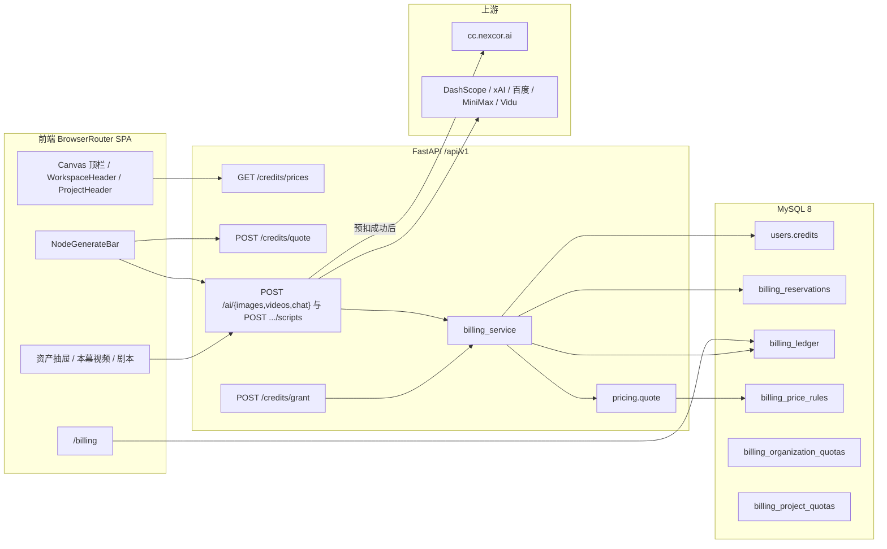
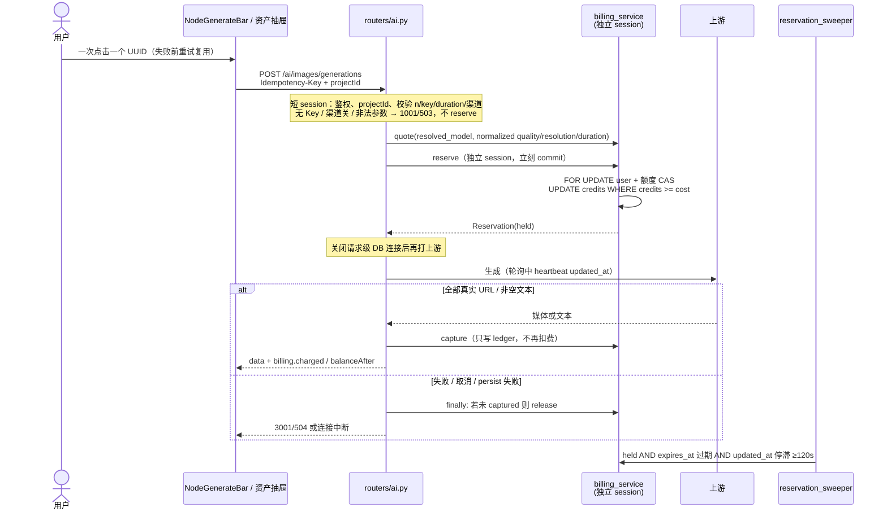
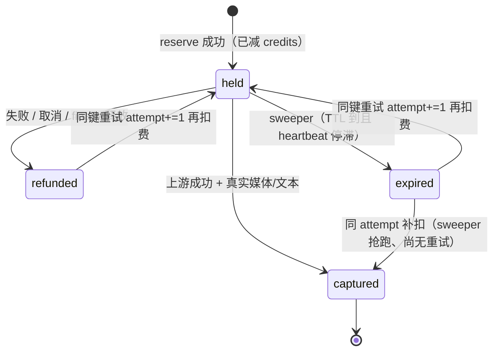
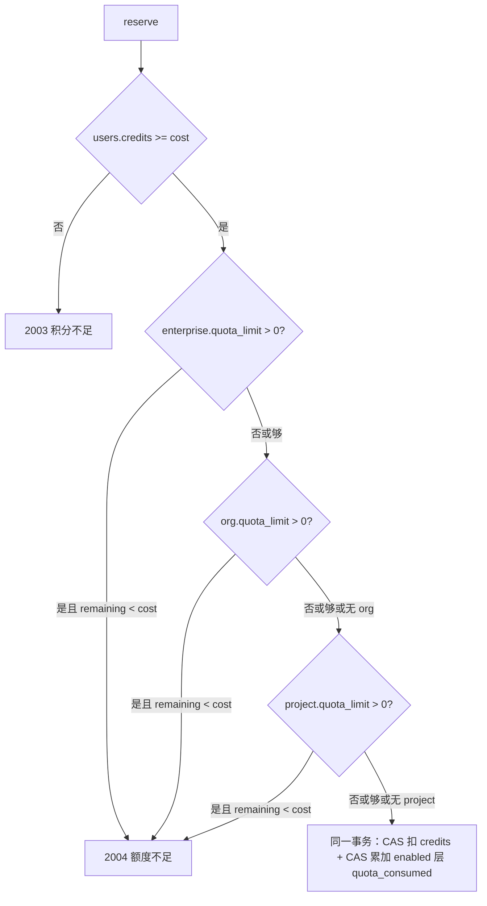
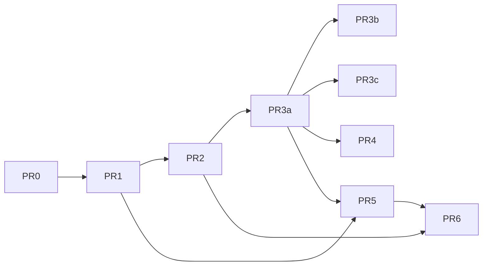

# MangaCanvas 积分系统设计

| 字段 | 值 |
|------|----|
| 作者 | MangaCanvas engineering |
| 日期 | 2026-09-20（r4，官网刊例换算 + 产品拍板） |
| 状态 | Draft |
| 代码基线 | `main` `af15214`（及此后本地工作树；计费相关文件无增量实现） |
| 范围 | FastAPI `/api/v1` + React 18 / Vite 5 / **BrowserRouter** SPA；生产 ECS `47.104.138.144:18999` + MySQL 8 |
| 前作 | `docs/billing-system-design.md`（2026-09-09，Approved）。本文是对照**当前代码**的重写，不是原文拷贝。钱包/预扣引擎仍未落地，工程骨架沿用前作；产品价目、生成入口、鉴权与错误码按 2026-09-20 现状更新。 |
| 非范围（v1） | Stripe / 支付宝 / 微信；Redis、Celery、消息队列；改 nexcor / 百度 / MiniMax / Vidu 网关本身；公开自助注册 |

---

## Overview

MangaCanvas 已经在为图像、视频、润色、剧本解析付上游账单，但产品侧积分是空转：`User.credits` 从不递减；`BillingLedger` 在调用上游**之前**写入 `entry_type="consume"` 且 **`amount=0`**；四级额度表只提供 GET/PUT。失败、超时、占位 SVG、渠道未开、启发式剧本拆解都会留下（或随请求回滚）无意义流水。价格页是月费营销壳，画布顶栏和 `NodeGenerateBar` 都不展示余额或估价。

本设计把积分做成**真实钱包**：按「解析后的 `model_id` + 计量单位」报价；调用上游**之前**用独立短事务预扣（reserve）；**仅在拿到真实媒体 / 非空文本 / 成功 LLM 剧本 JSON 后**入账 consume；失败、超时、占位图、客户端取消、进程崩溃则释放预扣。账本追加写；余额与额度用 `UPDATE ... WHERE remaining >= :cost` 防并发透支。组织 / 项目额度表已存在，v1 **有条件启用**（`quota_limit > 0` 才拦截）。v1 不接支付通道，充值只走超级管理员发放。

对照 09-09 稿的关键事实变化：

1. **计费实现仍为零**。仓库里没有 `billing_service.py` / `pricing.py` / `schema_migrate.py` / `BillingPriceRule` / `BillingReservation` / `BILLING_ENABLED`。`_record_usage` 仍在 `ai.py`；`scripts.py` 同样写 `amount=0`。
2. **生成入口变了**。画布主路径是选中 `imageConfig` / `videoConfig` 后的 `NodeGenerateBar`，不是节点卡片上的提交按钮。`ImageConfigNode` 已改成预览卡。资产库（角色 / 场景 / 物品）走 `assetGenerationStore` → `imageService`，**会真正打** `POST /ai/images/generations`。本幕视频走 `generateActVideo` → `happyhorse-1.1-r2v`。
3. **模型目录扩大**。图像增加 `gpt-image-2.5-flare` / `sunburst`；视频增加 `happyhorse-1.1-r2v`，以及代码已接入、默认关闭的 Seedance / MiniMax / Vidu。聊天可能落到 `qwen-plus` 或 `grok-4.5`（`xai_api_key`）。
4. **注册关闭**。`allow_registration` 默认 `False`；`POST /auth/register` 与飞书新用户创建都走 `require_open_registration()`。**但该函数误用错误码 `2003`**（V2 里 `2003` = 积分不足 / HTTP 402）。打开扣费前必须让出这个码。
5. **路由与入口**。前端是 `BrowserRouter`（`src/App.tsx`），不是 HashRouter。生产只听 **18999**（nginx `listen 18999`，不听 80）。媒体 URL 为同源相对路径 `/static/uploads/...`。

工程默认：`BILLING_ENABLED` **默认 False**。现有用户不静默改余额。超管 `grant` 可用之后再在 env 打开扣费。注册关闭期间不送体验包。

---

## Background & Motivation

### 产品与运行时（2026-09-20）

- 前端：React 18 + Vite 5 + TypeScript，`BrowserRouter` SPA（`src/App.tsx`）。旧 Hash 深链由 `LegacyHashRedirect` 兼容。
- 后端：FastAPI，前缀 `/api/v1`（`backend/app/main.py`），SQLAlchemy 2，JWT。启动时 `Base.metadata.create_all`，无 Alembic，无 lifespan。
- 生产：阿里云 ECS `http://47.104.138.144:18999/`。Nginx 只 listen **18999**（`scripts/nginx/mangacanvas.conf`），`proxy_pass` 到 `127.0.0.1:8088`，`proxy_read_timeout 600s`。静态媒体 `/static/uploads/` 同源反代。
- 数据库：生产 MySQL 8（`mysql+pymysql`，`pymysql==1.1.1`）；本地默认 SQLite。`create_engine` **未**设 `pool_pre_ping` / `pool_size`。
- 鉴权：邮箱密码登录现有用户；`allow_registration=False` 时 `POST /auth/register` 403。飞书 OAuth 只登录/绑定已有用户，新飞书身份不会自动建号（`oauth.upsert_feishu_user` → `require_open_registration()`）。
- 生成网关：nexcor OpenAI 兼容 `https://cc.nexcor.ai/v1`（`OPENAI_API_KEY` / `OPENAI_BASE_URL`）；可选 DashScope、xAI、百度 Seedance、MiniMax、Vidu。后三个渠道 `*_ENABLED` 默认 False，画布 `VIDEO_MODELS` 对应项 `enabled: false`，`/ai/models` 探测也不返回。密钥只在服务端 `backend/app/config.py`。

现有**会打上游、应扣积分**的入口：

| 模态 | 模型（解析后） | 后端 | 前端 |
|------|----------------|------|------|
| 图像 | `gpt-image-2`、`gpt-image-2.5-flare` / `sunburst`、`wan2.7-image` / `-pro`、`qwen-image-2.0` / `-pro`；有 DashScope key 时 `wan2.6-t2i` / `wan2.6-image` | `POST /ai/images/generations` → `openai_image_generate` / `dashscope_async` | **主路径**：`NodeGenerateBar` → `useNodeGenerateAction` → `useImageGeneration`。资产库：`CharacterCreator` / `SceneCreator` / `ObjectCreator` → `assetGenerationStore.start`；`CharacterForm` 另有 `generateAssetImage`。`ImageGenerationForm` 只收集参数，文案却写「每次生成会消耗相应积分」。`src/api/imageGenerationApi.ts` 仍导出同一 POST |
| 视频 | `happyhorse-1.1-t2v` / `i2v` / **`r2v`**；模板特效改写成 i2v prompt。渠道打开后：Seedance 2.0/2.5、`MiniMax-H3` / `H3-Max`、`viduq3-pro` / `turbo` | `POST /ai/videos/generations`。nexcor / 百度 / MiniMax 轮询最多 110×5s ≈ **550s** + persist 180s；DashScope `180×3s`；nginx 600s 会先掐客户端 | `NodeGenerateBar`（`videoConfig`）、`TemplateEffectNode`、`generateActVideo`（固定 `happyhorse-1.1-r2v` / 5s / 720P）、`videoService.generate` |
| 文本润色 | **现网**：`dashscope_chat` 在「有 openai key 且无 xAI key」时强制 `qwen-plus`；有 `xai_api_key` 时把 **body.model**（前端常发 `qwen-plus`）传进 `resolve_chat_endpoint(preferred_model)`，可能对 xAI 请求 `qwen-plus`。`TEXT_CATALOG` 只有 `qwen-plus`。**本设计改为**统一 `resolve_billed_chat_model()`：有 xAI key 则恒 `grok-4.5`（这是对 `dashscope_chat` 的行为变更，不是「与现网一致」） | `POST /ai/chat/completions` → `dashscope_chat` → `llm_complete` | `TextNode`、`useWorkflowOrchestrator.analyzeIntent`（都发 `model: 'qwen-plus'`） |
| 剧本解析 | 同上 chat 端点；`llm_complete` 超时 180s；失败则启发式、不视为 LLM 成功 | **`POST /api/v1/projects/{project_id}/scripts/parse`**（`routers/scripts.py` L106；前端 `src/features/project/api/scripts.ts` L102）。没有 `POST /projects/{id}/scripts`。persist 后写 `amount=0` 的 consume（含 heuristic） | `ScriptStudio` |

组织 → 项目 → 成员层级已落地（`organizations` / `projects` / `project_members`）。计费必须挂 `organization_id` + `project_id`，否则团队额度无法落地。`organization_id` **只信** `projects.organization_id`，不信客户端。

### 现状审计：计费仍是占位符

对照 09-09 稿逐项复核（`af15214`）：

| 09-09 断言 | 2026-09-20 实测 |
|------------|-----------------|
| `User.credits` 从不递减 | **仍成立**。`models.User.credits` INT 默认 0 |
| `_record_usage` amount=0，调用前写入 | **仍成立**（`ai.py` 图像 / 视频 / 聊天） |
| 额度表不扣 `quota_consumed` | **仍成立**。`billing.py` 仅 CRUD |
| 无 `BILLING_ENABLED` | **仍成立**。`config.py` 无该字段 |
| 无 `billing_reservations` / `billing_price_rules` | **仍成立**。`models.py` 停在 ledger + 四级 quota |
| 无 `billing_service` / `pricing` / lifespan sweeper | **仍成立**。`main.py` 模块 import 时 `create_all` + seed |
| `GET /credits` 内存分页 | **部分过时**：余额汇总已是 SQL `SUM`；**history 仍 `all()` 再 `paginate`** |
| 新建组织 `quota_limit=0` | **仍成立**（`orgs.py`） |
| 新建项目 `quota_limit=100000` | **仍成立**（`projects.py` L116） |
| Header 不展示积分 | **仍成立**。`ProjectHeader` 左侧甚至留了 `w-48` spacer 注释「for balance」，但未实现 |
| 画布不挂 `WorkspaceHeader` | **仍成立**。真实壳是 `Canvas.tsx` 自有顶栏（返回、工作流、API 设置、清空） |
| HashRouter | **过时**。现为 `BrowserRouter` |
| 图像主路径 `ImageConfigNode` 提交 | **过时**。主路径是 `NodeGenerateBar`；节点是预览卡 |
| Character/Object 保存不调 AI | **过时**。`assetGenerationStore` / `generateAssetImage` **会调** `imageService.generate` |
| Seedance 未进 v1 报价 | **必须改**：代码与 `docs/ai-providers.md` 已接入，只是默认关闭。打开 `BILLING_ENABLED` 前价目必须覆盖，否则一开渠道就 1001 或白嫖 |
| 生产端口未强调 | nginx **只听 18999** |

**钱包**（`backend/app/models.py` `User.credits`）：

- Seed：`superadmin` 10000，陈晓明 4000，林夏 1200，周衡 800（`backend/app/seed.py`）。对应 `entry_type="earn"` 流水。
- 注册 / 飞书新建：`credits=0`。注册当前关闭，这条路径生产上基本走不到。
- 登录 / `/auth/me` 通过 `serialize.user_public` 返回 `credits`，前端写入 `session.user.credits`，工作台 **不展示、不刷新**。

**流水** `billing_ledger`（字段保持，不要改名）：

```282:295:MangaCanvas/backend/app/models.py
class BillingLedger(Base):
    __tablename__ = "billing_ledger"
    id: Mapped[int] = mapped_column(Integer, primary_key=True, autoincrement=True)
    organization_id: Mapped[int | None] = mapped_column(Integer, nullable=True)
    project_id: Mapped[int | None] = mapped_column(Integer, nullable=True)
    user_id: Mapped[int] = mapped_column(Integer)
    entry_type: Mapped[str] = mapped_column(String(16))
    amount: Mapped[int] = mapped_column(Integer)
    balance_after: Mapped[int | None] = mapped_column(Integer, nullable=True)
    description: Mapped[str | None] = mapped_column(String(256), nullable=True)
    reference_type: Mapped[str | None] = mapped_column(String(32), nullable=True)
    reference_id: Mapped[str | None] = mapped_column(String(64), nullable=True)
    extra_metadata: Mapped[dict | None] = mapped_column("metadata", JSON, nullable=True)
    created_at: Mapped[datetime] = mapped_column(DateTime(timezone=True), default=now)
```

`BACKEND_API_SPEC_V2.md` §19.7：`entryType` = `consume | purchase | refund | allocate | adjust | earn`。v1 **不把 `hold` 暴露给对外 API**。

**占位扣费**（问题核心，未变）：

```37:47:MangaCanvas/backend/app/routers/ai.py
def _record_usage(db: Session, user: models.User, description: str, reference_type: str) -> None:
    db.add(
        models.BillingLedger(
            user_id=user.id,
            entry_type="consume",
            amount=0,
            balance_after=user.credits,
            description=(description or "")[:200],
            reference_type=reference_type,
        )
    )
```

图像 / 视频 / 聊天在打网关**之前**调用。`scripts.py` 剧本解析成功落库后同样写 `amount=0`、`reference_type="script_parse"`（启发式拆解也会写）。`get_db()` 成功才 commit、异常 rollback：

```25:34:MangaCanvas/backend/app/db.py
def get_db():
    db = SessionLocal()
    try:
        yield db
        db.commit()
    except Exception:
        db.rollback()
        raise
    finally:
        db.close()
```

后果：

1. **从不减 `users.credits`**。
2. 成功时流水 `amount=0`；`GET /credits/history` 与 `GET /ai/bills` 金额全是 0。
3. `ApiError` 会 rollback 整请求。不能在同一 session 里「先预扣、except 里退款再 raise」——raise 会把退款一起滚掉。这是必须拆**独立计费 session** 的直接原因。
4. 无 API Key 时图像返回本地 SVG 占位（`persist_placeholder`，文件名 `gen_{ms}_{hex}.svg`，SVG 内含 `generated placeholder` 文本）；聊天返回本地拼句。仍可能留下 amount=0 的 consume。
5. 流水没有可靠的 `project_id` / `organization_id`（生成 API 不收 `projectId`）。
6. **错误码冲突**：`security.require_open_registration` 使用 `fail(2003, "暂不开放注册", 403)`。V2 规定 `2003` = 积分不足、HTTP **402**。前端一旦按 2003 提示「积分不足」，关注册会被误诊。

**额度表已建、从未消费**：

| 表 | 写入时机 | 生成时 |
|----|----------|--------|
| `billing_enterprise_quota` id=1 | seed，`quota_limit=1_000_000` | 不碰 `quota_consumed` |
| `billing_organization_quotas` | 建组织 **`quota_limit=0`** | 不碰 |
| `billing_project_quotas` | 新建项目 **`quota_limit=100000`**；seed 项目 `300000 / consumed=12000`（与流水无关的假数据） | 不碰 |
| `billing_user_project_quotas` | GET 时懒创建 | 不碰 |

`GET /billing/organizations/{id}/quota` **没有** `require_org_member`。

**前端（消费面）**：

- `src/pages/Pricing.tsx`：免费 / 专业 / 企业月费，文案含支付宝/微信，无积分。
- 无限画布遗留 `Layout.tsx` 有 `{ path: '/billing', label: '账单' }`，但 `App.tsx` **没有** `/billing` 路由；该 Layout **不是**真实画布壳。
- 真实生成：`src/features/infinite-canvas/Canvas.tsx` + `NodeGenerateBar.tsx`。模型/比例/时长在 `generateParams.ts`（`getSizeRatio` / `applyImageRatio` / `VIDEO_SIZE_MAP`）和 `NodeGenerateBar` 里改，提交走 `useNodeGenerateAction`（图像 `n` 固定 1）。
- `WorkspaceHeader` / `ProjectHeader` / `UserProfileMenu` 不显示余额。`UserProfileMenu` 「我的主页」仍是 `notify.info("个人中心开发中")`。
- `session.user.credits` 只在登录时写一次。无 `creditsApi`。
- `src/api/core/error.ts` 的 `HttpError.code` 是 axios `ERR_*`，**不是**后端 JSON `code`（2003/2004/1005）。`appClient` timeout 600000，**无**自动重试拦截器。

### 痛点（量化）

- 单次视频上游成本发生在 1–10 分钟轮询窗口，产品侧 0 积分。并发两个 800 积分用户各打 10 次 1080P HappyHorse，网关照付、钱包不变。
- Seed 全站积分 10000+4000+1200+800 = **16000**。按下文官网换算，一张 `gpt-image-2` medium ≈ **39**，一条 5s HappyHorse 720p 占位 **600**。16000 大约是 410 张中档图，或 26 条 5s 720p 视频——这是「看起来很多、实际没人花」的虚假充裕。
- 历史 `amount=0` 的 consume 会污染账单列表。当前 `totalUsed` 按 `amount < 0` 汇总，0 还不进 used；一旦开始写负数，新旧口径必须分开（账单 UI 过滤 0）。
- 打开 `BAIDU_ENABLED` / `MINIMAX_ENABLED` / `VIDU_ENABLED` 而不先有价目，会变成无报价白嫖或 1001 锁死。

---

## Goals & Non-Goals

### Goals（v1）

1. **成功才收费**：真实图片 URL / 视频 URL / 非空 chat content / 剧本 LLM JSON 才 `consume`。失败、超时、模型不可用、本地 placeholder、无 Key 兜底、启发式剧本拆解 **不扣费**（已预扣则释放）。
2. **价目表覆盖当前目录**：`model_probe.IMAGE_CATALOG` + `VIDEO_CATALOG` + 解析后的 chat 模型（`qwen-plus` / `grok-4.5`）+ `script_parse`。整数积分，服务端为唯一真相。渠道关闭时 **先 503、不 reserve**。
3. **先检查再打网关**：余额不足或（可选）额度用尽时返回 `2003` / `2004`，HTTP 402，**不调用**上游。
4. **原子预扣**：独立短事务内递减 `users.credits` + 写 `billing_reservations`；`UPDATE ... WHERE credits >= cost`，禁止并发打成负数。
5. **UI 出现在真实消费面**：`NodeGenerateBar` **和 `TemplateEffectNode`** 显示预估积分；`Canvas.tsx` 顶栏、`WorkspaceHeader`、`ProjectHeader`、`UserProfileMenu` 显示可用余额；资产创建抽屉的生成按钮显示估价；`/billing` 账单列表显示真实金额。
6. **超管发放积分**；组织 / 项目 / 企业额度 **可选启用**（`quota_limit > 0`；`quota_percent` v1 忽略）。
7. **幂等**：同一用户同一 `Idempotency-Key`：成功重放、进行中等待、失败后同键可再试；body 变更换 1006。
8. 密钥与成本策略只在服务端；浏览器最多拿**公开价目**。
9. 在现有 ECS + MySQL 8 上分 PR 上线，不引入 Redis / Stripe / 新进程模型。
10. **让出错误码 2003**：注册关闭改用 `1003` + HTTP 403，避免与积分不足冲突。

### Non-Goals（v1）

- 法币支付、发票、税务、订阅（`Pricing.tsx` 改成积分说明，不接通道）。
- 把生成改成异步任务队列 / WebSocket 进度（保持现有同步 HTTP + 轮询）。
- 按真实 token 向 nexcor / xAI 对账（chat / 剧本按次；上游 usage 只进 metadata 备查）。
- 删除或重命名已有四张额度表。
- 强制启用「员工 × 项目」额度（表保留，v1 不拦截）。
- 用 `quota_percent` 从企业额度推导项目预算（v1 只认硬 `quota_limit`）。
- 清理所有历史 `amount=0` 流水（可忽略；不作为正确性前置）。
- 热更新 feature flag（pydantic Settings 读 env，改完必须 `systemctl restart`）。
- 开放公开注册或飞书自动建号。
- 按像素面积 / 参考图张数加价（r2v 与 i2v 用同一秒×分辨率价；参考图张数只影响能否生成）。

---

## Key Decisions

| # | 决策 | 选择 | 理由 |
|---|------|------|------|
| D1 | 扣费时点 | **Reserve-then-capture**：调用上游前预扣，成功后写 consume；失败释放预扣 | 「成功才收费」且挡住并发透支。成功后再 `UPDATE WHERE credits >= cost` 会让第二路已经打完的网关变成坏账（见 Alternatives A） |
| D2 | 账本形态 | 预扣走新表 `billing_reservations`；`billing_ledger` **仅在 capture 时写 consume**，失败预扣**不写** consume/refund | 保持 V2 `entryType`；用户账单不被「预扣+退款」刷屏；`totalUsed` 只含成功消费 |
| D3 | Session | 计费用独立 `SessionLocal()` 立刻 commit。长调用（生成 / 剧本 LLM）**禁止** `Depends(current_user)` / `Depends(get_db)` 跨过上游等待。新增 **`current_user_detached()`**。剧本 **文档 persist** 另开短 `SessionLocal`，立刻 commit 后关闭；**不得**把 `get_db` 活过 `llm_complete` 的 180s。**不得**在 handler 里对 `get_db` 产出的 session 调 `.close()` | FastAPI 把 `get_db` 绑到整个请求；跨 LLM 持有连接会占满 pool；handler 里 `db.close()` 会让事后 `commit()` 打在已关闭 session 上 |
| D4 | 额度 | 保留四张表；v1 CAS 只拦 `quota_limit > 0`。**`quota_percent` 忽略**。**所有默认/懒创建路径写成 0**：模型列默认、`billing.py` GET 懒创建、`projects.py` insert。另做存量 `UPDATE ... WHERE quota_limit=100000 AND quota_consumed=0`。打开 `BILLING_ENFORCE_QUOTAS` 前 **preflight 列出所有 `quota_limit > 0` 行**（不只 `=100000`）。seed 演示项目 `300000/12000` 是生产上**唯一有意开启的项目层帽** | 只改 `projects.py` insert 挡不住 model default 与 GET 懒创建；org GET 今日会按 `BillingOrganizationQuota.quota_limit` 默认 `1_000_000` 造出活帽 |
| D5 | 计价 | 新表 `billing_price_rules` + **`seed_price_rules()` 只 insert-if-missing**。seed 数字来自 **官网刊例换算**（1 积分=¥0.01）。超管 PUT 才改价（发票校准）。匹配前同一套 normalize；**按解析后参数收费**。`reserve` 现读 DB。关闭渠道也要有价目行 | startup 覆盖会打回刊例；缺价目则一开渠道无法扣费 |
| D6 | Chat / 剧本 | 新增 **`resolve_billed_chat_model()`**，供 `dashscope_chat`、`llm_complete`、`quote`、`reserve` **共用**。有 `xai_api_key` → 恒 `grok-4.5`（**改现网**）。否则恒 `qwen-plus`。Chat / 剧本按次，但 **单价按官网 token 刊例 × 典型用量 ceil**（润色短请求 vs `MAX_LLM_CHARS` 剧本）。启发式 **不 reserve** | 否则报价模型与上游不一致。v1 仍不按真实 usage 对账 |
| D7 | 占位图 / 本地兜底 | 付费路径 **删除** `_persist_or_placeholder`。persist 失败 = 生成失败。占位只认 `PLACEHOLDER_SVG` 中的 `generated placeholder` 或 `gen_*_placeholder.svg`。**不认任意 `.svg`**。nexcor 图像：`n` 张必须全部真实，否则整单 `release`（预扣金额 = 成功 capture 金额，不做部分退款）。DashScope/Wan 今日只返回 1 URL：`n!=1` → 1001。`n` 范围 1–4 | 任意 `.svg` 会误伤真实 SVG；Wan 收 quoted n 却只给 1 张违反 Goal 1 |
| D8 | 支付 / 获客 | **v1 不做 Stripe**；超管 `POST /credits/grant` / `adjust`。注册 / 飞书建号 **永不送欢迎包**（即使将来 `ALLOW_REGISTRATION=1`，新用户仍 `credits=0`） | 产品拍板 2026-09-20：获客只走超管发放 |
| D9 | 幂等键 | 唯一仍是 `(user_id, idempotency_key)` 一行。行上 **`attempt` INT**，每次从 refunded/expired 再扣费 `attempt+=1`。`capture` / `release` / `heartbeat` CAS **`(id, attempt)`**。全路径锁顺序 **user → enterprise → org → project → reservation**。retry `UPDATE` 必须 `rowcount==1`，否则 rollback 再读 | 同键重试与 sweeper 会和首次 reserve 形成 AB-BA 死锁；无 rowcount 会扣费却不占行 |
| D10 | 生成 API | 保持现路径：`/ai/images/generations`、`/ai/videos/generations`、`/ai/chat/completions`、**`POST /api/v1/projects/{project_id}/scripts/parse`**。扩展 `projectId` + 响应 `data.billing`。不发明 `/ai/generate` | 以现网为准；剧本没有 `POST /projects/{id}/scripts` |
| D11 | 错误码 | `2003`/`2004` HTTP 402（V2）。**1005 保持 V2「资源冲突」**（`projects.py` / `orgs.py` / `catalog.py` / `workflows.py` 已用）。生成/剧本进行中也用 1005，**message=`生成进行中`**；客户端按 **路径 + 1005** 决定是否同 UUID 重试，禁止全局拦截器把所有 1005 当生成重试。**1006** 键/body 不匹配（v1 新增）。`ApiError` 增加可选 `headers`（`Retry-After: 5`）。`3001` HTTP 以现网为准。注册关闭 **2003→1003 / 403** | 把 1005 改成「仅生成进行中」会破坏片段编号冲突等现网语义 |
| D12 | Schema | 无 Alembic；`create_all` + `schema_migrate.py` **按方言**建索引/CHECK。MySQL 8 **没有** `CREATE INDEX IF NOT EXISTS` | 生产 `mysql+pymysql`，本地 SQLite；migrate 必须能跑两次 |
| D13 | 钱包变动点 | `users.credits` 在 `reserve`、retry/`attempt+=1`、`release`、sweeper expire、`grant`/`adjust` 改变。**held→captured 不再扣**。仅当 **同 attempt** 的 expired/refunded 补扣时 capture 才再跑 credits+额度 CAS（失败则 uncollected、回滚） | 否则成功路径双扣；补扣漏额度会让熔断变松 |
| D14 | 取消与 finally | handler 用 `captured` 标志 + `finally: if reservation and not captured: release()`。覆盖 `CancelledError`（`BaseException`）。**先校验再 reserve**（无 Key、渠道禁用、非法 n/duration 不得预扣） | `except Exception` 漏掉 nginx abort；`capture` 后 `ok()` 抛错会误 release |
| D15 | Sweeper vs 在飞任务 | TTL 图像 ≥12 min、视频 ≥20 min、chat 3 min、剧本 5 min。heartbeat 带 **attempt**。**图像/聊天/剧本在整个上游期间每 60s heartbeat 一次**（不是「开始一次、超过 60s 再 bump 一次」）。视频每次 poll。Sweeper 只过期停滞 held | 图像最坏约 360s；若只 bump 一次，活任务可能被 sweeper 当成死任务 |
| D16 | 打开扣费 | `billing_enabled` 默认 False。另加 **`allow_placeholder` 默认 False**。`allow_placeholder=True` 且未开扣费时才保留今日 SVG/拼句。第一次上生产必须 flag 关闭 | flag 关着也会改生成语义（n 上限、persist 失败、无 Key 503）；本地 demo 需要显式开关 |
| D17 | 重放载荷 | 图像/视频：`response_payload` 只存媒体 URL（禁止嵌 `billing`）。**剧本**：存 `{ "scriptId": int, "document": serialize.script_document(..., include_text=True) }`，同样禁止嵌 `billing`。重放：图像/视频用 payload 组 `data`；剧本 **先按 scriptId 短 session 重载**，文档已删则退回 payload.document。`capture()` 返回 `{uncollected, charged, attempt_matched, replayed}`。前端只赋 `balanceAfter` | mismatch 会把 B 的扣费显示成 A 的；只存 scriptId 无法在文档被删时组 200 |
| D18 | 视频 duration / HappyHorse 分辨率 | 产品 duration **`{5, 10, 15}`**，否则 1001；禁止 HappyHorse `else: 5` 参与报价。HappyHorse **计费档**信任 body `resolution`（`NodeGenerateBar` 发 `720P`/`1080P`），**lookup/seed 的 key 一律 `canon_resolution()` → `720p`/`1080p`**。`openai_video_size` 只决定上游 size。缺省 resolution 时从 size 推断 1080 档（含 `1440`） | `VIDEO_SIZE_MAP` 1080P 1:1 是 `1440*1440`；seed `720P` 对 lookup `720p` 会 1001 |
| D19 | 画布 UI | 估价与 disable：**`NodeGenerateBar`**（imageConfig/videoConfig）**以及 `TemplateEffectNode`**（它自己调 `useVideoGeneration`，不走 bar；`isGenerateNodeType` 不含它）。`EffectConfigNode` 不生成，不估价。`Canvas.tsx` 顶栏余额。资产抽屉生成按钮同样估价 | 漏掉 TemplateEffectNode 等于 09-09 漏 ImageConfigNode |
| D20 | 剧本解析 | 路径 **`POST /api/v1/projects/{project_id}/scripts/parse`**。`unit=script_parse`。无 chat 端点 → heuristic，**不 reserve**。有端点 → **先 reserve**。`reserve` 返回 `captured` → **禁止**再调 `llm_complete` / 再 insert 文档，按 D17 重放。`held` 且同 hash 由 `reserve` 抛 1005（与图像相同）。首次 held 才 `llm_complete`。JSON 非法则 `release` + 短 session persist heuristic。JSON 合法则短 session persist 成功后再 `capture` | 否则 504 后同键会二次打 LLM 并复制 ScriptDocument |
| D21 | `n` vs 实扣 | v1 前端全部按 **n=1** 调用。`ImageGenerationForm` quantity 1–5 **未接入请求**，PR5 **隐藏该控件**，接线前禁止按 quantity 估价。后端：quote/reserve/capture 成功时金额相同 = `n * unit_price`。nexcor `n>1` 必须全部 persist，否则整单释放。Wan/DashScope `n!=1` → 1001 | 部分成功按实扣张数退差额会让 capture 再改钱包，v1 不值得；拒绝 Wan 的 n>1 更干净 |
| D22 | `request_hash` | UTF-8 JSON、键递归排序、**不排序数组**（首帧顺序有语义）。排除 `Idempotency-Key` / `clientRequestId`。缺省字段与 `quote_request` 相同（`n` 默认 1、视频 `duration` 默认 5）。哈希输入是 **raw body + 这些默认**，不是 resolved model（resolved 进 reservation.quote）。PR2 带 golden-vector 测试 | 键序/默认 n 不一致会导致合法重试 1006 |
| D23 | `ApiError` 头 | `ApiError` / `fail()` / `api_error_handler` 增加可选 `headers: dict[str, str]`。进行中：`fail(1005, "生成进行中", 409, headers={"Retry-After": "5"})` | 现网 `fail()` 不能挂响应头；只写文档会让实现漏掉 `Retry-After` |

---

## 产品规则

### 积分是什么

- 1 积分 = 平台内部计价单位，**不能兑人民币**。v1 刊例换算规则：**1 积分 = ¥0.01**（见下节 FX）。
- 钱包主体是 **用户**（`users.credits`）。项目额度是可选熔断，不是第二套余额。
- 可花余额 = `users.credits`（预扣后立即变少）。冻结中金额 `frozenCredits` 只展示，不能花。
- 硬不变量：`users.credits == SUM(billing_ledger.amount) - SUM(held reservation.amount)`。

### 获取（Earn / Grant）

| 方式 | `entry_type` | 谁能做 | v1 是否做 |
|------|----------------|--------|-----------|
| Seed 开户 / 入职发放 | `earn` | `seed.py`，只跑一次 | 已存在，**不再改余额** |
| 超管发放 | `allocate` | `role.code == "super_admin"`，`POST /credits/grant` | **主路径** |
| 超管有符号调整 | `adjust` | 同上，`POST /credits/adjust`；扣减不得把余额打到 0 以下 | 纠错 / 补偿 uncollected |
| 欢迎包 | `earn` | 注册 / 飞书建号 | **永不做**（注册重开后新用户仍 0；实现禁止静默写入） |
| 自助购买 | `purchase` | — | **不做**，枚举预留 |
| 邀请 / 签到 | `earn` | — | 不做 |

发放规则：

- `grant.amount` 整数，范围 `1 ..= 1_000_000`。
- 必须写 ledger，禁止直接 `UPDATE users SET credits`。
- UI：超管在 `/billing` Dialog 用邮箱走 **`GET /credits/users?email=`**（仅 `super_admin`）得到 `userId` 再 grant。**不要**复用现网 `GET /users?email=`（`users.py` L13–25：任何登录用户都能读到别人的 `credits`）。PR6 一并把 `GET /users?email=` 限为 `super_admin`，或停止对非超管返回 `credits`。
- 飞书登录已有用户 **不**加积分。新注册 / 将来开放注册的账号 **credits=0**，无欢迎包。

### 消耗（Spend）

只对下面「成功」定义收费。估价与实扣必须同一套 normalize。

| 动作 | 成功 | 单位 | 失败（不扣 / 释放） |
|------|------|------|---------------------|
| 文生图 / 图生图 | 恰好 `n` 个真实 URL（nexcor）；Wan/DashScope 仅允许 n=1 | `image` × n | persist 失败、空 data、无 Key（reserve 前 503）、取消、Wan/DashScope `n!=1`、nexcor 部分成功 |
| 文生视频 / 图生视频 / r2v / 特效模板 / 本幕视频 | `persist_remote_url` 得到真实视频 | `video_second` × 解析后 duration | 提交失败、轮询 failed、超时、无 URL、渠道 503、取消 |
| 文本润色 / 工作流意图分析 | 上游非空 `content` | `chat_request` × 1 | 4xx/5xx；无 Key **reserve 前 503**（禁止本地拼句当成功） |
| 剧本解析 | LLM 返回可解析 JSON（非 heuristic） | `script_parse` × 1 | 无端点走规则拆解、JSON 非法而 fallback、超时 |

**不收费**：

- 保存角色 / 场景 / 物品 **元数据**（不点生成）。
- 上传参考图、`POST /ai/persist-media`（只是转存已有 URL）。
- 画布清空、导出工作流、切换项目、飞书登录。
- `/ai/models` 探测（`docs/ai-providers.md` 已禁止用 POST 探测，因其会真实建任务）。
- 启发式剧本拆解。

**`n`（v1）**：

- 现网调用全部是 **n=1**：`useNodeGenerateAction`、`assetGenerationStore.start`、`generateAssetImage({ n: 1 })`。
- `CharacterForm` 把 `quantityOptions={[1,2,3,4,5]}` 传给 `ImageGenerationForm`，**quantity 不进入 generate 请求**。PR5 **隐藏生成数量**（或文案「当前固定生成 1 张」），在真正接线之前 **禁止按 `generationConfig.quantity` 估价**。
- 后端请求 `n` 默认 1，范围 1–4（5 → 1001，即使 UI 曾展示 5）。
- **quote / reserve / 成功 capture** 金额相同 = `n * unit_price`。nexcor `n>1`：必须全部 persist，否则整单 `release`（v1 **不做**部分退款）。
- DashScope/Wan 分支今日 `extract_media_url` 只取 1 张：`n!=1` 在 reserve 前 **1001**「该模型暂不支持 n>1」。

### v1 刊例：官网公开价 → 整数积分

产品拍板（2026-09-20）：**全部看官网价格**。seed / quote / reserve 用下表；超管 PUT 可在看到 nexcor / 百度发票后覆盖。**禁止**再写无出处的 8/12/20 锚价。

#### FX 与取整

| 项 | 规则 |
|----|------|
| 积分面值 | **1 积分 = ¥0.01**（人民币 1 分）。用户不能兑法币，只用于内部钱包。 |
| 美元刊例 | **USD × 7.20 = CNY**（目录快照 2026-09-20 运营汇率，不是实时中间价）。再 `/ 0.01` 得积分。即 **1 USD = 720 积分**。 |
| 取整 | **一律向上取整**（`ceil`），避免低于刊例。最低 1 积分。 |
| 无公开价 | 行标 **`needs invoice`**，给保守占位（偏高），首张发票后 PUT。 |
| 网关加价 | OpenAI / 火山刊例是**厂商**价；现网经 nexcor / 百度网关。行上注明；发票高于刊例时 PUT 上调。 |

#### 图像（`unit=image`，credits / 张）

| model_id | quality | 刊例 | credits | 出处 |
|----------|---------|------|---------|------|
| `gpt-image-2` | low | $0.006 / 张（1024²） | **5** | [OpenAI image generation 计算器](https://developers.openai.com/api/docs/guides/image-generation.md) 2026-09 |
| `gpt-image-2` | medium | $0.053 | **39** | 同上 |
| `gpt-image-2` | high | $0.211 | **152** | 同上 |
| `gpt-image-2.5-flare` | low / medium / high | token 单价与 2.0 相同（图输出 $30/1M） | **5 / 39 / 152** | [OpenAI Pricing](https://developers.openai.com/api/docs/pricing)：Flare/Sunburst 与 gpt-image-2 同档 token 价。**2.5 每张 token 数官方计算器未覆盖**，v1 暂用 2.0 1024² 估算 |
| `gpt-image-2.5-sunburst` | low / medium / high | 同上 | **5 / 39 / 152** | 同上 |
| `wan2.7-image` | `""` | ¥0.20 / 张 | **20** | 阿里云百炼中国内地（[模型计费](https://help.aliyun.com/zh/model-studio/models) / 开发者社区转载刊例） |
| `wan2.7-image-pro` | `""` | ¥0.50 / 张 | **50** | 同上 |
| `qwen-image-2.0` | `""` | ¥0.20 / 张 | **20** | 同上 |
| `qwen-image-2.0-pro` | `""` | ¥0.50 / 张 | **50** | 同上 |
| `wan2.6-t2i` / `wan2.6-image` | `""` | ¥0.20 / 张 | **20** | 同上 |

nexcor 转售 GPT Image：**刊例按 OpenAI**；若 nexcor 账单更高，标 needs-invoice 并由超管 PUT。Wan/Qwen **不要**为 `standard` 单独建行。GPT 必须有 low/medium/high 三行。画布比例不加价（v1 用 1024² 官方档，与现网默认 size 一致）。

#### 视频（`unit=video_second`，credits / 秒）

| model_id | resolution | 刊例 | credits / 秒 | 5s | 出处 |
|----------|------------|------|--------------|----|------|
| `happyhorse-1.1-t2v` / `i2v` / `r2v` | `720p` | 无公开网关价 | **120** | 600 | **needs invoice**。nexcor / 百炼未公布 HappyHorse 1.1 秒价。保守占位：高于 MiniMax-H3 768P（50）与 Vidu Q3 Pro 720p（63） |
| 同上 | `1080p` | 无公开网关价 | **200** | 1000 | **needs invoice**。保守占位：高于 MiniMax-H3 2K（80）与 Vidu Q3 Pro 1080p（75） |
| `doubao-seedance-2-0-260128` | `720p` | ≈¥0.994 / 秒 | **100** | 500 | 火山方舟 token 刊例（无视频输入 720P **46 元/百万 tokens**）+ 5s 参考用量 ≈10.9 万 tokens（[资源包规则](https://www.volcengine.com/docs/82379/2191775)）。走百度网关时账单可能不同 |
| 同上 | `1080p` | ≈¥2.478 / 秒 | **248** | 1240 | 无视频输入 1080P **51 元/百万 tokens**；5s ≈24.5 万 tokens |
| `doubao-seedance-2-0-fast-260128` | `720p` | ≈¥0.80 / 秒 | **80** | 400 | 火山 5s 参考 ¥4.00（720p 无视频输入） |
| `doubao-seedance-2-0-mini-260615` | `720p` | ≈¥0.50 / 秒 | **50** | 250 | 火山 5s 参考 ¥2.50 |
| `doubao-seedance-2-5-260628` | `720p` | ≈¥1.525 / 秒 | **153** | 765 | 无视频输入 720P **70 元/百万 tokens** × ~10.9 万 / 5s |
| 同上 | `1080p` | ≈¥3.773 / 秒 | **378** | 1890 | 无视频输入 1080P **77 元/百万 tokens** × ~24.5 万 / 5s |
| `MiniMax-H3` | `768p` | ¥0.50 / 秒 | **50** | 250 | [MiniMax 开放平台按量计费](https://platform.minimax.cn/docs/guides/pricing-paygo) |
| `MiniMax-H3` | `2k` | ¥0.80 / 秒 | **80** | 400 | 同上 |
| `MiniMax-H3-Max` | `768p` | ¥0.50 / 秒 | **50** | 250 | 同上（画布 1080 请求解析为 768P） |
| `viduq3-pro` | `720p` | 20 Vidu积分/秒 × ¥0.03125 | **63** | 315 | [Vidu 开放平台定价](https://platform.vidu.cn/docs/pricing.md)；非错峰 |
| `viduq3-pro` | `1080p` | 24 × ¥0.03125 = ¥0.75 / 秒 | **75** | 375 | 同上 |
| `viduq3-turbo` | `720p` | 12 × ¥0.03125 = ¥0.375 / 秒 | **38** | 190 | 同上 |
| `viduq3-turbo` | `1080p` | 13 × ¥0.03125 = ¥0.40625 / 秒 | **41** | 205 | 同上 |

Seedance 官方是 **token 计费**；v1 产品单位仍是 `video_second`，上表用「刊例 × 公开 5s token 估算 / 时长」折成秒价。真实 token 以发票为准，偏差大则 PUT。

**存储与查找的唯一 canonical 形式**：`720p` / `1080p` / `768p` / `2k`。分辨率计费模型禁止空 `resolution` 行。模板特效 / `kf2v` 按 `happyhorse-1.1-i2v`；多参考图按 `r2v`。

#### 文本（按次，刊例 × 典型用量）

v1 仍不按真实 usage 对账（Non-Goal）。按次单价 = ceil(官网 token 价 × 下表用量)。

| model_id | unit | 典型用量 | 刊例成本 | credits | 出处 |
|----------|------|----------|----------|---------|------|
| `qwen-plus` | `chat_request` | 500 in + 200 out | ¥0.0008（≤128K：入 0.8 / 出 2 元每百万） | **1** | [百炼模型价格](https://help.aliyun.com/zh/model-studio/model-pricing) `qwen-plus` |
| `grok-4.5` | `chat_request` | 500 in + 200 out | $0.0022 → ¥0.0158 | **2** | [xAI grok-4.5](https://x.ai/docs/developers/models/grok-4.5) $2 / $6 per 1M |
| `qwen-plus` | `script_parse` | 30k in + 8k out（`MAX_LLM_CHARS=40_000` 量级） | ¥0.040 | **4** | 同上刊例 |
| `grok-4.5` | `script_parse` | 30k in + 8k out | $0.108 → ¥0.778 | **78** | 同上 |

启发式剧本 **0**。有 xAI key 时剧本走 grok 行（78），否则 qwen 行（4）。

### 用户可见文案

- 余额：「N 积分」。不足：「积分不足，请联系管理员发放」。
- 额度不足：「当前项目/组织额度已用完」（`message` 带来源层）。
- 进行中：「生成进行中，请稍候」+ 尊重 `Retry-After`。
- uncollected：toast「本单未扣积分，请联系管理员核对」，**不改本地减法**。v1 没有工单/飞书通知通道，只有 stdout `event=billing.capture_uncollected`。
- `ImageGenerationForm`：隐藏 quantity；仅生成按钮显示估价；「保存」不得写消耗积分。
- `Pricing.tsx`：改为「积分由工作室管理员发放；生成按模型扣积分」，去掉支付宝/微信/月费 CTA。

### UI 表面

| 表面 | 展示 | 行为 |
|------|------|------|
| `Canvas.tsx` 顶栏（API 设置左侧） | 可用余额；点击进 `/billing` | 挂载 `GET /credits`；生成成功赋 `billing.balanceAfter` |
| `NodeGenerateBar` 发送按钮 | 「生成 · N 积分」；不足 disable | 模型/时长/分辨率变化时 `POST /credits/quote` |
| `TemplateEffectNode` 生成 | 「特效 · N 积分」（i2v × 默认 5s × 节点所选 resolution，缺省 720p **needs-invoice 占位 600**） | 该节点 **自己**调 `useVideoGeneration`，bar 覆盖不到。Idempotency-Key、`projectId`、2003 disable。`EffectConfigNode` 不生成、不估价 |
| `WorkspaceHeader` / `ProjectHeader`（已有 w-48 spacer） | 余额徽章 | 同 Canvas |
| `UserProfileMenu` | 余额一行；「积分明细」进 `/billing` | 替换「个人中心开发中」中与积分相关的空位，不借机做整个个人主页 |
| `CharacterCreator` / `SceneCreator` / `ObjectCreator` 底部生成 | 估价（v1 按 n=1）；不足 disable | `projectId` 用当前项目 |
| 本幕视频按钮 | 固定展示 r2v 5s 720p 估价（**600**，needs invoice 占位） | `generateActVideo` 带 Idempotency-Key |
| `TextNode` 润色 | 小字估价 | chat quote |
| `ScriptStudio` 解析 | 「解析 · N 积分」（quote：qwen 4 / grok 78） | 无 chat 端点则显示「本地规则拆解，不扣积分」 |
| `/billing` | 余额、冻结、流水、超管发放 | 过滤 `amount==0` |
| `/pricing` | 公开价目说明 + 引导登录 | 不接支付 |

样式遵循 butler：徽章用 `hsl(var(--surface-container-low))`，主按钮 `signature-gradient`，不要硬编码色。

---

## Proposed Design

### 总览



### 生成扣费时序



### 模块落点

| 新/改 | 路径 | 职责 |
|-------|------|------|
| 新 | `backend/app/pricing.py` | normalize + 回退匹配；与 `openai_quality` / `openai_video_size` / `resolve_video_model` / `seedance_*` / `minimax_resolution` / `vidu_resolution` / `resolve_chat_endpoint` 共用 |
| 新 | `backend/app/billing_service.py` | `quote` / `reserve` / `capture` / `release` / `grant` / heartbeat；独立 session + CAS |
| 新 | `backend/app/schema_migrate.py` | 按方言幂等建索引/CHECK；启动两次不得报错 |
| 改 | `backend/app/models.py` | `BillingPriceRule`、`BillingReservation`；ledger 不加列 |
| 改 | `backend/app/errors.py` | `ApiError` / `fail()` / `api_error_handler` 支持可选 `headers`（`Retry-After`） |
| 改 | `backend/app/routers/ai.py` | 图像/视频/聊天分 PR 停用 `_record_usage`（**PR3a 只停图像调用，不删函数**）；付费路径去掉 `_persist_or_placeholder`；`Depends(current_user_detached)`；finally release |
| 改 | `backend/app/routers/scripts.py` | **`POST /{project_id}/scripts/parse`**：LLM 路径 reserve-then-capture；heuristic 不 reserve；短 session persist 文档 |
| 改 | `backend/app/deps.py` | **必须**新增 `current_user_detached()`。禁止全局改 `current_user` |
| 改 | `backend/app/security.py` | 注册关闭：`fail(1003, "暂不开放注册", 403)`，让出 2003 |
| 改 | `backend/app/routers/credits.py` | prices / quote / grant / PUT price；history SQL 分页；`frozenCredits` |
| 改 | `backend/app/main.py` | **新增** FastAPI lifespan；sweeper 走 `asyncio.to_thread` |
| 改 | `backend/app/seed.py` / `projects.py` | seed 价目；新建项目 `quota_limit=0` |
| 改 | `backend/app/ai_media.py` | 非法 duration 1001（HappyHorse）；placeholder 可检测前缀；渠道禁用保持 503 |
| 改 | `backend/app/config.py` | `billing_enabled` / `billing_enforce_quotas` / `allow_placeholder` |
| 改 | `backend/app/db.py` | 非 SQLite：`pool_pre_ping=True`、`pool_size=10`、`max_overflow=20` |
| 新 | `src/api/creditsApi.ts` | 读 `data.balance` 不是 `credits` |
| 新 | `src/pages/Billing.tsx` | 账单页 + 超管发放 Dialog |
| 改 | `Canvas.tsx`、`NodeGenerateBar.tsx`、`TemplateEffectNode.tsx`、workspace headers、aigc clients、`error.ts`、`App.tsx` | 余额、估价、幂等、`HttpError.code` 取信封顶层数字、`onError` 按生成 URL 跳过全局 toast、`/billing` 路由 |
| 改 | `src/pages/Pricing.tsx` | 积分说明，去掉支付通道文案 |
| 改 | `backend/tests/test_auth_register.py` / `test_oauth_feishu.py` | 断言注册关闭为 1003 而非 2003 |

### 1. 计价引擎

公开价目与内部报价同一张表。**收费对象是解析后的模型与参数**，不是客户端原始字符串。

**先解析，再匹配**（必须与 `ai.py` / `ai_media.py` 现网改写一致）：

1. **渠道开关（reserve 之前）**
   - `is_seedance_model` 且（`not baidu_enabled` 或无 key）→ 503，不 reserve。
   - MiniMax / Vidu 同理。
   - 图像：无 `openai_api_key` 且（非 wan 或无 `dashscope_api_key`）→ 503（除非 `allow_placeholder and not billing_enabled`）。
2. **模型**
   - 图像：`settings.dashscope_api_key` 为空且 `model.startswith("wan")` 且不是 `wan2.7*` 时，rewrite 为 `wan2.7-image`。
   - 视频：`is_seedance|minimax|vidu` 走各自分支，**保留原 id**（`resolve_video_model` 已如此）。HappyHorse：`build_happyhorse_video_body`（≥2 张参考或 id 含 r2v → `happyhorse-1.1-r2v`；1 张 → i2v；0 张 → t2v）。`template` → `happyhorse-1.1-i2v`。`kf2v` 按 i2v 计价。
   - 聊天 / 剧本：**`resolve_billed_chat_model(body_model)`**（`dashscope_chat` / `llm_complete` / quote / reserve 共用）：
     ```python
     def resolve_billed_chat_model(_body_model: str | None) -> str:
         if settings.xai_api_key:
             return "grok-4.5"          # 忽略 body；改现网 dashscope_chat
         if settings.openai_api_key or settings.dashscope_api_key:
             return "qwen-plus"
         return (_body_model or "qwen-plus")
     ```
     有 xAI key 时 `dashscope_chat` **必须**把这个 id 传给 `llm_complete`，不得再传 `model or "qwen-plus"`。`TEXT_CATALOG` 在 `xai_api_key` 存在时加入 `grok-4.5`。
   - 剧本：同一 billed chat 模型；计价 unit 为 `script_parse`。
3. **quality**（图像）：`openai_quality()`。缺省或 `standard` → `medium`；`hd` → `high`。画布 Wan/Qwen 的 `defaultParams.quality='standard'` 必须落到 medium 后再查表；无 quality 档的模型走 `""` 行。
4. **n**：整数 1–4。缺省 1。越界（含 5）1001。quote/reserve 的 `unit_count = n`。Wan/DashScope 且 `n!=1` → 1001。画布与资产库当前恒 1。
5. **duration**（视频）：必须属于 `{5, 10, 15}`，否则 **1001**。然后套提供方函数得到 **resolved_duration**。`unit_count = resolved_duration`。
6. **resolution**（视频）→ **`canon_resolution()`** 后再查表。映射：
   - `720P`/`720p`/`720` → `720p`
   - `1080P`/`1080p`/`1080` → `1080p`
   - `768P`/`768p`/`768` → `768p`
   - `2K`/`2k` → `2k`
   - HappyHorse **计费档**：若 body `resolution` 能归一到 `720p`/`1080p`，**以该值为准**。`openai_video_size` 只用于上游 size（`1280*720` + `1080P` → 上游 `1920*1080`，计费 key 仍 `1080p`）。resolution 缺省时才从 size 推断：含 `1440`/`1632`/`1248`/`1920`/`1080` → `1080p`，否则 `720p`。
   - Seedance：`seedance_resolution` 后再 `canon_resolution`（fast/mini 的 1080 → `720p`）。
   - MiniMax：`minimax_resolution` 后再归一（H3-Max 恒 `768p`；H3：720→`768p`，1080→`2k`）。
   - Vidu：`vidu_resolution` 后再归一（`720p` / `1080p`）。

**价目查找**（只看 `is_active=True`；`quality`/`resolution` 在 DB 用 `""` 哨兵）。**图像**：

```
lookup(model, image, canon_quality, "")
  → lookup(model, image, "", "")
  → 1001
```

**视频（分辨率计费，禁止空 resolution 行）**：

```
lookup(model, video_second, "", canon_resolution)
  → 1001   # 不得 fallback 到 resolution=""
```

**文本**：`lookup(model, chat_request|script_parse, "", "")`。

`quote_request` 对规则表：GET/quote 展示允许 60s 内存缓存；**`reserve` 必须现读 DB**。PUT 时 bump 缓存代次。

**工作示例**

| 请求 | 解析 | credits |
|------|------|---------|
| `wan2.7-image` + `quality=standard` + `n=1` | quality=`medium`，命中空 quality 行 | **20** |
| `gpt-image-2` 省略 quality | quality=`medium` | **39** |
| `gpt-image-2.5-sunburst` + `quality=high` + `n=2` | high，n=2 | 152×2=**304** |
| `wan2.6-t2i` 且无 DashScope key | rewrite `wan2.7-image` | **20** |
| 本幕视频 `happyhorse-1.1-r2v` 5s 1280*720 | r2v × 5 × `720p` | **600**（needs invoice） |
| HappyHorse `size=1440*1440` + `resolution=1080P` 5s | body `1080P` → key **`1080p`** | **1000**（needs invoice） |
| HappyHorse `size=1280*720` + `resolution=1080P` 5s | 上游 size 升到 `1920*1080`；计费 `1080p` | **1000** |
| HappyHorse `size=1440*1440`、无 resolution | size 含 1440 → `1080p` | **1000** |
| 模板特效（`TemplateEffectNode`，默认 5s） | `happyhorse-1.1-i2v` 720p | **600** |
| `MiniMax-H3-Max` + size 1920*1080 + 5s（渠道已开） | `768p` | **250** |
| Seedance 2.0 Fast + 1080 + 5s | 解析 `720p` | **400** |
| chat + openai key、无 xAI | `qwen-plus` | **1** |
| chat + **xAI key** + `body.model=qwen-plus` | **`grok-4.5`** | **2** |
| 剧本 LLM 成功（无 xAI） | `qwen-plus` `script_parse` | **4** |
| 剧本 LLM 成功（有 xAI） | `grok-4.5` `script_parse` | **78** |
| 剧本 heuristic | — | 0，不 reserve |
| `duration=12` | — | 1001 |

```python
@dataclass(frozen=True)
class Quote:
    model_id: str          # resolved
    modality: str          # image|video|text
    unit: str
    unit_count: int
    unit_price: int
    credits: int
    quality: str           # normalized or ""
    resolution: str        # normalized or ""
    rule_id: int
```

负载假设：峰值 **< 50 次生成 / 小时**，价目 < 80 行。无需 Redis。

### 2. 预扣状态机



**TTL**（覆盖上游最坏路径 + nginx 超时后 worker 仍在跑的窗口）：

| 模态 | 上游最坏 | reservation TTL |
|------|----------|-----------------|
| image | nexcor httpx 180s + persist 180s；DashScope 图像 `poll_interval=1.5` × `max_attempts=120` = 180s + persist 180s → **~360s**（540s/3s×180 是**视频** DashScope 分支） | **12 min（720s）** |
| video | HappyHorse / Seedance / MiniMax / Vidu 均为 `110×5s=550s` + persist 180s ≈ 730s；DashScope `180×3s`。nginx **600s** 先切断客户端 | **20 min（1200s）** |
| text | httpx 60s | 3 min |
| script_parse | `llm_complete` 180s | 5 min |

`expires_at = now() + TTL`。heartbeat 签名 `heartbeat(id, attempt)`：`UPDATE ... SET updated_at=now() WHERE id=:id AND attempt=:attempt AND status='held'`。视频 **每次 poll** 调一次。图像 / 聊天 / 剧本：进入上游后 **每 60s** 调一次，直到 persist 结束（循环 heartbeat，不是「开始一次 + 超时再 bump 一次」）。12 min TTL 相对 ~360s 图像最坏路径有余量，但心跳仍必须覆盖全程。

**全路径锁顺序（死锁禁令）**：任何同时碰钱包与 reservation 的事务必须按

**`users` → `billing_enterprise_quota` → org quota → project quota → `billing_reservations`**

取锁。禁止先锁 reservation 再锁 user。额度层跳过 `quota_limit<=0` 的行，仍保持相对顺序。

**Sweeper**（每个 uvicorn worker 都跑，必须幂等）：

- 先 **不持锁** 查出候选 `id`：`status='held' AND expires_at < now() AND updated_at < now() - 120s`。
- **逐行**新开短事务：`FOR UPDATE` **user** →（若该层启用）额度行 → **reservation `WHERE id=:id AND attempt=:attempt AND status='held'`**，CAS `held → expired`，credits 与额度加回。`rowcount != 1` → rollback 本行，继续下一 id。
- 禁止过期 `updated_at` 仍新鲜的行。已 captured 不动。

**`attempt` 与 capture**（CAS 一律 `(id, attempt)`）：

| 行上状态 / attempt | 本 worker 的 capture(id, attempt=A) |
|--------------------|-------------------------------------|
| `held` 且 `attempt==A` | CAS → `captured`；只写 ledger，**不再扣费** |
| `expired`/`refunded` 且 `attempt==A` | **补扣**：锁顺序 user→额度→reservation。额度 2004 → 回滚，返回 `uncollected=true, charged=0`，**不改行**。成功 → `captured` + consume |
| 任意状态且 `attempt!=A` | **丢失 worker**：`uncollected=true, charged=0, attempt_matched=false`。**不 UPDATE、不读 B 的 payload**。handler 用 **本地 media** 组 200 |
| `captured` 且 `attempt==A` | 重放：`charged=0, replayed=true`，媒体来自 `response_payload`，`balanceAfter` 现读 |

```python
@dataclass(frozen=True)
class CaptureResult:
    uncollected: bool
    charged: int          # replay/uncollected 必须 0；held→captured 填 reservation.amount（展示用，不再扣钱包）
    attempt_matched: bool
    replayed: bool
```

重试从 `refunded`/`expired` 再出发，**先锁 user，后改 reservation**：

```python
user = SELECT users WHERE id=:uid FOR UPDATE
# credits CAS + 额度 CAS；任一层失败 → rollback → 2003/2004
result = UPDATE billing_reservations
         SET attempt=attempt+1, status='held', expires_at=:ttl,
             updated_at=now(), response_payload=NULL, ledger_id=NULL
         WHERE user_id=:uid AND idempotency_key=:key
           AND status IN ('refunded','expired') AND request_hash=:hash
if result.rowcount != 1:
    rollback()
    row = re-read()
    if row.status == 'held':
        fail(1005, "生成进行中", 409, headers={"Retry-After": "5"})
    if row.status == 'captured': return replay
    fail(1005, "生成进行中", 409, headers={"Retry-After": "5"})
```

两个并发 retry：胜者 `rowcount=1` 且 credits 只减一次；败者 rollback 后读到 `held` → 1005。MySQL 单测必须覆盖「expire 后并发 retry → 一行 held、一次扣费、另一次 1005」。`IntegrityError` 只用于首次 insert。

### 3. 独立计费事务

**严禁**在 `ai.py` / `scripts.py` 的请求 session 里预扣后 `fail()`。

```python
# backend/app/billing_service.py
def reserve(...) -> Reservation:
    db = SessionLocal()
    try:
        user = db.execute(
            select(models.User).where(models.User.id == user_id).with_for_update()
        ).scalar_one()
        result = db.execute(
            update(models.User)
            .where(models.User.id == user_id, models.User.credits >= cost)
            .values(credits=models.User.credits - cost)
        )
        if result.rowcount != 1:
            fail(2003, "积分不足", 402)
        # 额度 CAS：enterprise → org → project（仍在 user 锁之后）
        db.add(reservation)  # 最后碰 reservation 行；status=held
        db.commit()
        db.refresh(reservation)
        return reservation
    except Exception:
        db.rollback()
        raise
    finally:
        db.close()
```

**held→captured 不减余额。** 同 attempt 的 expired/refunded 补扣、以及 retry `attempt+=1`，才再减 credits（并重跑额度 CAS）。

MySQL 8 InnoDB 行锁 + `rowcount`。SQLite 本地 `FOR UPDATE` 弱，**并发钱包测试必须打 MySQL 8**。计费连接只持有几十毫秒。生成 handler **不得**注入 `get_db`，也 **不得**对请求级 session 调 `.close()`。

`capture` / `release` / 同 attempt 补扣：先 `FOR UPDATE` **user**，再额度，再 reservation `WHERE id=:id AND attempt=:attempt`。`heartbeat` 只碰 reservation（不改 credits）。attempt 不匹配则 no-op。

**崩溃窗口**：预扣已 commit、进程被杀 → 用户暂时少一笔，heartbeat 停止后 sweeper 归还。这比未预扣就打网关安全。

### 4. 接入现有生成路径

**不要全局改 `current_user`。** 它在 `deps.py` 里 `Depends(get_db)`，FastAPI 会把该 generator 活到 handler **返回之后**（视频 10 分钟）。handler 里对这个 session `.close()` 会让 `get_db` 的 post-yield `commit()` 打在已关闭 session 上：capture 已成功，HTTP 却 500。

```python
# backend/app/deps.py — 仅给 /ai/* 与剧本解析使用
def current_user_detached(
    authorization: str | None = Header(default=None),
) -> models.User:
    db = SessionLocal()
    try:
        # 与 current_user 相同的 JWT 解析 + joinedload(role)
        user = ...
        if not user:
            fail(1002, "未授权", 401)
        db.expunge_all()
        return user  # 分离对象：id / role_id / role 标量可用；禁止再 lazy-load
    finally:
        db.close()
```

`projectId` 用另一个私有短 session 跑 `require_project_access`，用完关闭，返回 `id` / `organization_id` 标量。生成 handler 结构：

```python
@router.post("/images/generations")
async def images(request: Request, user=Depends(current_user_detached)):
    body = await request.json()
    n = int(body.get("n") or 1)
    if n < 1 or n > 4:
        fail(1001, "n 必须为 1–4", 400)
    if not settings.openai_api_key and not settings.dashscope_api_key:
        if settings.allow_placeholder and not settings.billing_enabled:
            return ok(placeholder_payload())
        fail(3001, "未配置图片模型 API Key", 503)
    project = resolve_project_detached(user, body.get("projectId"))
    q = pricing.quote_request(...)
    key = _idempotency_key(request, body)
    reservation = None
    captured = False
    try:
        if settings.billing_enabled:
            reservation = billing_service.reserve(...)
            # held 同 hash：reserve() 已 fail(1005, "生成进行中", ...)
            if reservation.status == "captured" and reservation.response_payload:
                captured = True
                return ok(_with_fresh_billing(
                    reservation.response_payload, user.id,
                    CaptureResult(uncollected=False, charged=0, attempt_matched=True, replayed=True),
                ))
        urls = await generate_and_persist_all_or_fail(...)
        media = {"created": int(time.time()), "data": [{"url": u} for u in urls]}
        if reservation is not None:
            cap = billing_service.capture(
                reservation.id, reservation.attempt,
                response_payload=media,
            )
            captured = True
            return ok(_with_fresh_billing(media, user.id, cap))
        return ok(media)
    finally:
        if reservation is not None and not captured:
            billing_service.release(reservation.id, reservation.attempt, reason="finally")
```

```python
def _with_fresh_billing(media: dict, user_id: int, cap: CaptureResult) -> dict:
    wallet = billing_service.read_wallet(user_id)
    out = dict(media)
    out["billing"] = {
        "charged": cap.charged,
        "balanceAfter": wallet.balance,
        "reservationId": ...,
        "model": ...,
        "uncollected": cap.uncollected,
        "replayed": cap.replayed,
    }
    return out
```

- **uncollected**：HTTP **200**，`data` 为本 worker 媒体，`charged=0`，`uncollected=true`。不 3001。
- **replay**：HTTP 200，`charged=0`，`replayed=true`。
- **正常 held→captured**：`charged` = reservation.amount（展示「本单消耗」）。
- `_with_fresh_billing` **禁止**在 `attempt_matched=false` 时去读当前 reservation.amount。

单测（PR3a）：mock 上游 `await asyncio.sleep` 期间 `engine.pool.checkedout() == 0`。

`finally` 覆盖 `ApiError`、普通 Exception、**`asyncio.CancelledError`**。`release` 对已 captured 为 CAS no-op；必须先 `captured=True` 再 `return ok()`。

**付费路径删除 `_persist_or_placeholder`。** persist `ApiError` 就是失败。占位检测只认 SVG 内 `generated placeholder` 或文件名 `gen_*_placeholder.svg`。

`Settings.allow_placeholder: bool = False`（env `ALLOW_PLACEHOLDER`）：

| billing_enabled | allow_placeholder | 行为 |
|-----------------|-------------------|------|
| False | False（生产默认） | **不扣费**，但生成比今日严：无 Key → 503；persist 失败 → 3001；`n`∉[1,4] → 1001 |
| False | True（本地 demo） | 跳过 reserve；保留今日 SVG / 聊天拼句 |
| True | * | 忽略 allow_placeholder；占位永不收费；无 Key 在 reserve 前 503 |

生成请求 **新增可选字段**（不破坏现有 body）：

```json
{
  "model": "qwen-image-2.0",
  "prompt": "...",
  "n": 1,
  "projectId": 101,
  "clientRequestId": "optional-if-header-missing"
}
```

响应：

```json
{
  "billing": {
    "charged": 12,
    "balanceAfter": 1192,
    "reservationId": 9001,
    "model": "qwen-image-2.0",
    "uncollected": false,
    "replayed": false
  }
}
```

现网 `ok()` 信封是 `{ code, data }`。上列 `billing` 是 **`data` 的字段**，不是顶层。前端 `requestData()` 已经解包 `data`，因此 hooks 读 **`result.billing.balanceAfter`**，`creditsApi` 读 **`data.balance`**（即 `GET /credits` 解包后的 `balance`）。完整信封见 API 节。

`code != 0` 的失败不带 `billing`。前端只赋 `balanceAfter`。

**剧本解析 handler（`POST /api/v1/projects/{project_id}/scripts/parse`）——禁止 `Depends(get_db)` 跨 `llm_complete`：**

```python
@router.post("/parse")
async def parse_project_script(project_id: int, body: ScriptParseIn, user=Depends(current_user_detached)):
    project = resolve_project_detached(user, project_id, write=True)
    reservation = None
    captured = False
    try:
        if not resolve_chat_endpoint():
            parsed = heuristic_parse(...)          # 不 reserve
            doc = persist_script_document_short(project, user, parsed)
            return ok(serialize.script_document(doc, include_text=True))

        if settings.billing_enabled:
            reservation = billing_service.reserve(..., reference_type="script_parse", ttl=5min)
            # held 同 hash：reserve() 已 fail(1005, "生成进行中", 409, Retry-After: 5)
            if reservation.status == "captured" and reservation.response_payload:
                captured = True
                doc = replay_script_document(reservation.response_payload)  # 见下
                payload = serialize.script_document(doc, include_text=True)
                return ok(_with_fresh_billing(payload, user.id, CaptureResult(
                    uncollected=False, charged=0, attempt_matched=True, replayed=True,
                )))

        parsed_llm, model = await llm_complete(..., timeout=180, fail_on_error=False)
        parsed = extract_json_object(parsed_llm or "")
        if not parsed:
            parsed = heuristic_parse(...)
            doc = persist_script_document_short(project, user, parsed)
            return ok(serialize.script_document(doc, include_text=True))  # finally release

        doc = persist_script_document_short(project, user, parsed)
        snapshot = serialize.script_document(doc, include_text=True)
        if reservation is not None:
            cap = billing_service.capture(
                reservation.id, reservation.attempt,
                response_payload={"scriptId": doc.id, "document": snapshot},  # 禁止嵌 billing
            )
            captured = True
            return ok(_with_fresh_billing(snapshot, user.id, cap))
        return ok(snapshot)
    finally:
        if reservation is not None and not captured:
            billing_service.release(reservation.id, reservation.attempt, reason="finally")


def replay_script_document(payload: dict) -> models.ScriptDocument:
    """短 session：优先按 scriptId 重载；行已删则用 payload['document'] 组响应（不 insert）。"""
    sid = payload.get("scriptId")
    db = SessionLocal()
    try:
        row = db.get(models.ScriptDocument, sid) if sid else None
        if row:
            db.expunge(row)
            return row
    finally:
        db.close()
    data = payload.get("document") or {}
    return snapshot_to_detached_script(data)  # 内存对象，仅供 serialize
```

顺序硬约束：

1. `reserve` 返回 `captured` → **0 次** `llm_complete`、**0 次** insert `ScriptDocument`，走 D17 重放。
2. 同键 `held` → `reserve` 抛 1005（与图像相同），handler 不得自己再打 LLM。
3. JSON 合法必须 **persist 成功再 capture**；persist 失败走 finally release。
4. heuristic **从不 reserve**。LLM 路径是 D1 的 reserve-then-capture，**不是**「LLM 成功才 reserve」。

### 5. 幂等

- Header：`Idempotency-Key`（推荐 UUID）。
- Fallback：`clientRequestId`。二者最长 **64**；更长 1001。
- 缺省：服务端生成 `req_{uuid}`，**无跨请求保护**。本仓库 `appClient` **不会自动重试**；二次点击是新用户动作，前端必须每次 click 新 UUID。
- 存储：`idempotency_key` + `request_hash`。
- **`request_hash` 算法（D22，PR2 golden-vector）**：
  1. 以 JSON object 解析后的 raw body 为起点。
  2. 删除 `clientRequestId`（header `Idempotency-Key` 本就不在 body）。
  3. 补默认值，与 `quote_request` 相同：缺省 `n=1`；视频缺省 `duration=5`。其它缺省键不补（避免无 key 与显式 null 纠缠）。
  4. 递归按 **键名排序** 序列化；**数组保持客户端顺序**（参考图顺序有语义，不排序）。
  5. UTF-8、无多余空白：`json.dumps(obj, ensure_ascii=False, separators=(",", ":"), sort_keys=True)`（对 dict 排序；list 原样）。
  6. SHA-256 hex。哈希对象是 raw+默认，**不是** resolved model（resolved 写入 `reservation.quote`）。
- 并发双 insert：捕获 `IntegrityError`，**回读胜者行**，不得 500。

| 已有行 | 相同 hash | 客户端 |
|--------|-----------|--------|
| `captured` | 重放媒体 + **现算 billing** | 成功，0 次上游、0 次再扣 |
| `held` | `fail(1005, "生成进行中", 409, headers={"Retry-After": "5"})` | **仅生成/剧本路径**：同一 UUID 等待后重试同一 POST。其它资源的 1005 仍是「资源冲突」，不重试 |
| `refunded` / `expired` | **新 attempt** | 仅运输层超时 / 无 body 的 504 |
| 任意状态、**不同 hash** | `fail(1006, "幂等键与请求体不一致", 409)` | 换新 UUID |

不另做 `GET /credits/reservations/{id}`。

**前端契约（禁止把 3001 当超时重试；禁止全局重试所有 1005）**

一次按钮按下 = 一个 UUID，直到终端；用户再点 = 新 UUID。

`HttpError.code` 来自信封**顶层** `error.response.data.code`（`{ code, message, data: null }` 的 `code`，**不是** `data.data.code`）。今日 `HttpError.code` 是 `string` 且填 axios `ERR_*`。PR5 改为 `code?: number | string`，`normalizeHttpError` 优先取 `error.response?.data?.code`（数字），比较一律 `Number(err.code) === 2003`。

**不要**给生成请求传 `showErrorMessage: false`：该旗是 `createHttpClient` 的**客户端级**选项，关掉会静音登录/项目/`GET /credits`。v1 做法：

- `normalizeHttpError` 同时抄 `error.config?.url` 到 `HttpError.url`。
- `appClient.onError`：401 仍跳登录；若 `url` 匹配 `/ai/images/generations`、`/ai/videos/generations`、`/ai/chat/completions`、`/scripts/parse`，**跳过** `message.error`（hooks 自己 toast，含 2003 与 1005）。其它 URL 保持全局 toast。
- 不新增 per-request 旗，也不另起 axios 实例（除非以后 `onError` 拿不到 url）。

| 响应 | 处理 |
|------|------|
| HTTP 200 + `code=0` | 成功，丢弃 UUID。只赋 **`result.billing.balanceAfter`** |
| 可解析 JSON 且 `Number(code) ∈ {2003,2004,1001,1002,1003,1006,3001}` | **终端失败**，下一 click 新 UUID。含 HTTP 400/401/402/403/409/502/**503**/504 |
| `Number(code)===1005` **且 URL 是** `/ai/images/generations`、`/ai/videos/generations`、`/ai/chat/completions`、`/projects/*/scripts/parse` | 同 UUID，尊重 `Retry-After` 再 POST。其它路径的 1005（片段编号冲突等）**终端失败**，不重试 |
| 运输错误、nginx/html 504、HTTP 504 **且 body 无 JSON `code`** | 同 UUID 自动重试 |

自动重试写在 `imageService` / `videoService` / `chatService` / `assetGenerationStore` / `generateActVideo` / `TemplateEffectNode` / 剧本 `scripts.parse` 内，且只覆盖上表「同 UUID」行。**不要**在 axios 全局拦截器里对 1005 重试。

### 6. 额度（可选团队控制）



- `quota_limit <= 0`：**不启用**该层。
- **v1 忽略 `quota_percent`**。Seed 项目同时有 `quota_percent=30` 和硬顶 `300000`，enforce 只认后者。
- **CAS，禁止先读后加。** 每层：

```sql
UPDATE billing_project_quotas
   SET quota_consumed = quota_consumed + :cost
 WHERE project_id = :id
   AND quota_limit > 0
   AND quota_consumed + :cost <= quota_limit;
```

关闭层不 UPDATE。启用层 `rowcount != 1` → 2004 并 rollback 本计费事务。

release / expire：

```sql
UPDATE billing_project_quotas
   SET quota_consumed = GREATEST(quota_consumed - :cost, 0)
 WHERE project_id = :id AND quota_limit > 0;
```

**写入点清单（PR4 必须逐项改成 0，否则 GET 懒创建会在翻开关时突然启用）：**

| 站点 | 今日 | PR4 |
|------|------|-----|
| `BillingOrganizationQuota.quota_limit` 列默认（`models.py` L310） | `1_000_000` | **0** |
| `BillingProjectQuota.quota_limit` 列默认（L319） | `100_000` | **0** |
| `BillingUserProjectQuota.quota_limit` 列默认（L329） | `10_000` | **0**（v1 仍不 enforce 该层，避免将来误开） |
| `BillingEnterpriseQuota` 列默认 | `1_000_000` | **保持 1_000_000**（有意的全站熔断；seed 行已存在） |
| `orgs.py` 建组织 insert | 已是 0 | 保持 0 |
| `projects.py` 建项目 insert（L116） | `100000` | **0** |
| `billing.py` GET org/project/user-project 懒创建 | 走模型默认 | 显式 `quota_limit=0`（即使忘改模型默认也不造活帽） |
| `seed.py` 企业 / seed 组织 | 各 `1_000_000` | **保持**（单工作室双层熔断，与企业帽相同） |
| `seed.py` 演示项目（雾隐少年、星港夜航、赤月契约） | `300000 / consumed=12000` | **保持**；这是生产上**唯一有意开启的项目层帽** |

存量迁移（幂等，可重复跑）：

```sql
UPDATE billing_project_quotas
   SET quota_limit = 0
 WHERE quota_limit = 100000
   AND quota_consumed = 0;
```

seed 演示项目 `300000 / 12000` **不匹配，保持不动**。

**打开 `BILLING_ENFORCE_QUOTAS=1` 前的 preflight**（不只数 `=100000`）：

```sql
SELECT 'enterprise' AS layer, id AS ref, quota_limit, quota_consumed FROM billing_enterprise_quota WHERE quota_limit > 0
UNION ALL
SELECT 'org', organization_id, quota_limit, quota_consumed FROM billing_organization_quotas WHERE quota_limit > 0
UNION ALL
SELECT 'project', project_id, quota_limit, quota_consumed FROM billing_project_quotas WHERE quota_limit > 0;
```

期望：企业 1 行 1_000_000；seed 组织 1 行 1_000_000（可接受的重复熔断）；项目层仅三张演示项目 300000。其它任何 `>0` 行必须先人工确认或清零。

`BillingUserProjectQuota`：GET/PUT 保留，v1 不读不写 consumed。

PR4 给 org GET 补上 `require_org_member`。响应可加只读 `remaining`。`quotaPercent` 继续返回，标明「v1 不参与拦截」。

PR2 的额度函数是 **no-op**：`billing_enforce_quotas=False` 时不锁、不 UPDATE 额度行。CAS 实现与默认值迁移都在 PR4，避免两处各写一套。

### 7. 发放与注册

- `POST /api/v1/credits/grant`：仅 `role.code == "super_admin"`（后端码，不是前端 identity 别名 `superadmin`）。
  - Body：`{ "userId": 3, "amount": 500, "description": "活动发放" }`
  - `amount > 0`；`entry_type="allocate"`；同步加 `users.credits`；ledger `reference_type="admin"`。
- `POST /api/v1/credits/adjust`：超管有符号调整，`entry_type="adjust"`，扣减仍受 `credits >= 0` 约束。
- 注册保持 `credits=0`。**实现不得静默写入欢迎积分。**
- **注册关闭错误码**：`require_open_registration` 改为 `fail(1003, "暂不开放注册", 403)`。现有 `test_auth_register.py` / `test_oauth_feishu.py` 必须改断言。
- **不做** `purchase`，直到有支付通道。

### 8. 前端

**余额徽章必须出现在真实消费面上：**

- `src/features/infinite-canvas/Canvas.tsx` 顶栏（API 设置左侧）。
- `WorkspaceHeader`、`ProjectHeader`（使用已有左侧 spacer）、`UserProfileMenu`。
- 挂载时 `GET /credits`，读 **`data.balance`**（现网已是这个字段；不要读 `FRONTEND_API_REQUIREMENTS.md` 的 `data.credits`）。生成成功后 **只把 `billing.balanceAfter` 赋给 session**，**禁止** `credits -= billing.charged`。仍建议再拉一次 `/credits`。`uncollected=true` 时 toast 告知运营。

**估价 + 按钮态**：`GET /credits/prices` 缓存 5 min 做展示；提交前（或模型/秒数/分辨率变更时）打 `POST /credits/quote`，用 `sufficient` / `quotaOk` disable 生成。PR4 之前服务端 `quotaOk` **恒 true**。

展示估价的位置：

- `NodeGenerateBar.tsx`（主）
- **`TemplateEffectNode.tsx`**（自己调 `useVideoGeneration`；按 i2v × 5s × 节点 resolution）
- `generateActVideo` 触发处（幕节点 / 相关按钮）
- `CharacterCreator` / `SceneCreator` / `ObjectCreator` 生成按钮（n=1）
- `TextNode`、`useWorkflowOrchestrator.ts`
- `ScriptStudio` 解析按钮（`POST .../scripts/parse`）
- `ImageGenerationForm.tsx`：隐藏 quantity；保存不扣费；仅生成按钮显示估价

**幂等与项目**：`imageService` / `videoService` / `chatService` / `imageGenerationApi.ts` / `assetGenerationStore` / `generateActVideo` / **`TemplateEffectNode`** / `scripts.parse` 在 **一次 click** 生成 UUID，header 带上；仅生成/剧本路径的 1005 与运输超时复用。全局 toast 按 **URL 过滤**（见 §5），不要关整个 `appClient.showErrorMessage`。Body `projectId`：画布用路由 `projectId`，其它用 `getActiveProjectId()`。

**错误码**：改 `src/api/core/error.ts`，把信封顶层 `error.response.data.code` 写进 `HttpError.code`（`number | string`，比较用 `Number`）。生成 hooks 对 2003/2004 disable 并提示。

**账单页**：`/billing` + `Billing.tsx`，在 `App.tsx` 加 `RequireAuth` 路由。`Layout.tsx` 的「账单」链到该路由（即便该 Layout 不是主壳，避免死链）。过滤 `amount==0`。

**`Pricing.tsx`**：说明积分由管理员发放；去掉支付宝/微信与三档月费购买 CTA。可展示公开价目表（登录后 `GET /credits/prices`，未登录用静态说明）。

样式遵循 butler。

### 9. 启动与迁移

`main.py` 今天 **没有** lifespan，需要新增。`create_all` 之后 `schema_migrate.run(engine)`。**不要写「MySQL 8 支持 `CREATE INDEX IF NOT EXISTS`」——它不支持。**

| 动作 | MySQL 8 | SQLite |
|------|---------|--------|
| 新表 | `create_all` | 同左 |
| 索引 `ix_billing_ledger_user_id (user_id, id)` | 查 `information_schema.statistics`，没有再 `ALTER TABLE ... ADD INDEX`；捕获 1061 | `CREATE INDEX IF NOT EXISTS` |
| `ix_billing_reservations_expiry (status, expires_at)` | 同上 | 同上 |
| `ix_billing_reservations_user_status (user_id, status)` | 同上 | 同上 |
| `CHECK (credits >= 0)` | 查 `table_constraints`，没有再 ADD；捕获 3822 | **跳过**，应用层保证 |
| 冒烟 | 进程启动 **两次** 不得报错 | 同左 |

Seed 价目：`seed_price_rules()` **只 insert-if-missing**。匹配 `(model_id, unit, quality, resolution)`；已存在则 **不改** `credits_per_unit` / `is_active`。多 worker 同时启动：捕获 duplicate-key / `IntegrityError` 后忽略。单测：PUT 改价 → 再跑 seed → 行不变。若运营要把目录打回锚价，走独立命令（例如 `python -m app.seed_prices --reset`，**不**挂在进程启动上）。**不改**现有用户余额。

CI：`.github/workflows/build.yml` 今日只跑 `npm ci` / `tsc` / `build`。PR1/PR2 增加 job：MySQL 8 service + `pytest backend/tests/test_pricing.py backend/tests/test_wallet_mysql.py backend/tests/test_auth_register.py`，环境变量 `TEST_DATABASE_URL=mysql+pymysql://...`。`scripts/deploy.env.example` 与生产 systemd EnvironmentFile 增加 `BILLING_ENABLED=0`、`BILLING_ENFORCE_QUOTAS=0`、`ALLOW_PLACEHOLDER=0`。

Worker 与连接池：仓库 **没有** `uvicorn --workers`（`scripts/deploy-on-server.sh` / systemd 未记载）。设计按 **workers=2** 估算：`pool_size=10` × 2 + `max_overflow=20` × 2 ≈ 最多 60 条 SQLAlchemy 连接；计费短事务，生成路径不占请求级 session。若生产核实 workers>4，下调 `pool_size` 或提高 MySQL `max_connections` 后再开扣费。每个 worker 一个 sweeper，CAS 保证幂等。

Sweeper：lifespan 里 `asyncio.create_task` 循环 `await asyncio.sleep(30)` + **`await asyncio.to_thread(sweep_once)`**。每个 worker 一个 sweeper（见上节连接池估算）。

回滚 SQL：`scripts/release_held_reservations.sql`。

---

## API / Interface Changes

前缀保持 `/api/v1`。信封保持 `{ code, data, message? }`。

### 保留并增强

| 方法 | 路径 | 变化 |
|------|------|------|
| GET | `/credits` | 增加 `frozenCredits`。字段名是现网已有的 **`balance`** |
| GET | `/credits/history` | **SQL LIMIT/OFFSET**；默认不返回内部 reservation；query 仍支持 `entryType` |
| GET | `/ai/balance` | 与 `/credits.balance` 对齐；可附带 `frozenCredits` |
| GET | `/ai/bills` | `amount` 改为真实数；`order_id` 仍 `bill_{id}`；补 `balanceAfter`、`description` |
| POST | `/ai/images/generations` 等 | `projectId`、幂等、`data.billing` |
| POST | `/projects/{projectId}/scripts/parse` | 成功 LLM 带 `data.billing`；heuristic 无扣费、无 billing |
| GET/PUT | `/billing/.../quota` | 路径不变；PUT 后生成路径开始读这些数 |

GET `/credits`：

```json
{
  "code": 0,
  "data": {
    "balance": 1192,
    "frozenCredits": 8,
    "totalEarned": 1200,
    "totalUsed": 8
  }
}
```

口径：

- `balance` = `users.credits`（预扣后即可花余额）。
- `frozenCredits` = Σ `billing_reservations.amount` where `status='held'`。
- `totalUsed` = abs(Σ `entry_type='consume' AND amount < 0`) —— **成功生成花费**，不含 adjust。
- `totalEarned` = Σ `amount > 0`（含 earn / allocate / 正 adjust）。今日 `credits.py` 按正负号、不按 type；PR2 起 `totalUsed` 收窄到 consume，这是有意变更。

**禁止**宣称 `totalEarned - totalUsed - frozen == balance`（`adjust` 可负）。历史 `amount=0` consume 不影响 SUM。

### 新增

**GET `/credits/prices`**（需登录）

```json
{
  "code": 0,
  "data": {
    "list": [
      {
        "id": 1,
        "modelId": "qwen-image-2.0",
        "modality": "image",
        "unit": "image",
        "quality": "",
        "resolution": "",
        "creditsPerUnit": 20,
        "isActive": true
      }
    ]
  }
}
```

**POST `/credits/quote`**（无副作用）

请求：`{ "model", "modality", "n", "quality", "size", "resolution", "duration", "projectId?" }`  
响应：`{ "credits", "unit", "unitCount", "unitPrice", "modelId", "quality", "resolution", "balance", "frozenCredits", "sufficient", "quotaOk", "message" }`。

PR1 实现时 **`quotaOk` 恒为 `true`**；PR4 才读额度。

**PUT `/credits/prices/{id}`** 仅 `super_admin`：`{ "creditsPerUnit", "isActive?" }`。成功后使价目缓存失效。

**POST `/credits/grant`** / **`POST /credits/adjust`**：见 §7。

**GET `/credits/users?email=`** 仅 `super_admin`：返回 `{ id, username, email }`（**不含** `credits`）。供 grant Dialog 查找。不要用现网 `GET /users?email=`。

不新增 `/billing/hold`。失败重试走同一生成 POST + 同一幂等键。

### 响应信封（`billing` 在 `data` 内）

`ok()` 永远是 `{ "code": 0, "data": ... }`。SPA `requestData()` 返回内层 `data`。因此：

- `creditsApi.getBalance()` → `data.balance`
- 生成 hooks → **`result.billing.balanceAfter`**（即 HTTP `data.billing.balanceAfter`）

**图像** `POST /ai/images/generations`：

```json
{
  "code": 0,
  "data": {
    "created": 1740000000,
    "data": [{ "url": "/static/uploads/generated/gen_xxx.png" }],
    "billing": {
      "charged": 12,
      "balanceAfter": 1192,
      "reservationId": 9001,
      "model": "qwen-image-2.0",
      "uncollected": false,
      "replayed": false
    }
  }
}
```

**视频** `POST /ai/videos/generations`：

```json
{
  "code": 0,
  "data": {
    "url": "/static/uploads/generated/gen_xxx.mp4",
    "billing": { "charged": 60, "balanceAfter": 1132, "reservationId": 9002, "model": "happyhorse-1.1-i2v", "uncollected": false, "replayed": false }
  }
}
```

**聊天** `POST /ai/chat/completions`：

```json
{
  "code": 0,
  "data": {
    "choices": [{ "message": { "role": "assistant", "content": "..." } }],
    "billing": { "charged": 2, "balanceAfter": 1130, "reservationId": 9003, "model": "qwen-plus", "uncollected": false, "replayed": false }
  }
}
```

**剧本** `POST /api/v1/projects/{project_id}/scripts/parse`（LLM 成功）：`data` 为现有 `serialize.script_document(...)` 字段，**另加** `billing`。heuristic 成功不带 `billing`。

### 错误码

| code | HTTP | 场景 |
|------|------|------|
| 2003 | 402 | **仅**积分不足 |
| 2004 | 402 | 企业 / 组织 / 项目额度不足（哪一层写在 `message` 与日志） |
| 1005 | 409 | V2 **资源冲突**（片段编号、组织名等现网语义保持）。生成/剧本进行中也用 1005，`message=生成进行中`，可选头 `Retry-After: 5`。客户端按路径判断是否重试，禁止全局把 1005 当生成重试 |
| 1006 | 409 | 幂等键已绑定不同 body |
| 1001 | 400 | 未知模型/无匹配价目、非法 duration、n∉[1,4]、key 长于 64 |
| 1003 | 403 | 非超管 grant / PUT price；**以及注册关闭 / 飞书拒绝建号** |
| 3001 | 502 | 上游失败（finally 已 release） |
| 3001 | 504 | 上游超时 |
| 3001 | 503 | 未配置 API Key 或渠道禁用（reserve 之前） |

`test_auth_register.py` 今日若断言 2003，改为 1003。

`fail` / `ApiError` 扩展（PR2）：

```python
class ApiError(Exception):
    def __init__(self, code: int, message: str, http_status: int = 400, headers: dict[str, str] | None = None):
        self.code = code
        self.message = message
        self.http_status = http_status
        self.headers = headers or {}

def fail(code: int, message: str, http_status: int = 400, headers: dict[str, str] | None = None) -> None:
    raise ApiError(code, message, http_status, headers)

async def api_error_handler(_request: Request, exc: ApiError) -> JSONResponse:
    return JSONResponse(
        status_code=exc.http_status,
        content={"code": exc.code, "message": exc.message, "data": None},
        headers=exc.headers,
    )
```

---

## Data Model Changes

### 新表 `billing_price_rules`

```python
class BillingPriceRule(Base):
    __tablename__ = "billing_price_rules"
    __table_args__ = (
        UniqueConstraint("model_id", "unit", "quality", "resolution", name="uq_billing_price_rule"),
    )
    id: Mapped[int] = mapped_column(Integer, primary_key=True, autoincrement=True)
    model_id: Mapped[str] = mapped_column(String(128))
    modality: Mapped[str] = mapped_column(String(16))      # image|video|text
    unit: Mapped[str] = mapped_column(String(32))          # image|video_second|chat_request|script_parse
    quality: Mapped[str] = mapped_column(String(32), default="")
    resolution: Mapped[str] = mapped_column(String(32), default="")
    credits_per_unit: Mapped[int] = mapped_column(Integer)
    is_active: Mapped[bool] = mapped_column(Boolean, default=True)
    updated_at: Mapped[datetime] = mapped_column(DateTime(timezone=True), default=now, onupdate=now)
```

`quality` / `resolution` 用空字符串而非 NULL（MySQL 唯一索引对 NULL 不冲突）。

### 新表 `billing_reservations`

```python
class BillingReservation(Base):
    __tablename__ = "billing_reservations"
    __table_args__ = (
        UniqueConstraint("user_id", "idempotency_key", name="uq_billing_reservation_user_key"),
    )
    id: Mapped[int] = mapped_column(Integer, primary_key=True, autoincrement=True)
    user_id: Mapped[int] = mapped_column(Integer)
    organization_id: Mapped[int | None] = mapped_column(Integer, nullable=True)
    project_id: Mapped[int | None] = mapped_column(Integer, nullable=True)
    idempotency_key: Mapped[str] = mapped_column(String(64))
    request_hash: Mapped[str] = mapped_column(String(64))
    status: Mapped[str] = mapped_column(String(16))  # held|captured|refunded|expired
    attempt: Mapped[int] = mapped_column(Integer, default=1)
    amount: Mapped[int] = mapped_column(Integer)
    model_id: Mapped[str] = mapped_column(String(128))
    modality: Mapped[str] = mapped_column(String(16))
    quote: Mapped[dict] = mapped_column(JSON)
    reference_type: Mapped[str] = mapped_column(String(32))
    ledger_id: Mapped[int | None] = mapped_column(Integer, nullable=True)
    response_payload: Mapped[dict | None] = mapped_column(JSON, nullable=True)
    extra_metadata: Mapped[dict | None] = mapped_column("metadata", JSON, nullable=True)
    expires_at: Mapped[datetime] = mapped_column(DateTime(timezone=True))
    created_at: Mapped[datetime] = mapped_column(DateTime(timezone=True), default=now)
    updated_at: Mapped[datetime] = mapped_column(DateTime(timezone=True), default=now, onupdate=now)
```

`response_payload`：图像/视频只存媒体 URL；剧本存 `{scriptId, document}`（`document` 为 `serialize.script_document`）。**禁止**嵌 `billing`。另建 `ix_billing_reservations_expiry (status, expires_at)` 与 `ix_billing_reservations_user_status (user_id, status)`。

### 不改的表

- `users`：仍用 `credits` INT。不拆 `frozen_credits` 列。
- `billing_ledger`：**不加列**。capture 时：
  - `entry_type="consume"`
  - `amount = -cost`
  - `balance_after` = **capture 时刻**的 `users.credits`（预扣之后、不再扣一次）
  - `reference_type`：`ai_image` / `ai_video` / `ai_chat` / `script_parse`
  - `reference_id = str(reservation.id)`
  - `extra_metadata`：`{ model, unit, unitCount, unitPrice, quality, resolution, size, duration, n }`（均为 **resolved** 值）
  - `organization_id` / `project_id` 从 reservation 拷贝
- 四张 quota 表结构不动。

### 迁移策略

1. 部署新代码 → `create_all` 建新表 → `schema_migrate` 建索引。
2. 旧 `amount=0` consume 保留；`totalUsed` 用 `amount < 0`。账单 UI 过滤 `amount == 0`。
3. 回滚：停用新代码后，held 行靠 TTL 或 `scripts/release_held_reservations.sql` 把 held 金额加回 `users.credits` 再标 `expired`。
4. 错误码迁移：注册关闭 2003→1003 与钱包 PR 一起上；登录页若按 code 分支需同步。

### 存储估算

- 价目 < 8 KB。
- reservation：成功后可保留 30 天（含 URL，约 1–2 KB/行）。50 次/小时 × 24 × 30 ≈ 3.6 万行 / 月，< 100 MB。
- ledger：更小。现网 MySQL 无压力。

---

## Alternatives Considered

### A. 成功后再扣，不预扣

- 优点：失败路径简单；没有 TTL/sweeper。MySQL `UPDATE WHERE credits>=cost` 只在 persist 成功后持有几十毫秒，并不会把用户行锁 10 分钟。
- 缺点：两路并发生成都能通过「看起来余额够」的检查并各自打完上游；第二路 persist 成功后 `UPDATE` 失败 → **网关钱已付、用户 2003**。工作室付得起 sweeper，付不起双路白嫖视频。
- **否决**相对 D1。

### B. 预扣即写 ledger consume，失败再写 refund

- 优点：严格追加账本，用户能看到「扣了又退」。
- 缺点：`totalUsed` / `totalEarned` 被失败对刷高；账单噪音大；与「成功才收费」不一致。
- **否决**为默认；失败尝试可从 `billing_reservations` 导出。

### C. Redis 分布式锁 / 队列

- 优点：worker 崩溃可用 TTL 自动解锁。
- 缺点：生产只有 MySQL，引入 Redis 违反「无新基础设施」。InnoDB 行锁 + reservation TTL 已够当前 QPS。
- **否决** v1。

### D. Stripe / 微信 / 支付宝作为 v1 充值

- 优点：自助买积分。
- 缺点：主体、回调、对账、退款、发票；当前用户是组织内部账号（seed 邮箱 `@artofhacking.com`），且公开注册已关。超管发放已能跑通闭环。
- **推迟**到 v2；`entry_type=purchase` 预留。

### E. 删除额度表，只留用户钱包

- 优点：实现最小。
- 缺点：表已被 `orgs.py` / `projects.py` / `billing.py` / seed 使用。删除是破坏性迁移。
- **否决删除**；改为「limit>0 才启用」。

### F. Chat 按 token；剧本按字数

- 优点：接近上游成本。
- 缺点：`llm_complete` 未把 usage 纳入稳定契约；润色量小。剧本已用固定 20 分覆盖 40k 字量级。
- **推迟**；metadata 可先记下上游 usage（若有）。

### G. 只对画布扣费，资产库 / 剧本免费

- 优点：接入面小。
- 缺点：`assetGenerationStore` 与 `generateActVideo` 同样打付费网关，免费等于开旁路。剧本 LLM 单次比润色贵一个数量级。
- **否决**。所有成功的上游调用都走同一钱包。

### H. 按返回 URL 数部分扣费 vs 整单全有或全无

- 按实扣张数：更贴近 Goal 1，但 capture 还要退差额，钱包变动点变多。
- 整单全有或全无 + Wan `n!=1` 直接 1001：成功路径 reserve 金额 = capture 金额。v1 前端全是 n=1。
- **选择后者**（D21）。

---

## Security & Privacy Considerations

| 威胁 | 严重度 | 缓解 |
|------|--------|------|
| 浏览器伪造低价 / 跳过扣费 | 高 | 报价与扣费只在服务端；客户端估价仅展示 |
| 泄露网关密钥 | 高 | 保持现状：只在 `config.py` / 服务器 `.env`；`GET /credits/prices` 不含密钥与上游单价 |
| 并发双花打穿余额 | 高 | `UPDATE WHERE credits >= cost` + `FOR UPDATE`；独立 commit |
| 幂等键撞车 / 重放他人 key | 中 | 唯一约束带 `user_id`；key 不能跨用户 |
| 普通用户给自己 grant | 高 | `super_admin` 校验，与 `billing.py` PUT enterprise 一致 |
| 用别人的 `projectId` 消耗其项目额度 | 中 | `require_project_access`；额度扣的是项目 consumed，**钱仍出在操作者 `users.credits`** |
| 账单泄露他人流水 | 中 | history / bills 强制 `user_id == current_user`；超管 grant 不开放全站 ledger 列表（v1） |
| Prompt 进 description | 低 | 已有 `[:200]`；不要把完整 messages / 剧本原文写入 ledger |
| 整数溢出 | 低 | INT 积分；grant 校验 `1 <= amount <= 1_000_000` |
| 把注册关闭 2003 当成积分不足 | 高 | D11：改 1003；前端按 HTTP+code 分支 |
| `GET /users?email=` 泄露他人余额 | 中 | PR6 新增超管专用 `GET /credits/users?email=`；收紧原接口 |
| 渠道探测 POST 打出真实视频任务 | 高 | 已有约束：探测只用 GET `/v1/models` 等；计费不接入 probe |

认证：credits/billing/grant 仍 `Depends(current_user)`（短请求）。**`/ai/*` 与剧本解析只用 `current_user_detached`。** 超管判定用 **`user.role.code == "super_admin"`**。不在 URL 放余额。HTTPS 现网仍是 HTTP IP 访问——**不在本设计范围**。生产入口 `http://47.104.138.144:18999/`。

`GET /billing/organizations/{id}/quota` 现状无成员校验；PR4 加上 `require_org_member`，不要更松。

---

## Observability

无 Prometheus。先用结构化日志（stdout → `journalctl -u mangacanvas`）：

```
event=billing.reserve user_id=3 project_id=101 model=qwen-image-2.0 amount=8 reservation_id=9001 status=held idempotency_key=550e8400… request_hash=ab12… balance_after=1192
event=billing.capture reservation_id=9001 latency_ms=14200 balance_after=1192
event=billing.release reservation_id=9001 reason=upstream_error
event=billing.insufficient user_id=3 amount=200 balance=12
event=billing.quota_block user_id=3 layer=project project_id=101 remaining=3 cost=8
event=billing.capture_uncollected reservation_id=9001 amount=8
event=billing.sweeper released=3
event=billing.script_skip reason=heuristic
```

建议计数（日志 grep 即可）：

- `billing_reserve_total` / `capture_total` / `release_total` / `expire_total`
- `billing_insufficient_total`（2003）
- `billing_quota_block_total`（2004）
- `billing_idempotent_replay_total`
- `billing_uncollected_total`

告警（人工 / 脚本，v1）：

1. 连续 15 min `held` 且 `expires_at` 已过、`updated_at` 停滞仍未 expired → sweeper 挂了。
2. `release` 率 > 50% 持续 1h → 上游大面积失败。
3. enterprise `quota_consumed / quota_limit > 0.8`。
4. 任一 `billing.capture_uncollected` → 人工 `journalctl` 抽查后补 `adjust`。v1 **没有**自动飞书/工单；用户 toast 为「请联系管理员核对」。

`GET /credits/history` 足够运营抽查。超管 grant 必须写 ledger。

---

## Rollout Plan

环境：先本地 SQLite，再 ECS MySQL。`scripts/deploy.sh` 仍是「传 `app/` + restart systemd」，**无额外组件**。生产只通过 **18999** 验证，不要假设 :80。

### Feature flag

```python
billing_enabled: bool = False          # BILLING_ENABLED=0/1
billing_enforce_quotas: bool = False   # BILLING_ENFORCE_QUOTAS
allow_placeholder: bool = False        # ALLOW_PLACEHOLDER；仅 billing_enabled=False 时生效
```

**不提供** `billing_charge_placeholders`。

`billing_enabled=False`：跳过 reserve/capture，**不再写 amount=0**。PR3a 合入后生成比今日严，**不要**对运营说「行为与今天完全一样」。第一次生产保持 `BILLING_ENABLED=0`；本地无 Key 才开 `ALLOW_PLACEHOLDER=1`。

打开扣费前检查清单：

1. 超管 grant 已在生产验证（能给 0 分用户加分）。
2. `GET /credits/prices` 覆盖 IMAGE_CATALOG + VIDEO_CATALOG + qwen-plus + grok-4.5 + script_parse。
3. 注册关闭返回 1003 不是 2003。
4. 额度 preflight：所有 `quota_limit > 0` 行已人工确认（§6）。
5. 画布顶栏、`NodeGenerateBar`、`TemplateEffectNode` 已显示余额/估价。
6. **禁止**在 PR3a 单独上线后把 `BILLING_ENABLED=1`：那时视频/聊天/剧本仍走 `_record_usage amount=0`，会变成「只扣图、视频白嫖」。必须 3a+3b+3c **同一 artifact** 再翻开关（或书面接受仅图像计费的 soak）。

### 阶段

1. **PR0 + PR1–2**：错误码让位、价目、钱包、grant、sweeper。生成仍免费。在 **MySQL 8** 上跑并发 reserve 测试。
2. **PR3a 图像**：带着 **`BILLING_ENABLED=0`** 部署，观察无 Key 503 / persist 失败语义。覆盖画布与资产库同一 POST。**此步不翻开关。**
3. **PR3b 视频**（TTL/nginx/heartbeat 的主战场，含 r2v 本幕视频）。仍保持 `BILLING_ENABLED=0`。
4. **PR3c 聊天 + 剧本**（无 Key 改 503；heuristic 不扣）。仍保持 `BILLING_ENABLED=0`。
5. **一次翻开关**：3a+3b+3c **同一 artifact** 在生产 soak 后，才设 `BILLING_ENABLED=1` 并 `systemctl restart`。禁止 3a 单独计费（否则视频/聊天仍 `_record_usage amount=0` 白嫖）。仅图像 soak 若产品书面批准，作为例外写进发布说明，**不是默认步骤**。
6. **PR4** 额度（可与 3b/3c 并行开发，flag 另开）。
7. **PR5–6** 前端。画布顶栏余额可在 3a 后就有体感（读 `GET /credits`，即使尚未扣费）。

### 回滚

- 应用：上一 artifact，**或** `BILLING_ENABLED=0` 后 `systemctl restart mangacanvas`。
- 数据：跑 `scripts/release_held_reservations.sql`。
- 已 capture 的 consume **不自动退**。
- 多 worker = 多个 sweeper；rollback SQL 与 expire 都必须 CAS。

### 兼容

- 旧前端不传 `Idempotency-Key` / `projectId`：仍能生成，只是双击可能双扣；额度可能挂不上项目。应尽快发前端。
- `GET /ai/bills` 字段名保持 snake_case `order_id` 等。
- `serialize.user_public` 继续返回 `credits`（登录会话）；钱包页用 `balance`。两套并存到 session 刷新。

---

## Open Questions

1. **标价校准** — **已关闭（2026-09-20 产品拍板）**：v1 目录由**厂商/开放平台官网刊例**换算（1 积分 = ¥0.01，USD×7.20）。超管 PUT 仍可在看到 nexcor / 百度发票后覆盖。HappyHorse 与 nexcor 加价行标 `needs invoice`。
2. **欢迎包** — **已关闭（2026-09-20 产品拍板）**：即使将来 `ALLOW_REGISTRATION=1`，新用户仍 `credits=0`。只走超管 grant/adjust。
3. **超管是否需要全站流水** `GET /credits/history?userId=`？v1 不做。
4. **员工×项目额度**是否在第一个有 3+ 人共用项目后启用？
5. Seed 项目 `quota_consumed=12000` 是否在演示环境一次性归零？
6. **GPT Image 2.5 vs 2.0** — **已关闭**：OpenAI 公布 token 单价相同；v1 用 2.0 1024² 计算器估算（2.5 每张 token 数未公布）。发票后 PUT。
7. **剧本积分** — **已关闭**：按官网 token 价 × `MAX_LLM_CHARS` 量级用量：qwen-plus **4**，grok-4.5 **78**。

已关闭的前作问题：

- 新用户体验积分：注册关闭 **且重开后仍不送**（D8）。
- 无 Key 本地兜底：生产 503；本地 `ALLOW_PLACEHOLDER=1`（D16）。
- `Pricing.tsx` 三档月费：v1 **改成积分说明**，不做支付。
- Chat 模型：有 xAI key 时恒 `grok-4.5`，即使 body 是 `qwen-plus`（D6，**改现网** `dashscope_chat`）。
- `n>1`：v1 前端隐藏 quantity；Wan `n!=1` 1001；nexcor 整单全有或全无（D21）。

---

## Risks

| 风险 | 严重度 | 缓解 |
|------|--------|------|
| `get_db` rollback 吃掉退款 | **高** | D3 独立 session；单测 `fail()` 后余额恢复 |
| Worker 被杀 / nginx abort，held 残留 | **高** | finally + CancelledError；heartbeat；TTL 12/20 min；rollback SQL |
| 请求级 session 占满 pool（默认 5） | **高** | AI / scripts 只用 `current_user_detached`；禁止 handler close `get_db`；MySQL pool_size=10 |
| 同 key 重试抢走原 worker 的行 | **高** | `attempt` CAS；mismatch → uncollected |
| retry/sweeper 与 reserve 死锁 | **高** | 锁顺序 user→额度→reservation；retry `rowcount!=1` 则 rollback 再读 |
| 并发 retry 扣两次却只占一行 | **高** | 先扣费再 UPDATE 行且检查 rowcount；败者 1005 |
| 补扣漏掉额度 CAS | **高** | 每次再扣费都走 enterprise→org→project |
| 视频占用 uvicorn worker 10 分钟（既有） | 中 | 非本设计引入 |
| 新建组织/项目 `quota_limit=0` 被当成禁止 | **高** | `<=0` 禁用该层；新项目改为 0；单测 |
| `quality=standard` 匹配失败 1001 | **高** | §1 normalize + 回退链 + 工作示例单测 |
| 价目与 catalog 不同步 | 中 | seed **insert-if-missing**；加模型同 PR 加行；渠道默认关也要有行 |
| GET 懒创建把项目帽打成 10 万 | **高** | 模型默认 + 懒创建显式 0；preflight `quota_limit > 0` |
| HappyHorse 方图按 720P 收费 | **高** | D18 信任 body `resolution` |
| 全局重试所有 1005 | **高** | 只匹配生成/剧本路径 |
| seed 启动覆盖 PUT 改价 | **高** | insert-if-missing（D5） |
| 前端双击无 key | 中 | 每次 click 新 UUID |
| 失败后同 key 被拒 | **高** | refunded/expired 视为新尝试（D9） |
| 占位图被当成成功 | **高** | 删除 `_persist_or_placeholder`；只认标记前缀 |
| 打开扣费锁死 `credits=0` 用户 | **高** | `billing_enabled` 默认 False；grant 先上 |
| 注册 2003 与积分 2003 冲突 | **高** | D11 改 1003 |
| HappyHorse 静默 clamp duration | **高** | D18：非法秒数 1001 |
| r2v / 资产库被漏接导致白嫖 | **高** | 所有 POST `/ai/*` 与 LLM 剧本同一 billing_service；PR5 列出前端调用点 |
| MiniMax/Vidu/Seedance 一开渠道无价 | **高** | D5 预置价目 |
| 画布改 NodeGenerateBar 后改错节点 | 中 | D19 明确改 `NodeGenerateBar.tsx` 不是 `ImageConfigNode` |

---

## References

- 前作：`docs/billing-system-design.md`（2026-09-09 Approved）
- `docs/ai-providers.md` — 渠道开关与模型 id
- `backend/app/models.py` — `User.credits`、`BillingLedger`、四级 quota
- `backend/app/routers/ai.py` — `_record_usage`、生成、`/ai/balance`、`/ai/bills`
- `backend/app/routers/credits.py` — 余额与流水（history 仍内存分页）
- `backend/app/routers/billing.py` — 额度 CRUD
- `backend/app/routers/scripts.py` — `POST /projects/{id}/scripts/parse`，`script_parse` amount=0
- `backend/app/security.py` — `require_open_registration` 误用 2003
- `backend/app/oauth.py` — 飞书不自动建号
- `backend/app/db.py` — 请求级 commit/rollback
- `backend/app/seed.py` / `orgs.py` / `projects.py` — 初始积分与额度
- `backend/app/model_probe.py` / `ai_media.py` — 模型目录、解析、上游超时
- `BACKEND_API_SPEC_V2.md` §17–§21 — ledger 字段、错误码 2003/2004
- `FRONTEND_API_REQUIREMENTS.md` — 前端曾设想的 `data.credits`（**现网 GET /credits 已是 `balance`**）
- `src/App.tsx` — BrowserRouter，无 `/billing`
- `src/pages/Pricing.tsx`、`src/lib/session.ts`
- `src/features/infinite-canvas/Canvas.tsx`、`components/NodeGenerateBar.tsx`、`components/nodes/TemplateEffectNode.tsx`、`utils/generateParams.ts`
- `src/features/infinite-canvas/config/models.ts`、`hooks/useNodeGenerateAction.ts`
- `src/lib/actVideo.ts`、`src/lib/generateAssetImage.ts`、`src/store/assetGenerationStore.ts`
- `src/api/aigc/*.ts`、`src/api/core/error.ts`、`src/api/imageGenerationApi.ts`
- `scripts/nginx/mangacanvas.conf` — listen 18999，`proxy_read_timeout 600s`
- 刊例（2026-09-20 检索）：
  - OpenAI GPT Image 2 计算器 / [API Pricing](https://developers.openai.com/api/docs/pricing)（含 gpt-image-2.5-flare / sunburst token 价）
  - [阿里云百炼模型价格](https://help.aliyun.com/zh/model-studio/model-pricing)（qwen-plus、万相/千问生图）
  - [MiniMax 按量计费](https://platform.minimax.cn/docs/guides/pricing-paygo)
  - [Vidu 开放平台定价](https://platform.vidu.cn/docs/pricing.md)（1 积分 = ¥0.03125）
  - [火山方舟 Seedance 资源包规则](https://www.volcengine.com/docs/82379/2191775)
  - [xAI grok-4.5](https://x.ai/docs/developers/models/grok-4.5) $2 / $6 per 1M tokens
  - nexcor / HappyHorse 1.1：**无公开价目** → needs invoice

---

## PR Plan

每张 PR 独立可审、可合、可回滚。合入顺序严格按依赖。

### PR0 — 让出错误码 2003

- **标题**：`fix: use 1003 for closed registration, reserve 2003 for credits`
- **影响文件**：
  - `backend/app/security.py`（`require_open_registration` → `fail(1003, ..., 403)`）
  - `backend/tests/test_auth_register.py`
  - `backend/tests/test_oauth_feishu.py`
- **依赖**：无
- **说明**：不改生成行为。`Login.tsx` **今日不按 code 分支**（只用 `error.message`），**不必改**；只有以后加了 `code===2003` 才同步。打开扣费前必须合入。

### PR1 — 价目表与报价 API

- **标题**：`billing: add price catalog and quote API`
- **影响文件**：
  - `backend/app/models.py`（`BillingPriceRule`）
  - `backend/app/pricing.py`（新；normalize + HappyHorse **信任 body resolution** + `resolve_billed_chat_model`）
  - `backend/app/schema_migrate.py`（新；**按方言**）
  - `backend/app/seed.py`（`seed_price_rules` **insert-if-missing**；含 GPT 2.5、r2v、Seedance/MiniMax/Vidu、qwen-plus、grok-4.5、script_parse）
  - `backend/app/main.py`（调用 migrate + seed）
  - `backend/app/routers/credits.py`（`GET /prices`、`POST /quote`；`quotaOk` 恒 true）
  - `backend/requirements.txt` 或 `requirements-dev.txt`（`pytest`、`pytest-asyncio`）
  - `backend/tests/test_pricing.py`（§1 工作示例：standard→medium **20**、gpt-image-2 medium **39**、r2v 5s 720p **600**、**body `resolution=1080P` 命中 seed `1080p`**、H3-Max 5s **250**、qwen chat **1**、xAI 剧本 **78**、非法 duration、**PUT 后 seed 不改价**）
  - `.github/workflows/build.yml`（开始加 pytest job 骨架；PR2 补 MySQL）
- **依赖**：无（建议 PR0 先合）
- **说明**：不改变生成行为。未知模型 1001。migrate 必须能对 SQLite 与 MySQL **启动两次**。关闭渠道也要有价目行。

### PR2 — 钱包预扣引擎、发放、流水分页

- **标题**：`billing: reserve/capture/release wallet with admin grant`
- **影响文件**：
  - `backend/app/models.py`（`BillingReservation`）
  - `backend/app/billing_service.py`（新；heartbeat/`capture`/`release` 带 `attempt`；IntegrityError 回读；**额度函数 no-op**，除非 `billing_enforce_quotas`——PR4 才实现 CAS）
  - `backend/app/errors.py`（`ApiError.headers` / `fail(..., headers=)`）
  - `backend/app/db.py`（MySQL `pool_pre_ping` / pool_size）
  - `backend/app/config.py`（`billing_enabled`、`billing_enforce_quotas=False`；`allow_placeholder` 可在 PR3a 再加）
  - `backend/app/routers/credits.py`（balance + frozen；history SQL 分页；`POST /grant`、`POST /adjust`；`PUT /prices/{id}`；`GET /credits/users?email=` 超管）
  - `backend/app/main.py`（lifespan + `asyncio.to_thread` sweeper）
  - `backend/app/schema_migrate.py`（索引含 `(user_id, status)`；CHECK 方言分支）
  - `scripts/release_held_reservations.sql`（新）
  - `scripts/deploy.env.example`（`BILLING_ENABLED=0` 等三旗）
  - `backend/tests/test_wallet_mysql.py`（**必须在 MySQL 8**：并发 reserve；expire 后并发 retry → 一行 held、credits 只减一次、另一请求 1005；`request_hash` golden-vector）
  - `.github/workflows/build.yml`（MySQL 8 service + `TEST_DATABASE_URL` + pytest）
- **依赖**：PR1
- **说明**：**仍不改 `ai.py`**。TTL 图像 12 min / 视频 20 min / chat 3 min / script 5 min。锁顺序预留 user→额度→reservation；flag 关时跳过额度行。

### PR3a — 图像生成接入

- **标题**：`billing: charge successful image generations`
- **影响文件**：
  - `backend/app/deps.py`（**必须**：`current_user_detached`；单测 await 期间 pool.checkedout()==0）
  - `backend/app/config.py`（`allow_placeholder`）
  - `backend/app/routers/ai.py`（**仅图像路径**停用 `_record_usage` 调用，**不删除该函数**——视频/聊天 PR3b/3c 仍需要；`Depends(current_user_detached)`；fail-fast；finally `release(id, attempt)`；`projectId`；幂等；Wan `n!=1` 1001；n 上限 4）
  - `backend/app/ai_media.py`（placeholder 前缀；图像付费路径不用 `_persist_or_placeholder`）
- **依赖**：PR2
- **说明**：**第一次生产 `BILLING_ENABLED=0`。** 合入后无 Key 默认 503（除非 `ALLOW_PLACEHOLDER=1`），本地 demo 必须显式开 placeholder。不改视频/聊天。**不要**在 3b+3c 进同一 artifact 之前把 `BILLING_ENABLED=1`（否则只扣图、视频白嫖）。不宣称与今日行为相同。

### PR3b — 视频生成接入

- **标题**：`billing: charge successful video generations`
- **影响文件**：
  - `backend/app/routers/ai.py`（视频路径改 `current_user_detached` + heartbeat(id, attempt)；**停用**该路径的 `_record_usage` 调用；渠道 503 在 reserve 前）
  - `backend/app/ai_media.py`（HappyHorse 非法 duration **1001**；计费分辨率信任 body `resolution`；Seedance/MiniMax/Vidu 用解析后 duration/resolution）
  - `scripts/deploy.sh` / nginx 注释：600s vs TTL 20 min；不强制改 nginx
- **依赖**：PR3a
- **说明**：覆盖 CancelledError、nginx 先 504、capture-after-expire 补扣、r2v、模板特效改写。

### PR3c — 聊天与剧本解析接入

- **标题**：`billing: charge successful chat polish and script parse`
- **影响文件**：
  - `backend/app/routers/ai.py`（chat：`current_user_detached`；停用 `_record_usage`；可在 3c 末尾删除该函数）
  - `backend/app/routers/scripts.py`（**`POST /parse`**：LLM 路径 reserve-then-capture；heuristic **不 reserve**；短 session persist；不再写 amount=0）
  - `backend/app/ai_media.py`（`resolve_billed_chat_model` 接入 `dashscope_chat` / `llm_complete`；无 Key：`allow_placeholder and not billing_enabled` 才拼句，否则 503）
  - `backend/app/model_probe.py`（xAI key 时 `TEXT_CATALOG` 加入 `grok-4.5`）
- **依赖**：PR3a
- **说明**：**不是**「LLM 成功才 reserve」。`reserve` 已 `captured` 时 **禁止**再调 `llm_complete` / 再 insert 文档（D17 重放）。chat 按 billed `qwen-plus`（1）或 `grok-4.5`（2）；剧本 `script_parse` = qwen **4** / grok **78**。

### PR4 — 有条件启用组织 / 项目 / 企业额度

- **标题**：`billing: enforce org/project/enterprise quotas when limit > 0`
- **影响文件**：
  - `backend/app/billing_service.py`（**在此实现**分层 CAS；PR2 的 no-op 换成真 UPDATE）
  - `backend/app/models.py`（org/project/user-project `quota_limit` 列默认改为 0）
  - `backend/app/routers/projects.py`（新建 `quota_limit=0`）
  - `backend/app/routers/billing.py`（懒创建显式 `quota_limit=0`；`remaining`；org GET `require_org_member`）
  - `backend/app/schema_migrate.py` 或 `scripts/zero_default_project_quotas.sql`（存量 `100000/0` → 0；幂等）
  - `backend/app/config.py`（`billing_enforce_quotas`）
  - 单测：`limit=0` 放行；并发两条打同一 enterprise 行；GET 懒创建不会造出 10 万帽
- **依赖**：PR3a
- **说明**：忽略 `quota_percent`。不启用 user-project。不重置 seed 300000/12000。**打开 flag 前跑 §6 preflight**（所有 `quota_limit > 0` 行，不只 `=100000`）。项目层唯一有意活帽是三张演示项目。

### PR5 — 前端：余额、估价、真实账单、幂等

- **标题**：`feat: show credits, estimates, and billing history`
- **影响文件**：
  - `src/api/creditsApi.ts`（读 `data.balance`；解包后 `balance`）
  - `src/api/core/error.ts`（`HttpError.code: number | string`；取 `error.response.data.code`；抄 `config.url`）
  - `src/api/clients/appClient.ts`（`onError`：生成/剧本 URL 跳过 `message.error`，其它路径保持 toast；401 仍跳登录）
  - `src/api/aigc/imageService.ts` / `videoService.ts` / `chatService.ts`（Idempotency-Key；读 `result.billing.balanceAfter`；hooks 自己 toast）
  - `src/api/imageGenerationApi.ts`
  - `src/store/assetGenerationStore.ts`、`src/lib/generateAssetImage.ts`、`src/lib/actVideo.ts`
  - `src/components/layout/CreditsBadge.tsx`（新）
  - `src/components/layout/WorkspaceHeader.tsx`、`ProjectHeader.tsx`、`UserProfileMenu.tsx`
  - **`src/features/infinite-canvas/Canvas.tsx`**（顶栏徽章）
  - **`src/features/infinite-canvas/components/NodeGenerateBar.tsx`**（估价 + disable）
  - **`src/features/infinite-canvas/components/nodes/TemplateEffectNode.tsx`**（估价、Idempotency-Key、`projectId`、2003 disable）
  - `src/features/infinite-canvas/hooks/useNodeGenerateAction.ts`、`useImageGeneration.ts`、`useVideoGeneration.ts`、`useWorkflowOrchestrator.ts`
  - `src/pages/Billing.tsx`、`src/App.tsx`（`/billing` 路由，BrowserRouter）
  - `src/features/infinite-canvas/components/Layout.tsx`（账单链到真实路由）
  - `src/pages/project/CharacterCreator.tsx` / `SceneCreator.tsx` / `ObjectCreator.tsx` / `ScriptStudio.tsx`
  - `src/components/forms/ImageGenerationForm.tsx`（隐藏 quantity；不误导「保存扣费」）
  - `src/features/infinite-canvas/components/nodes/TextNode.tsx`
  - `src/lib/session.ts`
- **依赖**：PR1；扣费体感依赖 PR3a。不依赖 PR4（`quotaOk` 恒 true 亦可）。
- **说明**：一次 click 一个 UUID。仅 **生成/剧本路径** 的 1005 / 运输错误 / 无 JSON 的 504 同 UUID 重试。禁止全局拦截器重试所有 1005。Header **只赋 `billing.balanceAfter`**。不要改 `ImageConfigNode`。`EffectConfigNode` 不生成。

### PR6 — 超管发放 UI 与价格页文案

- **标题**：`feat: admin credit grant UI and pricing copy`
- **影响文件**：
  - `src/pages/Billing.tsx`（Dialog：邮箱走 **`GET /credits/users?email=`** → `userId` 再 grant）
  - `backend/app/routers/users.py`（可选：把 `GET /users?email=` 限超管或去掉响应里的 `credits`）
  - `src/pages/Members.tsx`（可选入口）
  - `src/pages/Pricing.tsx`（去掉月费/支付宝/微信；说明管理员发放）
  - 可选只读项目额度、超管改价表单
- **依赖**：PR2、PR5
- **说明**：无 Stripe。PUT 价目可在 Billing 超管区做简单表单，或先 SQL/API。

### 建议合入顺序



PR0+PR1+PR2 可先上生产（生成仍免费，超管能发积分，错误码已干净，seed 不会覆盖改价）。PR3a/3b/3c 都带着 `BILLING_ENABLED=0` 上。**只在 3a+3b+3c 同一 artifact soak 之后翻一次开关。** 3b 可单独观察超时/heartbeat，但仍保持 flag=0。渠道 Seedance/MiniMax/Vidu 保持默认关闭，但价目已在（seed 分辨率 key 为 `720p`/`1080p`/`768p`/`2k`）。
